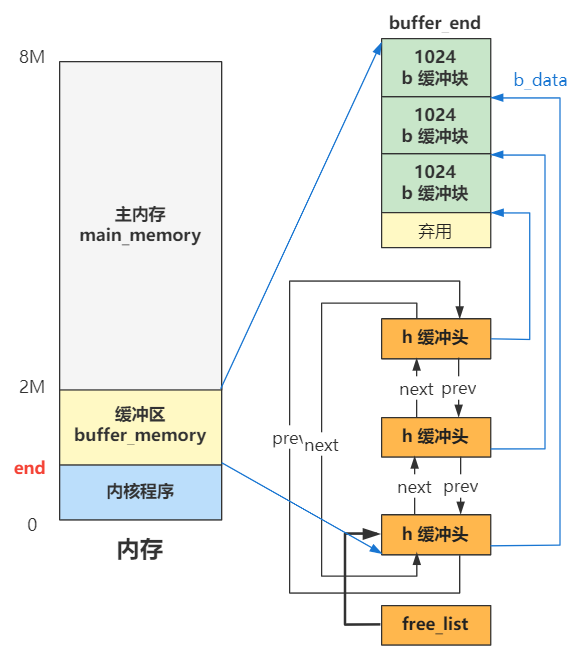
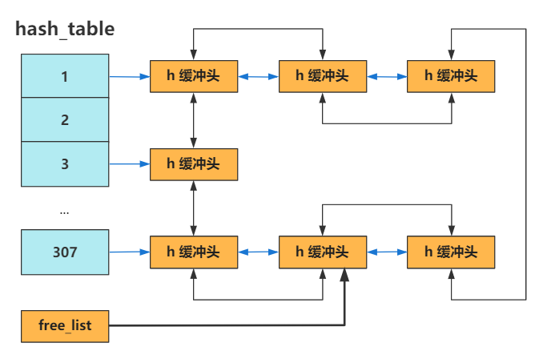

# 记一个最近看的将Linux内核的系列文章
- 作者：闪客 低并发编程（微信公众号）
- Github：https://github.com/sunym1993/flash-linux0.11-talk
- Github：https://github.com/mengchaobbbigrui/Linux-0.11code


> 以下是笔记内容
## 最开始的两行代码

首先了解一下寄存器：
寄存器	原文	             解释	        说明
AX	    accumulator	        累加寄存器   	通常用来执行加法，函数调用的返回值一般也放在这里面
CX	    counter    	        计数寄存器	    通常用来作为计数器，比如for循环
DX	    data    	        数据寄存器	    数据存取
BX	    base    	        基址寄存器	    读写I/O端口时，edx用来存放端口号
SP	    stack pointer	    栈指针寄存器	栈顶指针，指向栈的顶部
BP	    base pointer	    基址指针寄存器	栈底指针，指向栈的底部，通常用ebp+偏移量的形式来定位函数存放在栈中的局部变量
SI	    source index	    源变址寄存器	字符串操作时，用于存放数据源的地址
DI	    destination index	目标变址寄存器	字符串操作时，用于存放目的地址的，和esi两个经常搭配一起使用，执行字符串的复制等操作
ES	    extra segment	    附加段寄存器
CS	    code segment	    代码段寄存器
SS	    stack segment	    栈段寄存器
DS	    data segment	    数据段寄存器
FS	    segment part 2  	无名寄存器
GS	    segment part 3	    无名寄存器

> git/Linux-0.11code/boot/bootsect.s
> 背景知识：
>
> - 当你按下开机键的那一刻，在主板上提前写死的固件程序 BIOS 会将硬盘中启动区的 512 字节的数据，原封不动复制到内存中的 **0x7c00** 这个位置，并跳转到那个位置进行执行。
> - ds 是一个 16 位的段寄存器，具体表示数据段寄存器，在内存寻址时充当段基址的作用。啥意思呢？就是当我们之后用汇编语言写一个内存地址时，实际上仅仅是写了偏移地址。
> - 这个 ds 被赋值为了 0x07c0，由于 x86 为了让自己在 16 位这个实模式下能访问到 20 位的地址线这个历史因素（不了解这个的就先别纠结为啥了），所以段基址要先左移四位。那 0x07c0 左移四位就是 0x7c00，那这就刚好和这段代码被 BIOS 加载到的内存地址 0x7c00 一样了。

```c
SETUPLEN = 4				! nr of setup-sectors
BOOTSEG  = 0x07c0			! original address of boot-sector
INITSEG  = 0x9000			! we move boot here - out of the way
SETUPSEG = 0x9020			! setup starts here
SYSSEG   = 0x1000			! system loaded at 0x10000 (65536).
ENDSEG   = SYSSEG + SYSSIZE		! where to stop loading

! ROOT_DEV:	0x000 - same type of floppy as boot.
!		0x301 - first partition on first drive etc
ROOT_DEV = 0x306

entry start
start:
	mov	ax,#BOOTSEG
	mov	ds,ax
```

**最开始的两行代码（mov）做的事其实是根据cpu的规定，设定内存寻址时的段基址 0x7c00**

## 自己给自己挪个地

首先接着上述继续看代码：

```c
start:
	mov	ax,#BOOTSEG
	mov	ds,ax
	mov	ax,#INITSEG
	mov	es,ax
	mov	cx,#256
	sub	si,si
	sub	di,di
	rep
	movw
	jmpi	go,INITSEG
```

> 这些指令的意思：
>
> - 如果 sub 后面的两个寄存器一模一样，就相当于把这个寄存器里的值清零
> - rep 表示重复执行后面的指令
> - movw 表示复制一个字（word 16位）
> - rep movw 不断重复地复制一个字
> - 重复复制 cx 次，也就是256次
>   总的来说就是将 ds:si 位置开始的512字节的数据复制到 es:di 处
>   将内存地址 0x7c00 处开始往后的 512 字节的数据，原封不动复制到 0x90000 处
> - jmpi 是一个段间跳转指令，表示跳转到 0x9000:go 处执行
> - 段基址 : 偏移地址 这种格式的内存地址要如何计算吧？段基址仍然要先左移四位，因此结论就是跳转到 0x90000 + go 这个内存地址处执行
> - go 就是一个标签，最终编译成机器码的时候会被翻译成一个值，这个值就是 go 这个标签在文件内的偏移地址。这个偏移地址再加上 0x90000，就刚好是 go 标签后面那段代码 mov ax,cs 此时所在的内存地址了。

**所以到此为止，其实就是一段 512 字节的代码和数据，从硬盘的启动区先是被移动到了内存 0x7c00 处，然后又立刻被移动到 0x90000 处，并且跳转到此处往后再稍稍偏移 go 这个标签所代表的偏移地址处，也就是 mov ax,cs 这行指令的位置。**

## 做好最最基础的准备工作

```c
go:	mov	ax,cs
	mov	ds,ax
	mov	es,ax
! put stack at 0x9ff00.
	mov	ss,ax
	mov	sp,#0xFF00		! arbitrary value >>512
```

> - cs 寄存器表示代码段寄存器，CPU 当前正在执行的代码在内存中的位置，就是由 cs:ip 这组寄存器配合指向的，其中 cs 是基址，ip 是偏移地址
> - 由于之前执行过一个段间跳转指令,所以现在 cs 寄存器里的值就是 0x9000，ip 寄存器里的值是 go 这个标签的偏移地址。那这三个 mov 指令就分别给 ds、es 和 ss 寄存器赋值为了 0x9000
> - 所以现在 cs 寄存器里的值就是 0x9000，ip 寄存器里的值是 go 这个标签的偏移地址。那这三个 mov 指令就分别给 ds、es 和 ss 寄存器赋值为了 0x9000
> - es 是扩展段寄存器，仅仅是个扩展
> - ss 为栈段寄存器，后面要配合栈基址寄存器 sp 来表示此时的栈顶地址。而此时 sp 寄存器被赋值为了 0xFF00 了，所以目前的栈顶地址就是 ss:sp 所指向的地址 0x9FF00 处。

**这一部分其实就是把代码段寄存器 cs，数据段寄存器 ds，栈段寄存器 ss 和栈基址寄存器 sp 分别设置好了值，方便后续使用。
其实操作系统在做的事情，就是给如何访问代码，如何访问数据，如何访问栈进行了一下内存的初步规划。其中访问代码和访问数据的规划方式就是设置了一个基址而已，访问栈就是把栈顶指针指向了一个远离代码位置的地方而已。**

## 把自己在硬盘里的其他部分也放到内存来

```c
load_setup:
	mov	dx,#0x0000		! drive 0, head 0
	mov	cx,#0x0002		! sector 2, track 0
	mov	bx,#0x0200		! address = 512, in INITSEG
	mov	ax,#0x0200+SETUPLEN	! service 2, nr of sectors
	int	0x13			! read it
	jnc	ok_load_setup		! ok - continue
	mov	dx,#0x0000
	mov	ax,#0x0000		! reset the diskette
	int	0x13
	j	load_setup

ok_load_setup:

! Get disk drive parameters, specifically nr of sectors/track

	mov	dl,#0x00
	mov	ax,#0x0800		! AH=8 is get drive parameters
	int	0x13
	mov	ch,#0x00
	seg cs
	mov	sectors,cx
	mov	ax,#INITSEG
	mov	es,ax

! Print some inane message

	mov	ah,#0x03		! read cursor pos
	xor	bh,bh
	int	0x10

	mov	cx,#24
	mov	bx,#0x0007		! page 0, attribute 7 (normal)
	mov	bp,#msg1
	mov	ax,#0x1301		! write string, move cursor
	int	0x10

! ok, we've written the message, now
! we want to load the system (at 0x10000)

	mov	ax,#SYSSEG
	mov	es,ax		! segment of 0x010000
	call	read_it
	call	kill_motor

! After that we check which root-device to use. If the device is
! defined (!= 0), nothing is done and the given device is used.
! Otherwise, either /dev/PS0 (2,28) or /dev/at0 (2,8), depending
! on the number of sectors that the BIOS reports currently.

	seg cs
	mov	ax,root_dev
	cmp	ax,#0
	jne	root_defined
	seg cs
	mov	bx,sectors
	mov	ax,#0x0208		! /dev/ps0 - 1.2Mb
	cmp	bx,#15
	je	root_defined
	mov	ax,#0x021c		! /dev/PS0 - 1.44Mb
	cmp	bx,#18
	je	root_defined
undef_root:
	jmp undef_root
root_defined:
	seg cs
	mov	root_dev,ax

! after that (everyting loaded), we jump to
! the setup-routine loaded directly after
! the bootblock:

	jmpi	0,SETUPSEG
```

> - int 0x13 表示发起 0x13 号中断，这条指令上面给 dx、cx、bx、ax 赋值都是作为这个中断程序的参数。CPU 会通过这个中断号，去寻找对应的中断处理程序的入口地址，并跳转过去执行，逻辑上就相当于执行了一个函数。而 0x13 号中断的处理程序是 BIOS 提前给我们写好的，是读取磁盘的相关功能的函数。
> - 这段代码的作用就是将硬盘的第 2 个扇区开始，把数据加载到内存 0x90200 处，共加载 4 个扇区
> - 如果复制成功，就跳转到 ok_load_setup 这个标签，如果失败，则会不断重复执行这段代码，也就是重试。
> - 这段代码的作用就是把从硬盘第 6 个扇区开始往后的 240 个扇区，加载到内存 0x10000 处

**数据加载完毕后，继续执行**

> - jmpi 0,0x9020（jmpi	0,SETUPSEG），跳转到 0x90200 处，就是硬盘第二个扇区开始处的内容。第二个扇区的最开始处，那也就是 setup.s 文件的第一行代码。

## 进入保护模式前最后一次折腾内存

```c
INITSEG  = 0x9000	! we move boot here - out of the way
SYSSEG   = 0x1000	! system loaded at 0x10000 (65536).
SETUPSEG = 0x9020	! this is the current segment

.globl begtext, begdata, begbss, endtext, enddata, endbss
.text
begtext:
.data
begdata:
.bss
begbss:
.text

entry start
start:

! ok, the read went well so we get current cursor position and save it for
! posterity.

	mov	ax,#INITSEG	! this is done in bootsect already, but...
	mov	ds,ax
	mov	ah,#0x03	! read cursor pos
	xor	bh,bh
	int	0x10		! save it in known place, con_init fetches
	mov	[0],dx		! it from 0x90000.

! Get memory size (extended mem, kB)

	mov	ah,#0x88
	int	0x15
	mov	[2],ax

! Get video-card data:

	mov	ah,#0x0f
	int	0x10
	mov	[4],bx		! bh = display page
	mov	[6],ax		! al = video mode, ah = window width

! check for EGA/VGA and some config parameters

	mov	ah,#0x12
	mov	bl,#0x10
	int	0x10
	mov	[8],ax
	mov	[10],bx
	mov	[12],cx

! Get hd0 data

	mov	ax,#0x0000
	mov	ds,ax
	lds	si,[4*0x41]
	mov	ax,#INITSEG
	mov	es,ax
	mov	di,#0x0080
	mov	cx,#0x10
	rep
	movsb

! Get hd1 data

	mov	ax,#0x0000
	mov	ds,ax
	lds	si,[4*0x46]
	mov	ax,#INITSEG
	mov	es,ax
	mov	di,#0x0090
	mov	cx,#0x10
	rep
	movsb
  
! Check that there IS a hd1 :-)

	mov	ax,#0x01500
	mov	dl,#0x81
	int	0x13
	jc	no_disk1
	cmp	ah,#3
	je	is_disk1
no_disk1:
	mov	ax,#INITSEG
	mov	es,ax
	mov	di,#0x0090
	mov	cx,#0x10
	mov	ax,#0x00
	rep
	stosb
is_disk1:

! now we want to move to protected mode ...

	cli			! no interrupts allowed !

! first we move the system to it's rightful place

	mov	ax,#0x0000
	cld			! 'direction'=0, movs moves forward
do_move:
	mov	es,ax		! destination segment
	add	ax,#0x1000
	cmp	ax,#0x9000
	jz	end_move
	mov	ds,ax		! source segment
	sub	di,di
	sub	si,si
	mov 	cx,#0x8000
	rep
	movsw
	jmp	do_move

! then we load the segment descriptors

end_move:
```

> - int 0x10 是触发 BIOS 提供的显示服务中断处理程序，而 ah 寄存器被赋值为 0x03 表示显示服务里具体的读取光标位置功能。
> - int 0x10 中断程序执行完毕并返回时，dx 寄存器里的值表示光标的位置，具体说来其高八位 dh 存储了行号，低八位 dl 存储了列号。
> - mov [0],dx 就是把这个光标位置存储在 [0] 这个内存地址处。注意，前面我们说过，这个内存地址仅仅是偏移地址，还需要加上 ds 这个寄存器里存储的段基址，最终的内存地址是在 0x90000 处，这里存放着光标的位置，以便之后在初始化控制台的时候用到。
> - 再接下来的几行代码，都是和刚刚一样的逻辑，调用一个 BIOS 中断获取点什么信息，然后存储在内存中某个位置
> - cli，表示关闭中断的意思
> - rep movsw 把内存地址 0x10000 处开始往后一直到 0x90000 的内容，统统复制到内存的最开始的 0 位置

**此时的内存分布：**

1. 栈顶地址仍然是 0x9FF00 没有改变
2. 0x90000 开始往上的位置，原来是 bootsect 和 setup 程序的代码，现 bootsect 的一部分代码在已经被操作系统为了记录内存、硬盘、显卡等一些临时存放的数据给覆盖了一部分。
3. 内存最开始的 0 到 0x80000 这 512K 被 system 模块给占用了，之前讲过，这个 system 模块就是除了 bootsect 和 setup 之外的全部程序链接在一起的结果，可以理解为操作系统的全部。

## 先解决寄存器的历史包袱问题

> 这是 x86 的历史包袱问题，现在的 CPU 几乎都是支持 32 位模式甚至 64 位模式了，很少有还仅仅停留在 16 位的实模式下的 CPU。所以我们要为了这个历史包袱，写一段模式转换的代码，如果 Intel CPU 被重新设计而不用考虑兼容性，那么今天的代码将会减少很多甚至不复存在。

```c
end_move:
	mov	ax,#SETUPSEG	! right, forgot this at first. didn't work :-)
	mov	ds,ax
	lidt	idt_48		! load idt with 0,0
	lgdt	gdt_48		! load gdt with whatever appropriate
```

**实模式和保护模式**

- 实模式：这个模式的 CPU 计算物理地址的方式，就是段基址左移四位，再加上偏移地址。
- 保护模式： ds 寄存器里存储的值，在实模式下叫做段基址，在保护模式下叫段选择子。段选择子里存储着段描述符的索引。通过段描述符索引，可以从全局描述符表 gdt 中找到一个段描述符，段描述符里存储着段基址。段基址取出来，再和偏移地址相加，就得到了物理地址。

> lgdt	gdt_48: 全局描述符表（gdt）在内存中的位置存储在一个叫 gdtr 的寄存器中。

## 六行代码就进入了保护模式

```c
! that was painless, now we enable A20

	call	empty_8042
	mov	al,#0xD1		! command write
	out	#0x64,al
	call	empty_8042
	mov	al,#0xDF		! A20 on
	out	#0x60,al
	call	empty_8042
```

上述这段代码打开A20地址线

> 简单理解，这一步就是为了突破地址信号线 20 位的宽度，变成 32 位可用。这是由于 8086 CPU 只有 20 位的地址线，所以如果程序给出 21 位的内存地址数据，那多出的一位就被忽略了，比如如果经过计算得出一个内存地址为：1 0000 00000000 00000000，那实际上内存地址相当于 0，因为高位的那个 1 被忽略了，地方不够。 当 CPU 到了 32 位时代之后，由于要考虑兼容性，还必须保持一个只能用 20 位地址线的模式，所以如果你不手动开启的话，即使地址线已经有 32 位了，仍然会限制只能使用其中的 20 位。

```c
! well, that went ok, I hope. Now we have to reprogram the interrupts :-(
! we put them right after the intel-reserved hardware interrupts, at
! int 0x20-0x2F. There they won't mess up anything. Sadly IBM really
! messed this up with the original PC, and they haven't been able to
! rectify it afterwards. Thus the bios puts interrupts at 0x08-0x0f,
! which is used for the internal hardware interrupts as well. We just
! have to reprogram the 8259's, and it isn't fun.

	mov	al,#0x11		! initialization sequence
	out	#0x20,al		! send it to 8259A-1
	.word	0x00eb,0x00eb		! jmp $+2, jmp $+2
	out	#0xA0,al		! and to 8259A-2
	.word	0x00eb,0x00eb
	mov	al,#0x20		! start of hardware int's (0x20)
	out	#0x21,al
	.word	0x00eb,0x00eb
	mov	al,#0x28		! start of hardware int's 2 (0x28)
	out	#0xA1,al
	.word	0x00eb,0x00eb
	mov	al,#0x04		! 8259-1 is master
	out	#0x21,al
	.word	0x00eb,0x00eb
	mov	al,#0x02		! 8259-2 is slave
	out	#0xA1,al
	.word	0x00eb,0x00eb
	mov	al,#0x01		! 8086 mode for both
	out	#0x21,al
	.word	0x00eb,0x00eb
	out	#0xA1,al
	.word	0x00eb,0x00eb
	mov	al,#0xFF		! mask off all interrupts for now
	out	#0x21,al
	.word	0x00eb,0x00eb
	out	#0xA1,al
```

这一段代码是对可编程中断控制器 8259 芯片进行的编程。重新编程后8259 这个芯片的引脚与中断号的对应关系如下
PIC请求号	中断号	用途
IRQ0	0x20	时钟中断
IRQ1	0x21	键盘中断
IRQ2	0x22	接连从芯片
IRQ3	0x23	串口2
IRQ4	0x24	串口1
IRQ5	0x25	并口2
IRQ6	0x26	软盘驱动器
IRQ7	0x27	并口1
IRQ8	0x28	实时钟中断
IRQ9	0x29	保留
IRQ10	0x2a	保留
IRQ11	0x2b	保留
IRQ12	0x2c	鼠标中断
IRQ13	0x2d	数学协处理器
IRQ14	0x2e	硬盘中断
IRQ15	0x2f	保留

```c
! well, that certainly wasn't fun :-(. Hopefully it works, and we don't
! need no steenking BIOS anyway (except for the initial loading :-).
! The BIOS-routine wants lots of unnecessary data, and it's less
! "interesting" anyway. This is how REAL programmers do it.
!
! Well, now's the time to actually move into protected mode. To make
! things as simple as possible, we do no register set-up or anything,
! we let the gnu-compiled 32-bit programs do that. We just jump to
! absolute address 0x00000, in 32-bit protected mode.

	mov	ax,#0x0001	! protected mode (PE) bit
	lmsw	ax		! This is it!
	jmpi	0,8		! jmp offset 0 of segment 8 (cs)
```

> mov	ax,#0x0001 和 lmsw	ax将 cr0 这个寄存器的位 0 置 1，模式就从实模式切换到保护模式，cr0寄存器用位置0的值标记是否开启保护模式
> 段间跳转指令 jmpi，后面的 8 表示 cs（代码段寄存器）的值，0 表示偏移地址。请注意，此时已经是保护模式了，之前也说过，保护模式下内存寻址方式变了，段寄存器里的值被当做段选择子。
> 8 用二进制表示就是 00000,0000,0000,1000
> 第 0 项是空值，第一项被表示为代码段描述符，是个可读可执行的段，第二项为数据段描述符，是个可读可写段，不过他们的段基址都是 0。所以，这里取的就是这个代码段描述符，段基址是 0，偏移也是 0，那加一块就还是 0 咯，所以最终这个跳转指令，就是跳转到内存地址的 0 地址处，开始执行。

```s
! This routine checks that the keyboard command queue is empty
! No timeout is used - if this hangs there is something wrong with
! the machine, and we probably couldn't proceed anyway.
empty_8042:
	.word	0x00eb,0x00eb
	in	al,#0x64	! 8042 status port
	test	al,#2		! is input buffer full?
	jnz	empty_8042	! yes - loop
	ret

gdt:
	.word	0,0,0,0		! dummy

	.word	0x07FF		! 8Mb - limit=2047 (2048*4096=8Mb)
	.word	0x0000		! base address=0
	.word	0x9A00		! code read/exec
	.word	0x00C0		! granularity=4096, 386

	.word	0x07FF		! 8Mb - limit=2047 (2048*4096=8Mb)
	.word	0x0000		! base address=0
	.word	0x9200		! data read/write
	.word	0x00C0		! granularity=4096, 386

idt_48:
	.word	0			! idt limit=0
	.word	0,0			! idt base=0L

gdt_48:
	.word	0x800		! gdt limit=2048, 256 GDT entries
	.word	512+gdt,0x9	! gdt base = 0X9xxxx

.text
endtext:
.data
enddata:
.bss
endbss:
```

> 操作系统全部代码的 system 这个大模块，system 模块怎么生成的呢？由 Makefile 文件可知，是由 head.s 和 main.c 以及其余各模块的操作系统代码合并来的，可以理解为操作系统的全部核心代码编译后的结果。

## 又要重新设置一遍idt和gdt

> git/Linux-0.11code/boot/head.s

```c
_pg_dir:
startup_32:
	movl $0x10,%eax
	mov %ax,%ds
	mov %ax,%es
	mov %ax,%fs
	mov %ax,%gs
	lss _stack_start,%esp
```

> 连续五个 mov 操作，分别给 ds、es、fs、gs 这几个段寄存器赋值为 0x10，根据段描述符结构解析，表示这几个段寄存器的值为指向全局描述符表中的第二个段描述符，也就是数据段描述符。
> lss 指令相当于让 ss:esp 这个栈顶指针指向了 _stack_start 这个标号的位置。
> _stack_start:

```c
long user_stack[4096 >> 2];

struct
{
  long *a;
  short b;
}
stack_start = {&user_stack[4096 >> 2], 0x10};
```

> 首先，stack_start 结构中的高位 8 字节是 0x10，将会赋值给 ss 栈段寄存器，低位 16 字节是 user_stack 这个数组的最后一个元素的地址值，将其赋值给 esp 寄存器。赋值给 ss 的 0x10 仍然按照保护模式下的段选择子去解读，其指向的是全局描述符表中的第二个段描述符（数据段描述符），段基址是 0。赋值给 esp 寄存器的就是 user_stack 数组的最后一个元素的内存地址值，那最终的栈顶地址，也指向了这里（user_stack + 0），后面的压栈操作，就是往这个新的栈顶地址处压。

```c
	call setup_idt
	call setup_gdt
	movl $0x10,%eax		# reload all the segment registers
	mov %ax,%ds		# after changing gdt. CS was already
	mov %ax,%es		# reloaded in 'setup_gdt'
	mov %ax,%fs
	mov %ax,%gs
	lss _stack_start,%esp
```

> 先设置了 idt 和 gdt，然后又重新执行了一遍刚刚执行过的代码。为什么要重新设置这些段寄存器呢？因为上面修改了 gdt，所以要重新设置一遍以刷新才能生效。那我们接下来就把目光放到设置 idt 和 gdt 上。中断描述符表 idt 我们之前没设置过，所以这里设置具体的值，理所应当。

```c
/*
 *  setup_idt
 *
 *  sets up a idt with 256 entries pointing to
 *  ignore_int, interrupt gates. It then loads
 *  idt. Everything that wants to install itself
 *  in the idt-table may do so themselves. Interrupts
 *  are enabled elsewhere, when we can be relatively
 *  sure everything is ok. This routine will be over-
 *  written by the page tables.
 */
setup_idt:
	lea ignore_int,%edx
	movl $0x00080000,%eax
	movw %dx,%ax		/* selector = 0x0008 = cs */
	movw $0x8E00,%dx	/* interrupt gate - dpl=0, present */

	lea _idt,%edi
	mov $256,%ecx
rp_sidt:
	movl %eax,(%edi)
	movl %edx,4(%edi)
	addl $8,%edi
	dec %ecx
	jne rp_sidt
	lidt idt_descr
	ret

idt_descr:
	.word 256*8-1		# idt contains 256 entries
	.long _idt

_idt:	.fill 256,8,0		# idt is uninitialized
```

> 中断描述符表 idt 里面存储着一个个中断描述符，每一个中断号就对应着一个中断描述符，而中断描述符里面存储着主要是中断程序的地址，这样一个中断号过来后，CPU 就会自动寻找相应的中断程序，然后去执行它。
> 那这段程序的作用就是，设置了 256 个中断描述符，并且让每一个中断描述符中的中断程序例程都指向一个 ignore_int 的函数地址，这个是个默认的中断处理程序，之后会逐渐被各个具体的中断程序所覆盖。比如之后键盘模块会将自己的键盘中断处理程序，覆盖过去。
> 那现在，产生任何中断都会指向这个默认的函数 ignore_int，也就是说现在这个阶段你按键盘还不好使。

```c
_gdt:	.quad 0x0000000000000000	/* NULL descriptor */
	.quad 0x00c09a0000000fff	/* 16Mb */
	.quad 0x00c0920000000fff	/* 16Mb */
	.quad 0x0000000000000000	/* TEMPORARY - don't use */
	.fill 252,8,0			/* space for LDT's and TSS's etc */
```

> 其实和我们原先设置好的 gdt 一模一样。也是有代码段描述符和数据段描述符，然后第四项系统段描述符并没有用到，不用管。最后还留了 252 项的空间，这些空间后面会用来放置任务状态段描述符 TSS 和局部描述符 LDT。

**为什么原来已经设置过一遍了，这里又要重新设置一遍，你可千万别想有什么复杂的原因，就是因为原来设置的 gdt 是在 setup 程序中，之后这个地方要被缓冲区覆盖掉，所以这里重新设置在 head 程序中，这块内存区域之后就不会被其他程序用到并且覆盖了，就这么个事。**

```c
after_page_tables:
	pushl $0		# These are the parameters to main :-)
	pushl $0
	pushl $0
	pushl $L6		# return address for main, if it decides to.
	pushl $_main
	jmp setup_paging
L6:
	jmp L6			# main should never return here, but
				# just in case, we know what happens.
```

> 开启分页机制，并且跳转到 main 函数

## Linux内存管理：分段和分页

```c
/*
 * Setup_paging
 *
 * This routine sets up paging by setting the page bit
 * in cr0. The page tables are set up, identity-mapping
 * the first 16MB. The pager assumes that no illegal
 * addresses are produced (ie >4Mb on a 4Mb machine).
 *
 * NOTE! Although all physical memory should be identity
 * mapped by this routine, only the kernel page functions
 * use the >1Mb addresses directly. All "normal" functions
 * use just the lower 1Mb, or the local data space, which
 * will be mapped to some other place - mm keeps track of
 * that.
 *
 * For those with more memory than 16 Mb - tough luck. I've
 * not got it, why should you :-) The source is here. Change
 * it. (Seriously - it shouldn't be too difficult. Mostly
 * change some constants etc. I left it at 16Mb, as my machine
 * even cannot be extended past that (ok, but it was cheap :-)
 * I've tried to show which constants to change by having
 * some kind of marker at them (search for "16Mb"), but I
 * won't guarantee that's all :-( )
 */
.align 2
setup_paging:
	movl $1024*5,%ecx		/* 5 pages - pg_dir+4 page tables */
	xorl %eax,%eax
	xorl %edi,%edi			/* pg_dir is at 0x000 */
	cld;rep;stosl
	movl $pg0+7,_pg_dir		/* set present bit/user r/w */
	movl $pg1+7,_pg_dir+4		/*  --------- " " --------- */
	movl $pg2+7,_pg_dir+8		/*  --------- " " --------- */
	movl $pg3+7,_pg_dir+12		/*  --------- " " --------- */
	movl $pg3+4092,%edi
	movl $0xfff007,%eax		/*  16Mb - 4096 + 7 (r/w user,p) */
	std
1:	stosl			/* fill pages backwards - more efficient :-) */
	subl $0x1000,%eax
	jge 1b
	xorl %eax,%eax		/* pg_dir is at 0x0000 */
	movl %eax,%cr3		/* cr3 - page directory start */
	movl %cr0,%eax
	orl $0x80000000,%eax
	movl %eax,%cr0		/* set paging (PG) bit */
	ret			/* this also flushes prefetch-queue */
```

> 启动分页机制
> 代码中给出一个内存地址，在保护模式下要先经过分段机制的转换，才能最终变成物理地址，这是在没有开启分页机制的时候，只需要经过这一步转换即可得到最终的物理地址了，但是在开启了分页机制后，又会多一步转换。也就是说，在没有开启分页机制时，由程序员给出的逻辑地址，需要先通过分段机制转换成物理地址。但在开启分页机制后，逻辑地址仍然要先通过分段机制进行转换，只不过转换后不再是最终的物理地址，而是线性地址，然后再通过一次分页机制转换，得到最终的物理地址。
> CPU 在看到我们给出的内存地址后，首先把线性地址被拆分成  高 10 位：中间 10 位：后 12 位  ，高 10 位负责在页目录表中找到一个页目录项，这个页目录项的值加上中间 10 位拼接后的地址去页表中去寻找一个页表项，这个页表项的值，再加上后 12 位偏移地址，就是最终的物理地址。
> 而这一切的操作，都由计算机的一个硬件叫 MMU，中文名字叫内存管理单元，有时也叫 PMMU，分页内存管理单元。由这个部件来负责将虚拟地址转换为物理地址。
> 所以整个过程我们不用操心，作为操作系统这个软件层，只需要提供好页目录表和页表即可，这种页表方案叫做二级页表，第一级叫页目录表 PDE，第二级叫页表 PTE。
> 之后再开启分页机制的开关。其实就是更改 cr0 寄存器中的一位即可（31 位），还记得我们开启保护模式么，也是改这个寄存器中的一位的值。
> **再看上述代码：**
>
> - 当时 linux-0.11 认为，总共可以使用的内存不会超过 16M，也即最大地址空间为 0xFFFFFF。
> - 而按照当前的页目录表和页表这种机制，1 个页目录表最多包含 1024 个页目录项（也就是 1024 个页表），1 个页表最多包含 1024 个页表项（也就是 1024 个页），1 页为 4KB（因为有 12 位偏移地址），因此，16M 的地址空间可以用 1 个页目录表 + 4 个页表搞定。
> - 所以，上面这段代码就是，将页目录表放在内存地址的最开头。

```c
/*
 * I put the kernel page tables right after the page directory,
 * using 4 of them to span 16 Mb of physical memory. People with
 * more than 16MB will have to expand this.
 */
.org 0x1000
pg0:

.org 0x2000
pg1:

.org 0x3000
pg2:

.org 0x4000
pg3:

.org 0x5000
```

> 之后紧挨着这个页目录表，放置 4 个页表，代码里也有这四个页表的标签项。
> 最终将页目录表和页表填写好数值，来覆盖整个 16MB 的内存。随后，开启分页机制。此时内存中的页表相关的布局如下。

```c
	xorl %eax,%eax		/* pg_dir is at 0x0000 */
	movl %eax,%cr3		/* cr3 - page directory start */
```

> 通过一个寄存器告诉 CPU 我们把这些页表放在了哪里，就是这段代码。
> 相当于告诉 cr3 寄存器，0 地址处就是页目录表，再通过页目录表可以找到所有的页表，也就相当于 CPU 知道了分页机制的全貌了。

## 进入main函数前最后一跃

```c
after_page_tables:
	pushl $0		# These are the parameters to main :-)
	pushl $0
	pushl $0
	pushl $L6		# return address for main, if it decides to.
	pushl $_main
	jmp setup_paging
L6:
	jmp L6			# main should never return here, but
				# just in case, we know what happens.
```

> 启用分页指令完成后会跳转到main函数的内存地址
> git/Linux-0.11code/init/main.c

```c
void main(void)		/* This really IS void, no error here. */
{			/* The startup routine assumes (well, ...) this */
/*
 * Interrupts are still disabled. Do necessary setups, then
 * enable them
 */
 	ROOT_DEV = ORIG_ROOT_DEV;
 	drive_info = DRIVE_INFO;
	memory_end = (1<<20) + (EXT_MEM_K<<10);
	memory_end &= 0xfffff000;
	if (memory_end > 16*1024*1024)
		memory_end = 16*1024*1024;
	if (memory_end > 12*1024*1024) 
		buffer_memory_end = 4*1024*1024;
	else if (memory_end > 6*1024*1024)
		buffer_memory_end = 2*1024*1024;
	else
		buffer_memory_end = 1*1024*1024;
	main_memory_start = buffer_memory_end;
#ifdef RAMDISK
	main_memory_start += rd_init(main_memory_start, RAMDISK*1024);
#endif
	mem_init(main_memory_start,memory_end);
	trap_init();
	blk_dev_init();
	chr_dev_init();
	tty_init();
	time_init();
	sched_init();
	buffer_init(buffer_memory_end);
	hd_init();
	floppy_init();
	sti();
	move_to_user_mode();
	if (!fork()) {		/* we count on this going ok */
		init();
	}
/*
 *   NOTE!!   For any other task 'pause()' would mean we have to get a
 * signal to awaken, but task0 is the sole exception (see 'schedule()')
 * as task 0 gets activated at every idle moment (when no other tasks
 * can run). For task0 'pause()' just means we go check if some other
 * task can run, and if not we return here.
 */
	for(;;) pause();
}
```

## 进入内核前的苦力活

> 在这里总结一下之前的内容，进入内核前做了什么

1. 当你按下开机键的那一刻，在主板上提前写死的固件程序 BIOS 会将硬盘中启动区的 512 字节的数据，原封不动复制到内存中的 0x7c00 这个位置，并跳转到那个位置进行执行。有了这个步骤之后，我们就可以把代码写在硬盘第一扇区，让 BIOS 帮我们加载到内存并由 CPU 去执行，我们不用操心这个过程。而这一个扇区的代码，就是操作系统源码中最最最开始的部分，它可以执行一些指令，也可以把硬盘的其他部分加载到内存，其实本质上也是执行一些指令。这样，整个计算机今后如何运作，就完全交到我们自己的手中，想怎么玩就怎么玩了。
2. 接下来将硬盘中的其他部分加载到内存中，4个扇区+240个扇区
3. 设置内存中临时存放的一些变量，调整内存布局，将每块内存复制到他应该在的位置
4. 进入保护模式，设置分段、分页机制，idtr（中断）、gdtr（分段）、cr3（标志位），其中涉及操作系统的中断处理，逻辑地址到线性地址到物理地址的转换。
5. 压栈，转到main函数执行的地方

> 开机 --> 加载启动区 --> 加载setup.s --> 加载内核 --> 设置GDT --> 进入保护模式 --> 分页机制 --> 跳转到内核

## 整个操作系统就20几行代码

**s首先看一下main函数的代码**

```c
void main(void)		/* This really IS void, no error here. */
{			/* The startup routine assumes (well, ...) this */
/*
 * Interrupts are still disabled. Do necessary setups, then
 * enable them
 */
 	ROOT_DEV = ORIG_ROOT_DEV;
 	drive_info = DRIVE_INFO;
	memory_end = (1<<20) + (EXT_MEM_K<<10);
	memory_end &= 0xfffff000;
	if (memory_end > 16*1024*1024)
		memory_end = 16*1024*1024;
	if (memory_end > 12*1024*1024) 
		buffer_memory_end = 4*1024*1024;
	else if (memory_end > 6*1024*1024)
		buffer_memory_end = 2*1024*1024;
	else
		buffer_memory_end = 1*1024*1024;
	main_memory_start = buffer_memory_end;
#ifdef RAMDISK
	main_memory_start += rd_init(main_memory_start, RAMDISK*1024);
#endif
	mem_init(main_memory_start,memory_end); // 内存初始化
	trap_init();  // 中断初始化
	blk_dev_init();
	chr_dev_init();
	tty_init();
	time_init();
	sched_init();  // 进程调度初始化
	buffer_init(buffer_memory_end);
	hd_init();
	floppy_init();

	sti();
	move_to_user_mode();
	if (!fork()) {		/* we count on this going ok */
		init();
	}
/*
 *   NOTE!!   For any other task 'pause()' would mean we have to get a
 * signal to awaken, but task0 is the sole exception (see 'schedule()')
 * as task 0 gets activated at every idle moment (when no other tasks
 * can run). For task0 'pause()' just means we go check if some other
 * task can run, and if not we return here.
 */
	for(;;) pause();
}
```

> - main函数的第一部分是一些参数的取值和计算，包括根设备 ROOT_DEV，之前在汇编语言中获取的各个设备的参数信息 drive_info，以及通过计算得到的内存边界。其中的设备信息都是由 setup.s 这个汇编程序调用 BIOS 中断获取的各个设备的信息，并保存在约定好的内存地址 0x90000 处。
> - 接下来是各种初始化init操作。
> - 切换到用户态模式，并在一个新的进程中做一个最终的初始化 init，这个 init 函数里会创建出一个进程，设置终端的标准 IO，并且再创建出一个执行 shell 程序的进程用来接受用户的命令
> - 第四部分是个死循环，如果没有任何任务可以运行，操作系统会一直陷入这个死循环无法自拔。

## 管理内存前先划分出三个边界值

```c
void main(void)		/* This really IS void, no error here. */
{			/* The startup routine assumes (well, ...) this */
    ...
	memory_end = (1<<20) + (EXT_MEM_K<<10);
	memory_end &= 0xfffff000;
	if (memory_end > 16*1024*1024)
		memory_end = 16*1024*1024;
	if (memory_end > 12*1024*1024) 
		buffer_memory_end = 4*1024*1024;
	else if (memory_end > 6*1024*1024)
		buffer_memory_end = 2*1024*1024;
	else
		buffer_memory_end = 1*1024*1024;
	main_memory_start = buffer_memory_end;
	...
}
```

> **针对不同的内存大小，设置不同的边界值**，即主内存和缓冲区的内存范围

## 操作系统就用一张大表管理内存

> git/Linux-0.11code/mm/memory.c

```c
/* these are not to be changed without changing head.s etc */
#define LOW_MEM 0x100000
#define PAGING_MEMORY (15*1024*1024)
#define PAGING_PAGES (PAGING_MEMORY>>12)
#define MAP_NR(addr) (((addr)-LOW_MEM)>>12)
#define USED 100

#define CODE_SPACE(addr) ((((addr)+4095)&~4095) < \
current->start_code + current->end_code)

static long HIGH_MEMORY = 0;

#define copy_page(from,to) \
__asm__("cld ; rep ; movsl"::"S" (from),"D" (to),"c" (1024):"cx","di","si")

static unsigned char mem_map [ PAGING_PAGES ] = {0,};
// mem_init(main_memory_start,memory_end); // 内存初始化
void mem_init(long start_mem, long end_mem)
{
	int i;

	HIGH_MEMORY = end_mem;
	for (i=0 ; i<PAGING_PAGES ; i++)
		mem_map[i] = USED;
	i = MAP_NR(start_mem);
	end_mem -= start_mem;
	end_mem >>= 12;
	while (end_mem-->0)
		mem_map[i++]=0;
}
```

> mem_init做的事就是准备了一个表，记录了哪些内存被占用了，哪些内存没被占用。
> mem_map 这个数组的每个元素都代表一个 4K 内存是否空闲（准确说是使用次数）。4K 内存通常叫做 1 页内存，而这种管理方式叫分页管理，就是把内存分成一页一页（4K）的单位去管理。
> 1M 以下的内存这个数组干脆没有记录，这里的内存是无需管理的，或者换个说法是无权管理的，也就是没有权利申请和释放，因为这个区域是内核代码所在的地方，不能被“污染”。
> 1M 到 2M 这个区间是缓冲区，2M 是缓冲区的末端，缓冲区的开始在哪里之后再说，这些地方不是主内存区域，因此直接标记为 USED，产生的效果就是无法再被分配了。
> 2M 以上的空间是主内存区域，而主内存目前没有任何程序申请，所以初始化时统统都是零，未来等着应用程序去申请和释放这里的内存资源。

**程序申请内存**

```c
/*
 * Get physical address of first (actually last :-) free page, and mark it
 * used. If no free pages left, return 0.
 */
unsigned long get_free_page(void)
{
register unsigned long __res asm("ax");

__asm__("std ; repne ; scasb\n\t"
	"jne 1f\n\t"
	"movb $1,1(%%edi)\n\t"
	"sall $12,%%ecx\n\t"
	"addl %2,%%ecx\n\t"
	"movl %%ecx,%%edx\n\t"
	"movl $1024,%%ecx\n\t"
	"leal 4092(%%edx),%%edi\n\t"
	"rep ; stosl\n\t"
	"movl %%edx,%%eax\n"
	"1:"
	:"=a" (__res)
	:"0" (0),"i" (LOW_MEM),"c" (PAGING_PAGES),
	"D" (mem_map+PAGING_PAGES-1)
	:"di","cx","dx");
return __res;
}
```

> 选择 mem_map 中首个空闲页面，并标记为已使用。

## 你的键盘什么时候生效

> git/Linux-0.11code/kernel/traps.c

```c
// trap_init();  // 中断初始化
void trap_init(void)
{
	int i;

	set_trap_gate(0,&divide_error);
	set_trap_gate(1,&debug);
	set_trap_gate(2,&nmi);
	set_system_gate(3,&int3);	/* int3-5 can be called from all */
	set_system_gate(4,&overflow);
	set_system_gate(5,&bounds);
	set_trap_gate(6,&invalid_op);
	set_trap_gate(7,&device_not_available);
	set_trap_gate(8,&double_fault);
	set_trap_gate(9,&coprocessor_segment_overrun);
	set_trap_gate(10,&invalid_TSS);
	set_trap_gate(11,&segment_not_present);
	set_trap_gate(12,&stack_segment);
	set_trap_gate(13,&general_protection);
	set_trap_gate(14,&page_fault);
	set_trap_gate(15,&reserved);
	set_trap_gate(16,&coprocessor_error);
	for (i=17;i<48;i++)
		set_trap_gate(i,&reserved);
	set_trap_gate(45,&irq13);
	outb_p(inb_p(0x21)&0xfb,0x21);
	outb(inb_p(0xA1)&0xdf,0xA1);
	set_trap_gate(39,&parallel_interrupt);
}
```

> git/Linux-0.11/include/asm/system.h

```c
// 效果就是在中断描述符表中插入了一个中断描述符。
#define _set_gate(gate_addr,type,dpl,addr) \
__asm__ ("movw %%dx,%%ax\n\t" \
	"movw %0,%%dx\n\t" \
	"movl %%eax,%1\n\t" \
	"movl %%edx,%2" \
	: \
	: "i" ((short) (0x8000+(dpl<<13)+(type<<8))), \
	"o" (*((char *) (gate_addr))), \
	"o" (*(4+(char *) (gate_addr))), \
	"d" ((char *) (addr)),"a" (0x00080000))

#define set_intr_gate(n,addr) \
	_set_gate(&idt[n],14,0,addr)

#define set_trap_gate(n,addr) \
	_set_gate(&idt[n],15,0,addr)

#define set_system_gate(n,addr) \
	_set_gate(&idt[n],15,3,addr)
```

> 这段代码就是往这个 idt 表里一项一项地写东西，其对应的中断号就是第一个参数，中断处理程序就是第二个参数。产生的效果就是，之后如果来一个中断后，CPU 根据其中断号，就可以到这个中断描述符表 idt 中找到对应的中断处理程序了。
> 这个 system 与 trap 的区别仅仅在于，设置的中断描述符的特权级不同，前者是 0（内核态），后者是 3（用户态），这块展开将会是非常严谨的、绕口的、复杂的特权级相关的知识，不明白的话先不用管，就理解为都是设置一个中断号和中断处理程序的对应关系就好了。
> 17 到 48 号中断都批量设置为了 reserved 函数，这是暂时的，后面各个硬件初始化时要重新设置好这些中断，把暂时的这个给覆盖掉。

```c
void tty_init(void)
{
	rs_init();
	con_init();
}

/*
 *  void con_init(void);
 *
 * This routine initalizes console interrupts, and does nothing
 * else. If you want the screen to clear, call tty_write with
 * the appropriate escape-sequece.
 *
 * Reads the information preserved by setup.s to determine the current display
 * type and sets everything accordingly.
 */
void con_init(void)
{
	...
	set_trap_gate(0x21,&keyboard_interrupt);
	...
}
/* from bsd-net-2: */
```

> 设置键盘相关的中断
> 虽然设置了键盘中断，但是到目前为止这些中断还是处于禁用状态

```c
// sti(); // main
#define sti() __asm__ ("sti"::)
```

> sti 最终会对应一个同名的汇编指令 sti，表示允许中断。所以这行代码之后，键盘才真正开始生效！

## 读取硬盘前的准备工作有哪些

> git/Linux-0.11code/kernel/blk_drv/ll_rw_blk.c

```c
// blk_dev_init() // main()
void blk_dev_init(void)
{
	int i;

	for (i=0 ; i<NR_REQUEST ; i++) {
		request[i].dev = -1;
		request[i].next = NULL;
	}
}
```

> git/Linux-0.11code/kernel/blk_drv/blk.h

```c
/*
 * Ok, this is an expanded form so that we can use the same
 * request for paging requests when that is implemented. In
 * paging, 'bh' is NULL, and 'waiting' is used to wait for
 * read/write completion.
 */
struct request {
	int dev;		/* -1 if no request 表示设备号，-1 就表示空闲。 */
	int cmd;		/* READ or WRITE 表示命令，其实就是 READ 还是 WRITE，也就表示本次操作是读还是写。 */
	int errors;     /* 表示操作时产生的错误次数。 */
	unsigned long sector;          // 表示起始扇区。
	unsigned long nr_sectors;      // 表示扇区数。
	char * buffer;                 // 表示数据缓冲区，也就是读盘之后的数据放在内存中的什么位置。
	struct task_struct * waiting;  // 是个 task_struct 结构，这可以表示一个进程，也就表示是哪个进程发起了这个请求。
	struct buffer_head * bh;       // 是缓冲区头指针
	struct request * next;         // 指向了下一个请求项。
};
```

> 比如读请求时，cmd 就是 READ，sector 和 nr_sectors 这俩就定位了所要读取的块设备（可以简单先理解为硬盘）的哪几个扇区，buffer 就定位了这些数据读完之后放在内存的什么位置。
> request 结构可以完整描述一个读盘操作。然后那个 request 数组就是把它们都放在一起，并且它们又通过 next 指针串成链表。

**读盘操作**

> 读操作的系统调用函数是 sys_read
> 简化版函数如下：

```c
int sys_read(unsigned int fd,char * buf,int count) {
    struct file * file = current->filp[fd];  // 在进程文件描述符数组filp中找到一个空闲项  在系统文件表file_table中找到一个空闲项
    struct m_inode * inode = file->f_inode;  // 根据文件名从文件系统中查找inode
    // 校验 buf 区域的内存限制
    verify_area(buf,count);
    // 仅关注目录文件或普通文件
    return file_read(inode,file,buf,count);
}
```

> 入参 fd 是文件描述符，通过它可以找到一个文件的 inode，进而找到这个文件在硬盘中的位置。另两个入参 buf 就是要复制到的内存中的位置，count 就是要复制多少个字节。

```c
int file_read(struct m_inode * inode, struct file * filp, char * buf, int count) {
    int left,chars,nr;
    struct buffer_head * bh;
    left = count;
    while (left) {  // 每次读入一个块的数据，直到入参所要求的大小全部读完为止。
        if (nr = bmap(inode,(filp->f_pos)/BLOCK_SIZE)) {
            if (!(bh=bread(inode->i_dev,nr)))  // 这个函数就是去读某一个设备的某一个数据块号的内容
                break;
        } else
            bh = NULL;
        nr = filp->f_pos % BLOCK_SIZE;
        chars = MIN( BLOCK_SIZE-nr , left );
        filp->f_pos += chars;
        left -= chars;
        if (bh) {
            char * p = nr + bh->b_data;
            while (chars-->0)
                put_fs_byte(*(p++),buf++);
            brelse(bh);
        } else {
            while (chars-->0)
                put_fs_byte(0,buf++);
        }
    }
    inode->i_atime = CURRENT_TIME;
    return (count-left)?(count-left):-ERROR;
}

struct buffer_head * bread(int dev,int block) {
    struct buffer_head * bh = getblk(dev,block);  // 申请了一个内存中的缓冲块
    if (bh->b_uptodate)
        return bh;
    ll_rw_block(READ,bh);  //  ll_rw_block 负责把数据读入这个缓冲块
    wait_on_buffer(bh);
    if (bh->b_uptodate)
        return bh;
    brelse(bh);
    return NULL;
}

void ll_rw_block(int rw, struct buffer_head * bh) {
    ...
    make_request(major,rw,bh);
}

static void make_request(int major,int rw, struct buffer_head * bh) { // 该函数会往刚刚的设备的请求项链表 request[32] 中添加一个请求项，只要 request[32] 中有未处理的请求项存在，都会陆续地被处理，直到设备的请求项链表是空为止。
    ...
if (rw == READ)
        req = request+NR_REQUEST;
    else
        req = request+((NR_REQUEST*2)/3);
/* find an empty request */
    while (--req >= request)
        if (req->dev<0)
            break;
    ...
/* fill up the request-info, and add it to the queue */
    req->dev = bh->b_dev;
    req->cmd = rw;
    req->errors=0;
    req->sector = bh->b_blocknr<<1;
    req->nr_sectors = 2;
    req->buffer = bh->b_data;
    req->waiting = NULL;
    req->bh = bh;
    req->next = NULL;
    add_request(major+blk_dev,req);
}
```

## 按下键盘后屏幕上为啥会有输出

> tty_init()
> git/Linux-0.11code/kernel/chr_drv/tty_io.c

```c
void tty_init(void)
{
    rs_init();
    con_init();
}

// git/Linux-0.11code/kernel/chr_drv/serial.c
void rs_init(void)
{
	set_intr_gate(0x24,rs1_interrupt);
	set_intr_gate(0x23,rs2_interrupt);
	init(tty_table[1].read_q.data);
	init(tty_table[2].read_q.data);
	outb(inb_p(0x21)&0xE7,0x21);
}
```

> rs_init是串口中断的开启，以及设置对应的中断处理程序，串口在我们现在的 PC 机上已经很少用到了，所以这个直接忽略

```c
// git/Linux-0.11code/kernel/chr_drv/console.c
/*
 *  void con_init(void);
 *
 * This routine initalizes console interrupts, and does nothing
 * else. If you want the screen to clear, call tty_write with
 * the appropriate escape-sequece.
 *
 * Reads the information preserved by setup.s to determine the current display
 * type and sets everything accordingly.
 */
void con_init(void)
{
	register unsigned char a;
	char *display_desc = "????";
	char *display_ptr;

	// 获取显示模式相关信息
	video_num_columns = ORIG_VIDEO_COLS;
	video_size_row = video_num_columns * 2;
	video_num_lines = ORIG_VIDEO_LINES;
	video_page = ORIG_VIDEO_PAGE;
	video_erase_char = 0x0720;

	if (ORIG_VIDEO_MODE == 7)			/* Is this a monochrome display? */
	{
		// 显存映射的内存区域
		video_mem_start = 0xb0000;
		video_port_reg = 0x3b4;
		video_port_val = 0x3b5;
		if ((ORIG_VIDEO_EGA_BX & 0xff) != 0x10)
		{
			video_type = VIDEO_TYPE_EGAM;
			video_mem_end = 0xb8000;
			display_desc = "EGAm";
		}
		else
		{
			video_type = VIDEO_TYPE_MDA;
			video_mem_end	= 0xb2000;
			display_desc = "*MDA";
		}
	}
	else								/* If not, it is color. */
	{
		video_mem_start = 0xb8000;
		video_port_reg	= 0x3d4;
		video_port_val	= 0x3d5;
		if ((ORIG_VIDEO_EGA_BX & 0xff) != 0x10)
		{
			video_type = VIDEO_TYPE_EGAC;
			video_mem_end = 0xbc000;
			display_desc = "EGAc";
		}
		else
		{
			video_type = VIDEO_TYPE_CGA;
			video_mem_end = 0xba000;
			display_desc = "*CGA";
		}
	}

	/* Let the user known what kind of display driver we are using */

	display_ptr = ((char *)video_mem_start) + video_size_row - 8;
	while (*display_desc)
	{
		*display_ptr++ = *display_desc++;
		display_ptr++;
	}

	/* Initialize the variables used for scrolling (mostly EGA/VGA)	*/
	// 滚动屏幕操作时的信息
	origin	= video_mem_start;
	scr_end	= video_mem_start + video_num_lines * video_size_row;
	top	= 0;
	bottom	= video_num_lines;
    // 定位光标并开启键盘中断
	gotoxy(ORIG_X,ORIG_Y);
	set_trap_gate(0x21,&keyboard_interrupt);
	outb_p(inb_p(0x21)&0xfd,0x21);
	a=inb_p(0x61);
	outb_p(a|0x80,0x61);
	outb(a,0x61);
}

/* NOTE! gotoxy thinks x==video_num_columns is ok */
static inline void gotoxy(unsigned int new_x,unsigned int new_y)
{
	if (new_x > video_num_columns || new_y >= video_num_lines)
		return;
	x=new_x;
	y=new_y;
	pos=origin + y*video_size_row + (x<<1);
}
```

> 这里的 if els为了应对不同的显示模式，来分配不同的变量值，那如果我们仅仅找出一个显示模式，这些分支就可以只看一个了。
> 显示模式的信息在 进入保护模式前 已经写到内存中了
> **如何将内存中的数据输出到显示器上？**
> 内存中有这样一部分区域，是和显存映射的。就是你往上图的这些内存区域中写数据，相当于写在了显存中。而往显存中写数据，就相当于在屏幕上输出文本了。
> gotoxy() 其中 x 表示光标在哪一列，y 表示光标在哪一行，pos 表示根据列号和行号计算出来的内存指针，也就是往这个 pos 指向的地址处写数据，就相当于往控制台的 x 列 y 行处写入字符了

**按下键盘后触发键盘中断，之后程序的调用链是：**

```c
_keyboard_interrupt:
    ...
    call _do_tty_interrupt
    ...
  
void do_tty_interrupt(int tty) {
   copy_to_cooked(tty_table+tty);
}

void copy_to_cooked(struct tty_struct * tty) {
    ...
    tty->write(tty);
    ...
}

// 控制台时 tty 的 write 为 con_write 函数 git/Linux-0.11code/kernel/chr_drv/console.c
void con_write(struct tty_struct * tty)
{
	int nr;
	char c;

	nr = CHARS(tty->write_q);
	while (nr--) {
		GETCH(tty->write_q,c);
		switch(state) {
			case 0:
				if (c>31 && c<127) {
					if (x>=video_num_columns) {  // 判断列号 x 是否大于了总列数，是否要换行
						x -= video_num_columns;
						pos -= video_size_row;
						lf();
					}
					__asm__("movb _attr,%%ah\n\t"
						"movw %%ax,%1\n\t"
						::"a" (c),"m" (*(short *)pos)
						:"ax");
					pos += 2;
					x++;
				} else if (c==27)
					state=1;
				else if (c==10 || c==11 || c==12)
					lf();
				else if (c==13)
					cr();
				else if (c==ERASE_CHAR(tty))
					del();
				else if (c==8) {
					if (x) {
						x--;
						pos -= 2;
					}
				} else if (c==9) {
					c=8-(x&7);
					x += c;
					pos += c<<1;
					if (x>video_num_columns) {
						x -= video_num_columns;
						pos -= video_size_row;
						lf();
					}
					c=9;
				} else if (c==7)
					sysbeep();
				break;
			case 1:
				state=0;
				if (c=='[')
					state=2;
				else if (c=='E')
					gotoxy(0,y+1);
				else if (c=='M')
					ri();
				else if (c=='D')
					lf();
				else if (c=='Z')
					respond(tty);
				else if (x=='7')
					save_cur();
				else if (x=='8')
					restore_cur();
				break;
			case 2:
				for(npar=0;npar<NPAR;npar++)
					par[npar]=0;
				npar=0;
				state=3;
				if (ques=(c=='?'))
					break;
			case 3:
				if (c==';' && npar<NPAR-1) {
					npar++;
					break;
				} else if (c>='0' && c<='9') {
					par[npar]=10*par[npar]+c-'0';
					break;
				} else state=4;
			case 4:
				state=0;
				switch(c) {
					case 'G': case '`':
						if (par[0]) par[0]--;
						gotoxy(par[0],y);
						break;
					case 'A':
						if (!par[0]) par[0]++;
						gotoxy(x,y-par[0]);
						break;
					case 'B': case 'e':
						if (!par[0]) par[0]++;
						gotoxy(x,y+par[0]);
						break;
					case 'C': case 'a':
						if (!par[0]) par[0]++;
						gotoxy(x+par[0],y);
						break;
					case 'D':
						if (!par[0]) par[0]++;
						gotoxy(x-par[0],y);
						break;
					case 'E':
						if (!par[0]) par[0]++;
						gotoxy(0,y+par[0]);
						break;
					case 'F':
						if (!par[0]) par[0]++;
						gotoxy(0,y-par[0]);
						break;
					case 'd':
						if (par[0]) par[0]--;
						gotoxy(x,par[0]);
						break;
					case 'H': case 'f':
						if (par[0]) par[0]--;
						if (par[1]) par[1]--;
						gotoxy(par[1],par[0]);
						break;
					case 'J':
						csi_J(par[0]);
						break;
					case 'K':
						csi_K(par[0]);
						break;
					case 'L':
						csi_L(par[0]);
						break;
					case 'M':
						csi_M(par[0]);
						break;
					case 'P':
						csi_P(par[0]);
						break;
					case '@':
						csi_at(par[0]);
						break;
					case 'm':
						csi_m();
						break;
					case 'r':
						if (par[0]) par[0]--;
						if (!par[1]) par[1] = video_num_lines;
						if (par[0] < par[1] &&
						    par[1] <= video_num_lines) {
							top=par[0];
							bottom=par[1];
						}
						break;
					case 's':
						save_cur();
						break;
					case 'u':
						restore_cur();
						break;
				}
		}
	}
	set_cursor();
}
```

> __asm__ 内联汇编，就是把键盘输入的字符 c 写入 pos 指针指向的内存，相当于往屏幕输出了。
> 写入一个字符，最底层，其实就是往内存的某处写个数据，然后顺便调整一下光标。
> 换行效果，当发现光标位置处于某一行的结尾时（这个应该很好算吧，我们都知道屏幕上一共有几行几列了），就把光标计算出一个新值，让其处于下一行的开头。
> 滚屏的效果，无非就是当检测到光标已经出现在最后一行最后一列了，那就把每一行的字符，都复制到它上一行，其实就是算好哪些内存地址上的值，拷贝到哪些内存地址，就好了。
> git/Linux-0.11code/kernel/chr_drv/console.c 定义了各种光标操作，主要是处理键盘各种不同的按键，需要写好多 switch case 等语句，十分麻烦，我们这里就完全没必要去展开了，就是个苦力活。

## 原来操作系统获取时间的方式也这么low

> time_init

```c
/*
 * Yeah, yeah, it's ugly, but I cannot find how to do this correctly
 * and this seems to work. I anybody has more info on the real-time
 * clock I'd be interested. Most of this was trial and error, and some
 * bios-listing reading. Urghh.
 */

#define CMOS_READ(addr) ({ \
outb_p(0x80|addr,0x70); \
inb_p(0x71); \
})

#define BCD_TO_BIN(val) ((val)=((val)&15) + ((val)>>4)*10)

static void time_init(void)
{
	struct tm time;

	do { // 通过读写 CMOS 上的指定端口，依次获取年月日时分秒等信息,至于 CMOS 又是如何知道时间的，这个就不在我们讨论范围了。
		time.tm_sec = CMOS_READ(0);
		time.tm_min = CMOS_READ(2);
		time.tm_hour = CMOS_READ(4);
		time.tm_mday = CMOS_READ(7);
		time.tm_mon = CMOS_READ(8);
		time.tm_year = CMOS_READ(9);
	} while (time.tm_sec != CMOS_READ(0));
	// 将读取到的BCD码转换成二进制值
	BCD_TO_BIN(time.tm_sec);
	BCD_TO_BIN(time.tm_min);
	BCD_TO_BIN(time.tm_hour);
	BCD_TO_BIN(time.tm_mday);
	BCD_TO_BIN(time.tm_mon);
	BCD_TO_BIN(time.tm_year);
	time.tm_mon--;
	startup_time = kernel_mktime(&time);
}

// git/Linux-0.11code/kernel/mktime.c
long kernel_mktime(struct tm * tm)
{
	long res;
	int year;

	year = tm->tm_year - 70;
/* magic offsets (y+1) needed to get leapyears right.*/
	res = YEAR*year + DAY*((year+1)/4);
	res += month[tm->tm_mon];
/* and (y+2) here. If it wasn't a leap-year, we have to adjust */
	if (tm->tm_mon>1 && ((year+2)%4))
		res -= DAY;
	res += DAY*(tm->tm_mday-1);
	res += HOUR*tm->tm_hour;
	res += MINUTE*tm->tm_min;
	res += tm->tm_sec;
	return res;
}
```

> CMOS_READ: 就是对一个端口先 out 写一下，再 in 读一下。这是 CPU 与外设交互的一个基本玩法，CPU 与外设打交道基本是通过端口，往某些端口写值来表示要这个外设干嘛，然后从另一些端口读值来接受外设的反馈。至于这个外设内部是怎么实现的，对使用它的操作系统而言，是个黑盒，无需关心。那对于我们程序员来说，就更不用关心了。
> CPU 最底层是如何与外设打交道？就是按照人家的操作手册，然后无脑按照要求读写端口就行了。当然，读取硬盘的这个无脑循环，可以 CPU 直接读取并做写入内存的操作，这样就会占用 CPU 的计算资源。也可以交给 DMA 设备去读，解放 CPU，但和硬盘的交互，通通都是按照硬件手册上的端口说明，来操作的，实际上也是做了一层封装。
> 获取时间也就是与外设 CMOS 打交道，进行读写，CMOS它是主板上的一个可读写的 RAM 芯片
> BCD_TO_BIN 就是 BCD 转换成 BIN，因为从 CMOS 上获取的这些年月日都是 BCD 码值，需要转换成存储在我们变量上的二进制数值，所以需要一个小算法来转换一下
> kernel_mktime 也很简单，就是根据刚刚的那些时分秒数据，计算从 1970 年 1 月 1 日 0 时起到开机当时经过的秒数，作为开机时间，存储在 startup_time 这个变量里。

## 大名鼎鼎的进程调度就是从这里开始的

> git/Linux-0.11code/kernel/sched.c

```c

struct task_struct * task[NR_TASKS] = {&(init_task.task), };

void sched_init(void)
{
	int i;
	struct desc_struct * p;

	if (sizeof(struct sigaction) != 16)
		panic("Struct sigaction MUST be 16 bytes");
	// 初始化TSS和LDT
	set_tss_desc(gdt+FIRST_TSS_ENTRY,&(init_task.task.tss));
	set_ldt_desc(gdt+FIRST_LDT_ENTRY,&(init_task.task.ldt));
	p = gdt+2+FIRST_TSS_ENTRY;
	for(i=1;i<NR_TASKS;i++) {
		task[i] = NULL;  // 给一个长度为 64，结构为 task_struct 的数组 task 附上初始值。task_struct 结构就是代表每一个进程的信息
		// 给 gdt 剩下的位置填充上 0，也就是把剩下留给 TSS 和 LDT 的描述符都先附上空值。
		p->a=p->b=0;
		p++;
		p->a=p->b=0;
		p++;
	}
/* Clear NT, so that we won't have troubles with that later on */
	__asm__("pushfl ; andl $0xffffbfff,(%esp) ; popfl");
	ltr(0);
	lldt(0);
	// 端口读写和设置中断
	// 而这次交互的外设是一个可编程定时器的芯片，这四行代码就开启了这个定时器，之后这个定时器变会持续的、以一定频率的向 CPU 发出中断信号。
	outb_p(0x36,0x43);		/* binary, mode 3, LSB/MSB, ch 0 */
	outb_p(LATCH & 0xff , 0x40);	/* LSB */
	outb(LATCH >> 8 , 0x40);	/* MSB */
	set_intr_gate(0x20,&timer_interrupt); // 第一个就是时钟中断，中断号为 0x20，中断处理程序为 timer_interrupt。那么每次定时器向 CPU 发出中断后，便会执行这个函数。这个定时器的触发，以及时钟中断函数的设置，是操作系统主导进程调度的一个关键！没有他们这样的外部信号不断触发中断，操作系统就没有办法作为进程管理的主人，通过强制的手段收回进程的 CPU 执行权限。

	outb(inb_p(0x21)&~0x01,0x21);
	set_system_gate(0x80,&system_call);  // 第二个设置的中断叫系统调用 system_call，中断号是 0x80，这个中断又是个非常非常非常非常非常非常非常重要的中断，所有用户态程序想要调用内核提供的方法，都需要基于这个系统调用来进行。
}

// git/Linux-0.11code/include/linux/sched.h ltr 是给 tr 寄存器赋值，以告诉 CPU 任务状态段 TSS 在内存的位置；lldt 一个是给 ldt 寄存器赋值，以告诉 CPU 局部描述符 LDT 在内存的位置。
#define ltr(n) __asm__("ltr %%ax"::"a" (_TSS(n)))
#define lldt(n) __asm__("lldt %%ax"::"a" (_LDT(n)))

// git/Linux-0.11code/include/linux/sched.h
struct tss_struct {
	long	back_link;	/* 16 high bits zero */
	long	esp0;
	long	ss0;		/* 16 high bits zero */
	long	esp1;
	long	ss1;		/* 16 high bits zero */
	long	esp2;
	long	ss2;		/* 16 high bits zero */
	long	cr3;
	long	eip;
	long	eflags;
	long	eax,ecx,edx,ebx;
	long	esp;
	long	ebp;
	long	esi;
	long	edi;
	long	es;		/* 16 high bits zero */
	long	cs;		/* 16 high bits zero */
	long	ss;		/* 16 high bits zero */
	long	ds;		/* 16 high bits zero */
	long	fs;		/* 16 high bits zero */
	long	gs;		/* 16 high bits zero */
	long	ldt;		/* 16 high bits zero */
	long	trace_bitmap;	/* bits: trace 0, bitmap 16-31 */
	struct i387_struct i387;
};
```

> TSS 和 LDT 被放在GDT的最后面
> TSS 叫任务状态段，就是保存和恢复进程的上下文的，所谓上下文，其实就是各个寄存器的信息而已，这样进程切换的时候，才能做到保存和恢复上下文，继续执行。
> LDT 叫局部描述符表，是与 GDT 全局描述符表相对应的，内核态的代码用 GDT 里的数据段和代码段，而用户进程的代码用每个用户进程自己的 LDT 里得数据段和代码段。
> task_struct 结构就是代表每一个进程的信息

```c
// git/Linux-0.11code/include/linux/sched.h
struct task_struct {
/* these are hardcoded - don't touch */
	long state;	/* -1 unrunnable, 0 runnable, >0 stopped */
	long counter;
	long priority;
	long signal;
	struct sigaction sigaction[32];
	long blocked;	/* bitmap of masked signals */
/* various fields */
	int exit_code;
	unsigned long start_code,end_code,end_data,brk,start_stack;
	long pid,father,pgrp,session,leader;
	unsigned short uid,euid,suid;
	unsigned short gid,egid,sgid;
	long alarm;
	long utime,stime,cutime,cstime,start_time;
	unsigned short used_math;
/* file system info */
	int tty;		/* -1 if no tty, so it must be signed */
	unsigned short umask;
	struct m_inode * pwd;
	struct m_inode * root;
	struct m_inode * executable;
	unsigned long close_on_exec;
	struct file * filp[NR_OPEN];
/* ldt for this task 0 - zero 1 - cs 2 - ds&ss */
	struct desc_struct ldt[3];
/* tss for this task */
	struct tss_struct tss;
};
```

> 就是以后每创建一个新进程，就会在后面添加一组 TSS 和 LDT 表示这个进程的任务状态段以及局部描述符表信息。
> 那为什么一开始就先有了一组 TSS 和 LDT 呢？现在也没创建进程呀。错了，现在虽然我们还没有建立起进程调度的机制，但我们正在运行的代码就是会作为未来的一个进程的指令流。
> 也就是当未来进程调度机制一建立起来，正在执行的代码就会化身成为进程 0 的代码。所以我们需要提前把这些未来会作为进程 0 的信息写好。

**最后总结一些进程调度的初始化做了什么**

1. 我们往全局描述符表写了两个结构，TSS 和 LDT，作为未来进程 0 的任务状态段和局部描述符表信息。
2. 设置了时钟中断 0x20 和系统调用 0x80，一个作为进程调度的起点，一个作为用户程序调用操作系统功能的桥梁，非常之重要。

## 操作系统就是用这两个面试常考的结构管理缓冲区

> buffer_init(buffer_memory_end)
> 其中的buffer_memory_end在之前 管理内存前先划分出三个边界值 已经设置过了
> git/Linux-0.11code/fs/buffer.c

```c
extern int end;  // 外部变量 end 并不是操作系统代码写就的，而是由链接器 ld 在链接整个程序时设置的一个外部变量，帮我们计算好了整个内核代码的末尾地址。
struct buffer_head * start_buffer = (struct buffer_head *) &end;
struct buffer_head * hash_table[NR_HASH];
static struct buffer_head * free_list;

void buffer_init(long buffer_end)
{
	struct buffer_head * h = start_buffer;  //  buffer_head 结构的 h，代表缓冲头，其指针值是 start_buffer，刚刚我们计算过了，就是图中的内核代码末端地址 end，也就是缓冲区开头。
	void * b;  // 代表缓冲块，指针值是 buffer_end，也就是2M，就是缓冲区结尾。
	int i;

	if (buffer_end == 1<<20)
		b = (void *) (640*1024);
	else
		b = (void *) buffer_end;  // 假设内存只有 8M
	while ( (b -= BLOCK_SIZE) >= ((void *) (h+1)) ) {  // 缓冲区结尾的 b 每次循环 -1024，也就是一页的值，缓冲区结尾的 h 每次循环 +1（一个 buffer_head 大小的内存），直到碰一块为止。
		h->b_dev = 0;
		h->b_dirt = 0;
		h->b_count = 0;
		h->b_lock = 0;
		h->b_uptodate = 0;
		h->b_wait = NULL;
		h->b_next = NULL;
		h->b_prev = NULL;
		h->b_data = (char *) b;  //  buffer 所表示的数据部分 b_data，也就是指向了上面的缓冲块 b
		//  buffer 的前后空闲 buffer 的指针 b_prev_free 和 b_next_free。
		h->b_prev_free = h-1;
		h->b_next_free = h+1;
		h++;
		NR_BUFFERS++;
		if (b == (void *) 0x100000)
			b = (void *) 0xA0000;
	}
	h--;
	free_list = start_buffer;  // free_list 指向了缓冲头双向链表的第一个结构，然后就可以顺着这个结构，从双向链表中遍历到任何一个缓冲头结构了，而通过缓冲头又可以找到这个缓冲头对应的缓冲块。缓冲头就是具体缓冲块的管理结构，而 free_list 开头的双向链表又是缓冲头的管理结构，整个管理体系就这样建立起来了。
	free_list->b_prev_free = h;
	h->b_next_free = free_list;
	for (i=0;i<NR_HASH;i++)
		hash_table[i]=NULL;  // 取块设备的数据（硬盘中的数据），需要先读到缓冲区中，如果缓冲区已有了，就不用从块设备读取了，直接取走。那怎么知道缓冲区已经有了要读取的块设备中的数据呢？从双向链表从头遍历当然可以，但是这效率可太低了。所以需要一个 hashmap 的结构方便快速查找，这就是 hash_table 这个数组的作用。
}

```

> 可是内核程序占多大内存在写的时候完全不知道，就算知道了如果改动一点代码也会变化，所以就由程序编译链接时由链接器程序帮我们把这个内核代码末端的地址计算出来，作为一个外部变量 end 我们拿来即用
> 当缓冲头 h 的所有 next 和 prev 指针都指向彼此时，就构成了一个双向链表。

## 硬盘初始化hd_init

> hd_init 是硬盘初始化
> floppy_init 是软盘初始化，现在软盘几乎都被淘汰了，计算机中也没有软盘驱动器了
> git/Linux-0.11code/kernel/blk_drv/hd.c

```c
void hd_init(void)
{
	blk_dev[MAJOR_NR].request_fn = DEVICE_REQUEST;  // 把 blk_dev 数组索引 3 位置处的块设备管理结构 blk_dev_struct 的 request_fn 赋值为了 do_hd_request, 因为有很多块设备，所以 Linux 0.11 内核用了一个 blk_dev[] 来进行管理，每一个索引表示一个块设备。索引为 3 这个位置，就表示给硬盘 hd 这个块设备留的位置。每个块设备执行读写请求都有自己的函数实现，在上层看来都是一个统一函数 request_fn 即可，具体实现各有不同，对于硬盘来说，这个实现就是 do_hd_request 函数。
	set_intr_gate(0x2E,&hd_interrupt);  // 设置了一个新的中断，中断号是 0x2E，中断处理函数是 hd_interrupt，也就是说硬盘发生读写时，硬盘会发出中断信号给 CPU，之后 CPU 便会陷入中断处理程序，也就是执行 hd_interrupt 函数。
    // 往几个 IO 端口上读写，其作用是允许硬盘控制器发送中断请求信号
	outb_p(inb_p(0x21)&0xfb,0x21);
	outb(inb_p(0xA1)&0xbf,0xA1);
}

// /root/git/Linux-0.11code/kernel/blk_drv/ll_rw_blk.c
/* blk_dev_struct is:
 *	do_request-address
 *	next-request
 */
struct blk_dev_struct blk_dev[NR_BLK_DEV] = {
	{ NULL, NULL },		/* no_dev */
	{ NULL, NULL },		/* dev mem */
	{ NULL, NULL },		/* dev fd */
	{ NULL, NULL },		/* dev hd */
	{ NULL, NULL },		/* dev ttyx */
	{ NULL, NULL },		/* dev tty */
	{ NULL, NULL }		/* dev lp */
};

// 中断
_hd_interrupt:
    ...
    xchgl _do_hd,%edx
    ...
  
// 如果是读盘操作，这个 do_hd 是 read_intr
static void read_intr(void) {
    ...
    do_hd_request();
    ...
}
```

**操作系统就是一个靠中断驱动的死循环而已，如果不发生任何中断，操作系统会一直在一个死循环里等待。换句话说，让操作系统工作的唯一方式，就是触发中断。**
硬盘端口表：
端口	读	写
0x1F0	数据寄存器	数据寄存器
0x1F1	错误寄存器	特征寄存器
0x1F2	扇区计数寄存器	扇区计数寄存器
0x1F3	扇区号寄存器或 LBA 块地址 0~7	扇区号或 LBA 块地址 0~7
0x1F4	磁道数低 8 位或 LBA 块地址 8~15	磁道数低 8 位或 LBA 块地址 8~15
0x1F5	磁道数高 8 位或 LBA 块地址 16~23	磁道数高 8 位或 LBA 块地址 16~23
0x1F6	驱动器/磁头或 LBA 块地址 24~27	驱动器/磁头或 LBA 块地址 24~27
0x1F7	命令寄存器或状态寄存器	命令寄存器

那读硬盘就是，往除了第一个以外的后面几个端口写数据，告诉要读硬盘的哪个扇区，读多少。然后再从 0x1F0 端口一个字节一个字节的读数据。这就完成了一次硬盘读操作。

如果觉得不够具体，那来个具体的版本。

1. 在 0x1F2 写入要读取的扇区数
2. 在 0x1F3 ~ 0x1F6 这四个端口写入计算好的起始 LBA 地址
3. 在 0x1F7 处写入读命令的指令号
4. 不断检测 0x1F7 （此时已成为状态寄存器的含义）的忙位
5. 如果第四步骤为不忙，则开始不断从 0x1F0 处读取数据到内存指定位置，直到读完。

## 大战前的初始化工作

> **梳理一下第二部分**

```c
void main(void) {
    ...
    mem_init(main_memory_start,memory_end);
    trap_init();
    blk_dev_init();
    chr_dev_init();
    tty_init();
    time_init();
    sched_init();
    buffer_init(buffer_memory_end);
    hd_init();
    floppy_init();
    sti();
    move_to_user_mode();
    if (!fork()) {init();}
    for(;;) pause();
}
```

**整体看一下开机后做了什么：第一部分**

1. 开机
2. BIOS 加载启动区
3. bootsect.s
   1. 加载setup.s
   2. 加载内核
4. setup.s
   1. 分段机制 全局描述符表GDT
   2. 进入保护模式
   3. 中断机制 中断描述符表 IDT
5. head.s
   1. 分页机制 页目录表和页表
   2. 跳转到内核 main()

**此时的内存分布**

- 栈顶地址
- setup 0x90200
- 一些临时存放的变量 0x90000
- 0x80000 操作系统的全部代码 512k
  - idt
  - gdt
    - 0 空
    - 1 代码段
    - 2 数据段
    - 3 空
    - 252项留给TSS 和 LDT
- 页表3
- 页表2
- 页表1
- 页表0
- 页表目录
- 0

**第二部分：进入main函数后**

1. 进行内存划分
   - 8M memory_end
   - 主内存 main_memory
   - 2M main_memory_start  buffer_memory_end
   - 缓冲区
   - end  由链接程序得到
   - 内核程序
   - 0
2. mem_init 主内存区域用 mem_map[] 数组管理了起来，其实就是每个位置表示一个** 4K **大小的内存页的使用次数而已，今后对主内存的申请和释放，其实都是对 mem_map 数组的操作
3. buf_init 对缓冲区区域用多种数据结构管理起来。其中包括双向链表缓冲头 h 和每个缓冲头管理的 1024 字节大小的缓冲块 b。同时，又用一个 hashmap 结构，索引到所有缓冲头，方便快速查找，为之后的通过 LRU 算法使用缓冲区做准备。
   
   
4. trap_init 把中断描述符表的一些默认中断都设置好了，随后再由各个模块设置它们自己需要的个性化的中断（比如硬盘中断、时钟中断、键盘中断等）。
5. blk_dev_init 对读写块设备（比如硬盘）的管理进行了初始化，比如对硬盘的读写操作，都要封装为一个 request 结构放在 request[] 数组里，后面用电梯调度算法进行排队读写硬盘。
6. tty_init 里的 con_init，实现了在控制台输出字符的功能，并且可以支持换行、滚屏等效果。当然此处也开启了键盘中断，如果此时中断已经处于打开状态，我们就可以用键盘往屏幕上输出字符啦。
7. shed_init，定义好了全部进程的管理结构 task[64] 数组，并在索引 0 位置处赋上了初始值，作为零号进程的结构体。然后又将全局描述符表增添了 TSS 和 LDT，用来管理 0 号进程的上下文信息以及内存规划。开启定时器，以及设置了时钟中断，用于响应定时器每隔 100ms 发来的中断信号。
8. 硬盘初始化 hd_init，为我们开启了硬盘中断，并设置了硬盘中断处理函数，此时我们便可以真正通过硬盘的端口与其进行读写交互了。
9. sti 汇编指令，意思是打开中断。其本质上是将 eflags 寄存器里的中断允许标志位 IF 位置 1。

**中断表：**

中断号       		 中断处理函数
0 ~ 0x10			trap_init 里设置的一堆
0x20				timer_interrupt
0x21				keyboard_interrupt
0x2E				hd_interrupt
0x80				system_call

## 一个新进程的诞生
> 简单说就是从内核态切换到用户态，然后通过 fork 创建出一个新的进程，再之后老进程进入死循环。
```c
void main(void)		/* This really IS void, no error here. */
{			/* The startup routine assumes (well, ...) this */
    ...
	move_to_user_mode();
	if (!fork()) {		/* we count on this going ok */
		init();
	}
/*
 *   NOTE!!   For any other task 'pause()' would mean we have to get a
 * signal to awaken, but task0 is the sole exception (see 'schedule()')
 * as task 0 gets activated at every idle moment (when no other tasks
 * can run). For task0 'pause()' just means we go check if some other
 * task can run, and if not we return here.
 */
	for(;;) pause();
}
```
> move_to_user_mode 就是转变为用户态模式。因为 Linux 将操作系统特权级分为用户态与内核态两种，之前都处于内核态，现在要先转变为用户态。一旦转变为了用户态，那么之后的代码将一直处于用户态的模式，除非发生了中断，比如用户发出了系统调用的中断指令，那么此时将会从用户态陷入内核态，不过当中断处理程序执行完之后，又会通过中断返回指令从内核态回到用户态。整个过程被操作系统的机制拿捏的死死的，始终让用户进程处于用户态运行，必要的时候陷入一下内核态，但很快就会被返回而再次回到用户态。
> fork 创建一个新进程的意思，而且所有用户进程想要创建新的进程，都需要调用这个函数。原来操作系统只有一个执行流，就是我们一直看过来的所有代码，就是进程 0，只不过我们并没有意识到它也是一个进程。调用完 fork 之后，现在又多了一个进程，叫做进程 1。更准确的说法是，我们一路看过来的代码能够被我们自信地称作进程 0 的确切时刻，是我们在 第18回 | 进程调度初始化 sched_init 里为当前执行流添加了一个进程管理结构到 task 数组里，同时开启了定时器以及时钟中断的那一个时刻。因为此时时钟中断到来之后，就可以执行到我们的进程调度程序，进程调度程序才会去这个 task 数组里挑选合适的进程进行切换。所以此时，我们当前执行的代码，才真正有了一个进程的身份，才勉强得到了一个可以被称为进程 0 的资格，毕竟还没有其他进程参与竞争。
> init 只有进程 1 会走到这个分支来执行。这里的代码可太多了，它本身需要完成如加载根文件系统的任务，同时这个方法将又会创建出一个新的进程 2，在进程 2 里又会加载与用户交互的 shell 程序，此时操作系统就正式成为了用户可用的一个状态了。
> pause 当没有任何可运行的进程时，操作系统会悬停在这里，达到怠速状态。没啥好说的，我一直强调，操作系统就是由中断驱动的一个死循环。

## 从内核态到用户态
**进程无法逃出用户态**
> move_to_user_mode 这行代码，作用就是将当前代码的特权级，从内核态变为用户态。一旦转变为了用户态，那么之后的代码将一直处于用户态的模式，除非发生了中断，比如用户发出了系统调用的中断指令，那么此时将会从用户态陷入内核态，不过当中断处理程序执行完之后，又会通过中断返回指令从内核态回到用户态。
**内核态与用户态的本质-特权级**
> 首先从一个最大的视角来看，这一切都源于 CPU 的保护机制。CPU 为了配合操作系统完成保护机制这一特性，分别设计了分段保护机制与分页保护机制。
> 当前代码所处段的特权级，必须要等于要跳转过去的代码所处的段的特权级，那就只能用户态往用户态跳，内核态往内核态跳，这样就防止了处于用户态的程序，跳转到内核态的代码段中做坏事。
> 此外还有访问内存数据时也会有数据段的特权级检查，这里就不展开了。最终的效果是，处于内核态的代码可以访问任何特权级的数据段，处于用户态的代码则只可以访问用户态的数据段，这也就实现了内存数据读写的保护。
> **代码跳转只能同特权级，数据访问只能高特权级访问低特权级。**
**特权级转换的方式**
> Intel 设计了好多种特权级转换的方式，中断和中断返回就是其中的一种。
> 处于用户态的程序，通过触发中断，可以进入内核态，之后再通过中断返回，又可以恢复为用户态。
> 而系统调用就是这么玩的，用户通过 int 0x80 中断指令触发了中断，CPU 切换至内核态，执行中断处理程序，之后中断程序返回，又从内核态切换回用户态。
> 但有个问题是，我们当前的代码，此时就是处于内核态，并不是由一个用户态程序通过中断而切换到的内核态，那怎么回到原来的用户态呢？答案还是，通过中断返回。
> 没有中断也能中断返回？可以的，Intel 设计的 CPU 就是这样不符合人们的直觉，中断和中断返回的确是应该配套使用的，但也可以单独使用，我们看代码。
```c
// git/Linux-0.11/include/asm/system.h
#define move_to_user_mode() \
__asm__ ("movl %%esp,%%eax\n\t" \
	"pushl $0x17\n\t" \
	"pushl %%eax\n\t" \
	"pushfl\n\t" \
	"pushl $0x0f\n\t" \
	"pushl $1f\n\t" \
	"iret\n" \ // 中断返回
	"1:\tmovl $0x17,%%eax\n\t" \
	"movw %%ax,%%ds\n\t" \
	"movw %%ax,%%es\n\t" \
	"movw %%ax,%%fs\n\t" \
	"movw %%ax,%%gs" \
	:::"ax")
```
> 那么为什么之前进行了一共五次的压栈操作呢？因为中断返回理论上就是应该和中断配合使用的，而此时并不是真的发生了中断到这里，所以我们得假装发生了中断才行。
> 怎么假装呢？其实就把栈做做工作就好了，中断发生时，CPU 会自动帮我们做如下的压栈操作。而中断返回时，CPU 又会帮我们把压栈的这些值返序赋值给响应的寄存器。
> 去掉错误码，刚好是五个参数，所以我们在代码中模仿 CPU 进行了五次压栈操作，这样在执行 iretd 指令时，硬件会按顺序将刚刚压入栈中的数据，分别赋值给 SS、ESP、EFLAGS、CS、EIP 这几个寄存器，这就感觉像是正确返回了一样，让其误以为这是通过中断进来的。

## 如果让你来设计进程调度
> 进程调度本质是什么？很简单，假如有三段代码被加载到内存中。 进程调度就是让 CPU 一会去程序 1 的位置处运行一段时间，一会去程序 2 的位置处运行一段时间。
**那么如何实现上述的CPU运行方式呢**
> 第一种办法就是，程序 1 的代码里，每隔几行就写一段代码，主动放弃自己的执行权，跳转到程序 2 的地方运行。然后程序 2 也是如此。但这种依靠程序自己的办法肯定不靠谱。
> 第二种办法就是，由一个不受任何程序控制的，第三方的不可抗力，每隔一段时间就中断一下 CPU 的运行，然后跳转到一个特殊的程序那里，这个程序通过某种方式获取到 CPU 下一个要运行的程序的地址，然后跳转过去。这个每隔一段时间就中断 CPU 的不可抗力，就是由定时器触发的时钟中断。
> **而这个时钟中断在sched_init函数里已经设置过了**
> 这个特殊的程序，就是具体的进程调度函数。
**上下文环境**
> 每个程序最终的本质就是执行指令。这个过程会涉及寄存器，内存和外设端口。
> **寄存器上下文**
> 每次切换进程时，都把当前这些寄存器的值存到一个地方，以便之后切换回来的时候恢复。Linux 0.11 就是这样做的，每个进程的结构 task_struct 里面，有一个叫 tss 的结构，存储的就是 CPU 这些寄存器的信息。
```c
// git/Linux-0.11code/kernel/sched.c
struct task_struct {
/* these are hardcoded - don't touch */
	long state;	/* -1 unrunnable, 0 runnable, >0 stopped */
	long counter;
	long priority;  /* 每次一个进程初始化时，都把 counter 赋值为这个 priority，而且当 counter 减为 0 时，下一次分配时间片，也赋值为这个。 */
	long signal;
	struct sigaction sigaction[32];
	long blocked;	/* bitmap of masked signals */
/* various fields */
	int exit_code;
	unsigned long start_code,end_code,end_data,brk,start_stack;
	long pid,father,pgrp,session,leader;
	unsigned short uid,euid,suid;
	unsigned short gid,egid,sgid;
	long alarm;
	long utime,stime,cutime,cstime,start_time;
	unsigned short used_math;
/* file system info */
	int tty;		/* -1 if no tty, so it must be signed */
	unsigned short umask;
	struct m_inode * pwd;
	struct m_inode * root;
	struct m_inode * executable;
	unsigned long close_on_exec;
	struct file * filp[NR_OPEN];
/* ldt for this task 0 - zero 1 - cs 2 - ds&ss */
	struct desc_struct ldt[3];
/* tss for this task */
	struct tss_struct tss;
};

struct tss_struct {
	long	back_link;	/* 16 high bits zero */
	long	esp0;
	long	ss0;		/* 16 high bits zero */
	long	esp1;
	long	ss1;		/* 16 high bits zero */
	long	esp2;
	long	ss2;		/* 16 high bits zero */
	long	cr3;        /* 表示 cr3 寄存器里存的值，而 cr3 寄存器是指向页目录表首地址的。 */
	long	eip;
	long	eflags;
	long	eax,ecx,edx,ebx;
	long	esp;
	long	ebp;
	long	esi;
	long	edi;
	long	es;		/* 16 high bits zero */
	long	cs;		/* 16 high bits zero */
	long	ss;		/* 16 high bits zero */
	long	ds;		/* 16 high bits zero */
	long	fs;		/* 16 high bits zero */
	long	gs;		/* 16 high bits zero */
	long	ldt;		/* 16 high bits zero */
	long	trace_bitmap;	/* bits: trace 0, bitmap 16-31 */
	struct i387_struct i387;
};
```
> **内存上下文**
> cr3 寄存器是指向页目录表首地址的。那么指向不同的页目录表，整个页表结构就是完全不同的一套，那么线性地址到物理地址的映射关系就有能力做到不同。也就是说，在我们刚刚假设的理想情况下，不同程序用不同的内存地址可以做到内存互不干扰。但是有了这个 cr3 字段，就完全可以无需由各个进程自己保证不和其他进程使用的内存冲突，因为只要建立不同的映射关系即可，由操作系统来建立不同的页目录表并替换 cr3 寄存器即可。当然 Linux 0.11 并不是通过替换 cr3 寄存器来实现内存互不干扰的，它的实现更为简单。
> **运行时间信息**
> 如何判断一个进程该让出 CPU 了，切换到下一个进程呢？总不能是每次时钟中断时都切换一次吧？一来这样不灵活，二来这完全依赖时钟中断的频率，有点危险。所以一个好的办法就是，给进程一个属性，叫剩余时间片，每次时钟中断来了之后都 -1，如果减到 0 了，就触发切换进程的操作。在 Linux 0.11 里，这个属性就是 counter。
```c
// git/Linux-0.11code/kernel/sched.c
void do_timer(long cpl)
{
	extern int beepcount;
	extern void sysbeepstop(void);

	if (beepcount)
		if (!--beepcount)
			sysbeepstop();

	if (cpl)
		current->utime++;
	else
		current->stime++;

	if (next_timer) {
		next_timer->jiffies--;
		while (next_timer && next_timer->jiffies <= 0) {
			void (*fn)(void);
			
			fn = next_timer->fn;
			next_timer->fn = NULL;
			next_timer = next_timer->next;
			(fn)();
		}
	}
	if (current_DOR & 0xf0)
		do_floppy_timer();
	if ((--current->counter)>0) return;  // 每次中断都判断一下是否到 0 了
	current->counter=0;
	if (!cpl) return;
	schedule();  // 如果已经到 0 了，就触发进程调度，选择下一个进程并使 CPU 跳转到那里运行。
}
```
> **优先级**
> 上面那个 counter 一开始的时候该是多少呢？而且随着 counter 不断递减，减到 0 时，下一轮回中这个 counter 应该赋予什么值呢？其实这俩问题都是一个问题，就是 counter 的初始化问题，也需要有一个属性来记录这个值。往宏观想一下，这个值越大，那么 counter 就越大，那么每次轮到这个进程时，它在 CPU 中运行的时间就越长，也就是这个进程比其他进程得到了更多 CPU 运行的时间。
> 每次一个进程初始化时，都把 counter 赋值为这个 priority，而且当 counter 减为 0 时，下一次分配时间片，也赋值为这个。
> **进程状态**
```c
// /root/git/Linux-0.11code/include/linux/sched.h
#define TASK_RUNNING		0
#define TASK_INTERRUPTIBLE	1
#define TASK_UNINTERRUPTIBLE	2
#define TASK_ZOMBIE		3
#define TASK_STOPPED		4
```

## 从一次定时器滴答来看进程调度
> sched_init 开启了定时器，这个定时器每隔一段时间就会向 CPU 发起一个中断信号。这个间隔时间被设置为 10 ms，也就是 100 Hz。发起的中断叫时钟中断，其中断向量号被设置为了 0x20。这样，当时钟中断，也就是 0x20 号中断来临时，CPU 会查找中断向量表中 0x20 处的函数地址，即中断处理函数，并跳转过去执行。这个中断处理函数就是 timer_interrupt。
> git/Linux-0.11code/kernel/system_call.s
```bash
.align 2
_timer_interrupt:
	push %ds		# save ds,es and put kernel data space
	push %es		# into them. %fs is used by _system_call
	push %fs
	pushl %edx		# we save %eax,%ecx,%edx as gcc doesn't
	pushl %ecx		# save those across function calls. %ebx
	pushl %ebx		# is saved as we use that in ret_sys_call
	pushl %eax
	movl $0x10,%eax
	mov %ax,%ds
	mov %ax,%es
	movl $0x17,%eax
	mov %ax,%fs
	incl _jiffies       # 将系统滴答数这个变量 jiffies 加一
	movb $0x20,%al		# EOI to interrupt controller #1
	outb %al,$0x20
	movl CS(%esp),%eax
	andl $3,%eax		# %eax is CPL (0 or 3, 0=supervisor)
	pushl %eax
	call _do_timer		# 'do_timer(long CPL)' does everything from 调用了另一个函数 do_timer。
	addl $4,%esp		# task switching to accounting ...
	jmp ret_from_sys_call
```
> git/Linux-0.11code/kernel/sched.c
```c
void do_timer(long cpl)
{
	extern int beepcount;
	extern void sysbeepstop(void);

	if (beepcount)
		if (!--beepcount)
			sysbeepstop();

	if (cpl)
		current->utime++;
	else
		current->stime++;

	if (next_timer) {
		next_timer->jiffies--;
		while (next_timer && next_timer->jiffies <= 0) {
			void (*fn)(void);
			
			fn = next_timer->fn;
			next_timer->fn = NULL;
			next_timer = next_timer->next;
			(fn)();
		}
	}
	if (current_DOR & 0xf0)
		do_floppy_timer();
	if ((--current->counter)>0) return;
	current->counter=0;
	if (!cpl) return;
	schedule();
}

/*
 *  'schedule()' is the scheduler function. This is GOOD CODE! There
 * probably won't be any reason to change this, as it should work well
 * in all circumstances (ie gives IO-bound processes good response etc).
 * The one thing you might take a look at is the signal-handler code here.
 *
 *   NOTE!!  Task 0 is the 'idle' task, which gets called when no other
 * tasks can run. It can not be killed, and it cannot sleep. The 'state'
 * information in task[0] is never used.
 */
void schedule(void)
{
	int i,next,c;
	struct task_struct ** p;

/* check alarm, wake up any interruptible tasks that have got a signal */

	for(p = &LAST_TASK ; p > &FIRST_TASK ; --p)
		if (*p) {
			if ((*p)->alarm && (*p)->alarm < jiffies) {
					(*p)->signal |= (1<<(SIGALRM-1));
					(*p)->alarm = 0;
				}
			if (((*p)->signal & ~(_BLOCKABLE & (*p)->blocked)) &&
			(*p)->state==TASK_INTERRUPTIBLE)
				(*p)->state=TASK_RUNNING;
		}

/* this is the scheduler proper: */

	while (1) {
		c = -1;
		next = 0;
		i = NR_TASKS;
		p = &task[NR_TASKS];
		while (--i) {
			if (!*--p)
				continue;
			if ((*p)->state == TASK_RUNNING && (*p)->counter > c)
				c = (*p)->counter, next = i;
		}
		if (c) break;
		for(p = &LAST_TASK ; p > &FIRST_TASK ; --p)
			if (*p)
				(*p)->counter = ((*p)->counter >> 1) +
						(*p)->priority;
	}
	switch_to(next);
}
```
**schedule() **
1. 拿到剩余时间片（counter的值）最大且在 runnable 状态（state = 0）的进程号 next。
2. 如果所有 runnable 进程时间片都为 0，则将所有进程（注意不仅仅是 runnable 的进程）的 counter 重新赋值（counter = counter/2 + priority），然后再次执行步骤 1。
3. 最后拿到了一个进程号 next，调用了 switch_to(next) 这个方法，就切换到了这个进程去执行了。
```c
// git/Linux-0.11code/include/linux/sched.h
/*
 *	switch_to(n) should switch tasks to task nr n, first
 * checking that n isn't the current task, in which case it does nothing.
 * This also clears the TS-flag if the task we switched to has used
 * tha math co-processor latest.
 */
#define switch_to(n) {\
struct {long a,b;} __tmp; \
__asm__("cmpl %%ecx,_current\n\t" \
	"je 1f\n\t" \
	"movw %%dx,%1\n\t" \
	"xchgl %%ecx,_current\n\t" \
	"ljmp %0\n\t" \
	"cmpl %%ecx,_last_task_used_math\n\t" \
	"jne 1f\n\t" \
	"clts\n" \
	"1:" \
	::"m" (*&__tmp.a),"m" (*&__tmp.b), \
	"d" (_TSS(n)),"c" ((long) task[n])); \
}
```
> 这段话就是进程切换的最最最最底层的代码了。其实主要就干了一件事，就是 ljmp 到新进程的 tss 段处。CPU 规定，如果 ljmp 指令后面跟的是一个 tss 段，那么，会由硬件将当前各个寄存器的值保存在当前进程的 tss 中，并将新进程的 tss 信息加载到各个寄存器。

## 通过fork看一次系统调用
> 看一下fork的实现
```c
static inline _syscall0(int,fork)   // 那我们再多说两句，刚刚定义 fork 的系统调用模板函数时，用的是 syscall0，其实这个表示参数个数为 0，也就是 sys_fork 函数并不需要任何参数。

// git/Linux-0.11code/include/unistd.h
#define _syscall0(type,name) \
type name(void) \
{ \
long __res; \
__asm__ volatile ("int $0x80" \
	: "=a" (__res) \
	: "0" (__NR_##name)); \
if (__res >= 0) \
	return (type) __res; \
errno = -__res; \
return -1; \
}
```
> 上述代码可以转换成下列形式
```c
#define _syscall0(type,name) \
type name(void) \
{ \
    volatile long __res; \
    _asm { \
        _asm mov eax,__NR_##name \
        _asm int 80h \
        _asm mov __res,eax \
    } \
    if (__res >= 0) \
        return (type) __res; \
    errno = -__res; \
    return -1; \
}
```
> 将宏展开就变成了fork
```c
int fork(void) {
     volatile long __res;
    _asm {
        _asm mov eax,__NR_fork		// #define __NR_fork	2
        _asm int 80h   				// 0x80 号软中断的触发，int 80h，set_system_gate(0x80, &system_call);
        _asm mov __res,eax			
    }
    if (__res >= 0)
        return (void) __res;
    errno = -__res;
    return -1;
}
```
> 关键指令就是一个 0x80 号软中断的触发，int 80h。其中还有一个 eax 寄存器里的参数是 __NR_fork，这也是个宏定义，值是 2。0x80 号中断的处理函数么？这个是我们在 第18回 | 大名鼎鼎的进程调度就是从这里开始的 sched_init 里面设置的。
```c
set_system_gate(0x80, &system_call);

_system_call:
    ...
    call [_sys_call_table + eax*4]   // 刚刚那个值就用上了，eax 寄存器里的值是 2，所以这个就是在这个 sys_call_table 表里找下标 2 位置处的函数，然后跳转过去。
    ...

// 就是各种函数指针组成的一个数组，说白了就是个系统调用函数表。从第零项开始数，第二项就是 sys_fork 函数！
fn_ptr sys_call_table[] = { sys_setup, sys_exit, sys_fork, sys_read,
  sys_write, sys_open, sys_close, sys_waitpid, sys_creat, sys_link,
  sys_unlink, sys_execve, sys_chdir, sys_time, sys_mknod, sys_chmod,
  sys_chown, sys_break, sys_stat, sys_lseek, sys_getpid, sys_mount,
  sys_umount, sys_setuid, sys_getuid, sys_stime, sys_ptrace, sys_alarm,
  sys_fstat, sys_pause, sys_utime, sys_stty, sys_gtty, sys_access,
  sys_nice, sys_ftime, sys_sync, sys_kill, sys_rename, sys_mkdir,
  sys_rmdir, sys_dup, sys_pipe, sys_times, sys_prof, sys_brk, sys_setgid,
  sys_getgid, sys_signal, sys_geteuid, sys_getegid, sys_acct, sys_phys,
  sys_lock, sys_ioctl, sys_fcntl, sys_mpx, sys_setpgid, sys_ulimit,
  sys_uname, sys_umask, sys_chroot, sys_ustat, sys_dup2, sys_getppid,
  sys_getpgrp, sys_setsid, sys_sigaction, sys_sgetmask, sys_ssetmask,
  sys_setreuid, sys_setregid
};

_sys_fork:
    call _find_empty_process
    testl %eax,%eax
    js 1f
    push %gs
    pushl %esi
    pushl %edi
    pushl %ebp
    pushl %eax
    call _copy_process
    addl $20,%esp
1:  ret
```
**系统调用**
> 操作系统通过系统调用，提供给用户态可用的功能，都暴露在 sys_call_table 里了。系统调用统一通过 int 0x80 中断来进入，具体调用这个表里的哪个功能函数，就由 eax 寄存器传过来，这里的值是个数组索引的下标，通过这个下标就可以找到在 sys_call_table 这个数组里的具体函数。同时也可以看出，用户进程调用内核的功能，可以直接通过写一句 int 0x80 汇编指令，并且给 eax 赋值，当然这样就比较麻烦。所以也可以直接调用 fork 这样的包装好的方法，而这个方法里本质也是 int 0x80 以及 eax 赋值而已。

```c
#define _syscall0(type,name)
#define _syscall1(type,name,atype,a)
#define _syscall2(type,name,atype,a,btype,b)
#define _syscall3(type,name,atype,a,btype,b,ctype,c)
```
> 其实 syscall1 就表示有一个参数，syscall2 就表示有两个参数。
> 那这些参数放在哪里了呢？总得有个约定的地方吧？我们看一个今后要讲的重点函数，execve，是一个通常和 fork 在一起配合的变身函数，在之后的进程 1 创建进程 2 的过程中，就是这样玩的。
```c
// git/Linux-0.11code/init/main.c
void init(void) {
    ...
    if (!(pid=fork())) {
        ...
        execve("/bin/sh",argv_rc,envp_rc);
        ...
    }
}

execve("/bin/sh",argv_rc,envp_rc);

// git/Linux-0.11code/include/unistd.h
_syscall3(int,execve,const char *,file,char **,argv,char **,envp)

#define _syscall3(type,name,atype,a,btype,b,ctype,c) \
type name(atype a,btype b,ctype c) { \
    volatile long __res; \
    _asm { \
        _asm mov eax,__NR_##name \
        _asm mov ebx,a \
        _asm mov ecx,b \
        _asm mov edx,c \
        _asm int 80h \
        _asm mov __res,eax\
    } \
    if (__res >= 0) \
        return (type) __res; \
    errno = -__res; \
    return -1; \
}

_system_call:
    cmpl $nr_system_calls-1,%eax
    ja bad_sys_call
    push %ds
    push %es
    push %fs
    pushl %edx
    pushl %ecx      # push %ebx,%ecx,%edx as parameters
    pushl %ebx      # to the system call
    movl $0x10,%edx     # set up ds,es to kernel space
    mov %dx,%ds
    mov %dx,%es
    movl $0x17,%edx     # fs points to local data space
    mov %dx,%fs
    call _sys_call_table(,%eax,4)
    pushl %eax
    movl _current,%eax
    cmpl $0,state(%eax)     # state
    jne reschedule
    cmpl $0,counter(%eax)       # counter
    je reschedule
ret_from_sys_call:
    movl _current,%eax      # task[0] cannot have signals
    cmpl _task,%eax
    je 3f
    cmpw $0x0f,CS(%esp)     # was old code segment supervisor ?
    jne 3f
    cmpw $0x17,OLDSS(%esp)      # was stack segment = 0x17 ?
    jne 3f
    movl signal(%eax),%ebx
    movl blocked(%eax),%ecx
    notl %ecx
    andl %ebx,%ecx
    bsfl %ecx,%ecx
    je 3f
    btrl %ecx,%ebx
    movl %ebx,signal(%eax)
    incl %ecx
    pushl %ecx
    call _do_signal
    popl %eax
3:  popl %eax
    popl %ebx
    popl %ecx
    popl %edx
    pop %fs
    pop %es
    pop %ds
    iret
```
> 就是 CPU 中断压入的 5 个值，加上 system_call 手动压入的 7 个值。中断处理程序如果有需要的话，就可以从这里取出它想要的值，包括 CPU 压入的那五个值，或者 system_call 手动压入的 7 个值。
```c
EIP = 0x1C  // 取走了位于栈顶 0x1C 位置处的 EIP 的值。
_sys_execve:
    lea EIP(%esp),%eax
    pushl %eax
    call _do_execve
    addl $4,%esp
    ret

int do_execve(
        unsigned long * eip,
        long tmp,
		// 通过 C 语言函数调用的约定，取走了 filename，argv，envp 等参数。
        char * filename,
        char ** argv,
        char ** envp) {
    ...
}
```

## fork中进程基本信息的复制
```c
// git/Linux-0.11code/kernel/system_call.s
_sys_fork:
    call _find_empty_process    	// find_empty_process，就是找到空闲的进程槽位。
    testl %eax,%eax
    js 1f
    push %gs
    pushl %esi
    pushl %edi
    pushl %ebp
    pushl %eax
    call _copy_process				// copy_process，就是复制进程。
    addl $20,%esp
1:  ret
```
> 这个方法的意思非常简单，因为存储进程的数据结构是一个 task[64] 数组，这个是在之前 第18回 | 大名鼎鼎的进程调度就是从这里开始的 sched_init 函数的时候设置的。就是先在这个数组中找一个空闲的位置，准备存一个新的进程的结构 task_struct，这个结构之前在 一个新进程的诞生（三）如果让你来设计进程调度 也简单说过了。
> 这个结构各个字段具体赋什么值呢？通过 copy_process 这个名字我们知道，就是复制原来的进程，也就是当前进程。当前只有一个进程，就是数组中位置 0 处的 init_task.init，也就是零号进程，那自然就复制它咯。

```c
// git/Linux-0.11/kernel/fork.c
long last_pid = 0;

int find_empty_process(void) {
    int i;
    repeat:
        if ((++last_pid)<0) last_pid=1;	 	// 判断 ++last_pid 是不是小于零了，小于零说明已经超过 long 的最大值了，重新赋值为 1，起到一个保护作用，这没什么好说的。
        for(i=0 ; i<64 ; i++)				// 一个 for 循环，看看刚刚的 last_pid 在所有 task[] 数组中，是否已经被某进程占用了。如果被占用了，那就重复执行，再次加一，然后再次判断，直到找到一个 pid 号没有被任何进程用为止。
            if (task[i] && task[i]->pid == last_pid) goto repeat;
    for(i=1 ; i<64; i++)					// 又是个 for 循环，刚刚已经找到一个可用的 pid 号了，那这一步就是再次遍历这个 task[] 试图找到一个空闲项，找到了就返回素组索引下标。
        if (!task[i])
            return i;						// 最终，这个方法就返回 task[] 数组的索引，表示找到了一个空闲项，之后就开始往这里塞一个新的进程吧。
    return -EAGAIN;
}
```
> 由于我们现在只有 0 号进程，且 task[] 除了 0 号索引位置，其他地方都是空的，所以这个方法运行完，last_pid 就是 1，也就是新进程被分配的 pid 就是 1，然后即将要加入的 task[] 数组的索引位置，也是 1。
```c
// git/Linux-0.11code/kernel/fork.c
/*
 *  Ok, this is the main fork-routine. It copies the system process
 * information (task[nr]) and sets up the necessary registers. It
 * also copies the data segment in it's entirety.
 */
int copy_process(int nr,long ebp,long edi,long esi,long gs,long none,
        long ebx,long ecx,long edx,
        long fs,long es,long ds,
        long eip,long cs,long eflags,long esp,long ss)
{
    struct task_struct *p;
    int i;
    struct file *f;


    p = (struct task_struct *) get_free_page();  	// 首先 get_free_page 会在主内存末端申请一个空闲页面，还记得我们之前在 第13回 内存初始化 mem_init 里是怎么管理内存的吧？那 get_free_page 这个函数就很简单了，就是遍历 mem_map[] 这个数组，找出值为零的项，就表示找到了空闲的一页内存。然后把该项置为 1，表示该页已经被使用。最后，算出这个页的内存起始地址，返回。拿到的这个内存起始地址，就给了 task_struct 结构的 p。
    if (!p)
        return -EAGAIN;
    task[nr] = p;						// 将这个 p 记录在进程管理结构 task[] 中。
    *p = *current;  /* NOTE! this doesn't copy the supervisor stack */
	// 进程 1 和进程 0 目前是完全复制的关系，但有一些值是需要个性化处理的，下面的代码就是把这些不一样的值覆盖掉。不一样的值，一部分是 state，pid，counter 这种进程的元信息，另一部分是 tss 里面保存的各种寄存器的信息，即上下文。这里有两个寄存器的值的赋值有些特殊，就是 ss0 和 esp0，这个表示 0 特权级也就是内核态时的 ss:esp 的指向。
    p->state = TASK_UNINTERRUPTIBLE;  	// 把进程 1 的状态先设置为 TASK_UNINTERRUPTIBLE，使得其不会被进程调度算法选中。
    p->pid = last_pid;
    p->father = current->pid;
    p->counter = p->priority;
    p->signal = 0;
    p->alarm = 0;
    p->leader = 0;      /* process leadership doesn't inherit */
    p->utime = p->stime = 0;
    p->cutime = p->cstime = 0;
    p->start_time = jiffies;
    p->tss.back_link = 0;
    p->tss.esp0 = PAGE_SIZE + (long) p;
    p->tss.ss0 = 0x10;
    p->tss.eip = eip;
    p->tss.eflags = eflags;
    p->tss.eax = 0;
    p->tss.ecx = ecx;
    p->tss.edx = edx;
    p->tss.ebx = ebx;
    p->tss.esp = esp;
    p->tss.ebp = ebp;
    p->tss.esi = esi;
    p->tss.edi = edi;
    p->tss.es = es & 0xffff;
    p->tss.cs = cs & 0xffff;
    p->tss.ss = ss & 0xffff;
    p->tss.ds = ds & 0xffff;
    p->tss.fs = fs & 0xffff;
    p->tss.gs = gs & 0xffff;
    p->tss.ldt = _LDT(nr);
    p->tss.trace_bitmap = 0x80000000;
    if (last_task_used_math == current)
        __asm__("clts ; fnsave %0"::"m" (p->tss.i387));
    if (copy_mem(nr,p)) {
        task[nr] = NULL;
        free_page((long) p);
        return -EAGAIN;
    }
    for (i=0; i<NR_OPEN;i++)
        if (f=p->filp[i])
            f->f_count++;
    if (current->pwd)
        current->pwd->i_count++;
    if (current->root)
        current->root->i_count++;
    if (current->executable)
        current->executable->i_count++;
    set_tss_desc(gdt+(nr<<1)+FIRST_TSS_ENTRY,&(p->tss));
    set_ldt_desc(gdt+(nr<<1)+FIRST_LDT_ENTRY,&(p->ldt));
    p->state = TASK_RUNNING;    /* do this last, just in case 而所有复制工作完成后，进程 1 就拥有了运行的内容，进程基本信息也有了，进程的内存规划也完成了。此时就把进程设置为 TASK_RUNNING，允许被 CPU 调度。*/
    return last_pid;
}
```
> 根据代码我们得知，其含义是将代码在内核态时使用的堆栈栈顶指针指向进程 task_struct 所在的 4K 内存页的最顶端，而且之后的每个进程都是这样被设置的。
> 就是内存中找个地方存一个 task_struct 结构的东东，并添加到 task[] 数组里的空闲位置处，这个东东的具体字段赋值的大部分都是复制原来进程的。

## 透过fork来看进程的内存规划
> 首先来看fork的剩下部分，copy_mem
```c
// git/Linux-0.11code/kernel/fork.c
int copy_mem(int nr,struct task_struct * p)
{
	// 局部描述符表 LDT 赋值
	unsigned long old_data_base,new_data_base,data_limit;
	unsigned long old_code_base,new_code_base,code_limit;
	// 其中段限长，就是取自进程 0 设置好的段限长，也就是 640K。
	code_limit=get_limit(0x0f);
	data_limit=get_limit(0x17);
	// 拷贝页表
	old_code_base = get_base(current->ldt[1]);
	old_data_base = get_base(current->ldt[2]);
	if (old_data_base != old_code_base)
		panic("We don't support separate I&D");
	if (data_limit < code_limit)
		panic("Bad data_limit");
	new_data_base = new_code_base = nr * 0x4000000;   // 而段基址有点意思，是取决于当前是几号进程，也就是 nr 的值。这里的 0x4000000 等于 64M。也就是说，今后每个进程通过段基址的手段，分别在线性地址空间中占用 64M 的空间（暂不考虑段限长），且紧挨着。
	p->start_code = new_code_base;
	set_base(p->ldt[1],new_code_base);
	set_base(p->ldt[2],new_data_base);
	if (copy_page_tables(old_data_base,new_data_base,data_limit)) {
		free_page_tables(new_data_base,data_limit);
		return -ENOMEM;
	}
	return 0;
}
```
> 其实就是新进程 LDT 表项的赋值，以及页表的拷贝。
> 我们给进程 0 准备的 LDT 的代码段和数据段，段基址都是 0，段限长是 640K。给进程 1，也就是我们现在正在 fork 的这个进程，其代码段和数据段还没有设置。所以第一步，局部描述符表 LDT 的赋值。其中段限长，就是取自进程 0 设置好的段限长，也就是 640K。
> 上面刚刚讲完段表的赋值，接下来就是页表的复制了。
```c
// git/Linux-0.11code/mm/memory.c
/*
 *  Well, here is one of the most complicated functions in mm. It
 * copies a range of linerar addresses by copying only the pages.
 * Let's hope this is bug-free, 'cause this one I don't want to debug :-)
 *
 * Note! We don't copy just any chunks of memory - addresses have to
 * be divisible by 4Mb (one page-directory entry), as this makes the
 * function easier. It's used only by fork anyway.
 *
 * NOTE 2!! When from==0 we are copying kernel space for the first
 * fork(). Then we DONT want to copy a full page-directory entry, as
 * that would lead to some serious memory waste - we just copy the
 * first 160 pages - 640kB. Even that is more than we need, but it
 * doesn't take any more memory - we don't copy-on-write in the low
 * 1 Mb-range, so the pages can be shared with the kernel. Thus the
 * special case for nr=xxxx.
 */
int copy_page_tables(unsigned long from,unsigned long to,long size)
{
	unsigned long * from_page_table;
	unsigned long * to_page_table;
	unsigned long this_page;
	unsigned long * from_dir, * to_dir;
	unsigned long nr;

	if ((from&0x3fffff) || (to&0x3fffff))
		panic("copy_page_tables called with wrong alignment");
	from_dir = (unsigned long *) ((from>>20) & 0xffc); /* _pg_dir = 0 */
	to_dir = (unsigned long *) ((to>>20) & 0xffc);
	size = ((unsigned) (size+0x3fffff)) >> 22;
	for( ; size-->0 ; from_dir++,to_dir++) {
		if (1 & *to_dir)
			panic("copy_page_tables: already exist");
		if (!(1 & *from_dir))
			continue;
		from_page_table = (unsigned long *) (0xfffff000 & *from_dir);
		if (!(to_page_table = (unsigned long *) get_free_page()))
			return -1;	/* Out of memory, see freeing */
		*to_dir = ((unsigned long) to_page_table) | 7;
		nr = (from==0)?0xA0:1024;
		for ( ; nr-- > 0 ; from_page_table++,to_page_table++) {
			this_page = *from_page_table;
			if (!(1 & this_page))
				continue;
			this_page &= ~2;		// ~2 表示取反，2 用二进制表示是 10，取反就是 01，其目的是把 this_page 也就是当前的页表的 RW 位置零，也就是是把该页变成只读。
			*to_page_table = this_page;	//  表示又把源页表也变成只读。也就是说，经过 fork 创建出的新进程，其页表项都是只读的，而且导致源进程的页表项也变成了只读。这个就是写时复制的基础，新老进程一开始共享同一个物理内存空间，如果只有读，那就相安无事，但如果任何一方有写操作，由于页面是只读的，将触发缺页中断，然后就会分配一块新的物理内存给产生写操作的那个进程，此时这一块内存就不再共享了。
			if (this_page > LOW_MEM) {
				*from_page_table = this_page;
				this_page -= LOW_MEM;
				this_page >>= 12;
				mem_map[this_page]++;
			}
		}
	}
	invalidate();
	return 0;
}
```
> 这个函数要完成什么事情呢？你想，现在进程 0 的线性地址空间是 0 - 64M，进程 1 的线性地址空间是 64M - 128M。我们现在要造一个进程 1 的页表，使得进程 1 和进程 0 最终被映射到的物理空间都是 0 - 64M，这样进程 1 才能顺利运行起来，不然就乱套了。

## 一个新进程的诞生
- 进程调度机制
  - 进程调度的始作俑者，就是那个每 10ms 触发一次的定时器滴答。而这个滴答将会给 CPU 产生一个时钟中断信号。而这个中断信号会使 CPU 查找中断向量表，找到操作系统写好的一个时钟中断处理函数 do_timer。
  - do_timer 会首先将当前进程的 counter 变量 -1，如果 counter 此时仍然大于 0，则就此结束。但如果 counter = 0 了，就开始进行进程的调度。
  - 进程调度就是找到所有处于 RUNNABLE 状态的进程，并找到一个 counter 值最大的进程，把它丢进 switch_to 函数的入参里。
  - switch_to 这个终极函数，会保存当前进程上下文，恢复要跳转到的这个进程的上下文，同时使得 CPU 跳转到这个进程的偏移地址处。
  - 这个进程就舒舒服服地运行了起来，等待着下一次时钟中断的来临。
- fork函数
  - copy_process 是复制进程的关键
  - 第一，原封不动复制了一下 task_struct。并且覆盖了一些基本信息，包括元信息和一些寄存器的信息。其中比较重要的是将内核态堆栈栈顶指针的指向了自己进程结构所在 4K 内存页的最顶端。
  - 第二，LDT 的复制和改造，使得进程 0 和进程 1 分别映射到了不同的线性地址空间。
  - 第三，页表的复制，使得进程 0 和进程 1 又从不同的线性地址空间，被映射到了相同的物理地址空间。
  - 最后，将新老进程的页表都变成只读状态，为后面写时复制的缺页中断做准备。
  - 到这里进程 1 的初步建立工作已经圆满结束，可以达到运行在 CPU 上的标准了。

## 写时复制
**背景知识**
- 分段分页
- **写时复制的本质**
> 在调用 fork() 生成新进程时，新进程与原进程会共享同一内存区。只有当其中一个进程进行写操作时，系统才会为其另外分配内存页面。
> 进程通过自己的页表占用了一定范围的物理内存空间。调用 fork 创建新进程时，原本页表和物理地址空间里的内容，都要进行复制，因为进程的内存空间是要隔离的嘛。但 fork 函数认为，复制物理地址空间里的内容，比较费时，所以姑且先只复制页表，物理地址空间的内容先不复制。如果只有读操作，那就完全没有影响，复不复制物理地址空间里的内容就无所谓了，这就很赚。但如果有写操作，那就不得不把物理地址空间里的值复制一份，保证进程间的内存隔离。有写操作时，再复制物理内存，就叫写时复制。
> 有上述的现象，必然是在 fork 时，对页表做了手脚，这回知道为啥储备知识里讲页表结构了吧？同时，只要有写操作，就会触发写时复制这个逻辑，这是咋做到的呢？答案是通过中断，具体是缺页中断。
```c
int copy_page_tables(...) {
    ...
    // 源页表和新页表一样
    this_page = *from_page_table;
    ...
    // 源页表和新页表均置为只读
    this_page &= ~2;
    *from_page_table = this_page;
    ...
}
```
> Linux 0.11 的缺页中断处理函数的开头是用汇编写的，看着太闹心了，这里我选 Linux 1.0 的代码给大家看，逻辑是一样的。
```c
void do_page_fault(..., unsigned long error_code) {
    ...   
    if (error_code & 1)	// 当 error_code 的第 0 位，也就是存在位为 0 时，会走 do_no_page 逻辑，其余情况，均走 do_wp_page 逻辑。
        do_wp_page(error_code, address, current, user_esp);	// 我们 fork 的时候只是将读写位变成了只读，存在位仍然是 1 没有动，所以会走 do_wp_page 逻辑。
    else
        do_no_page(error_code, address, current, user_esp);
    ...
}

void do_wp_page(unsigned long error_code,unsigned long address) {
    // 后面这一大坨计算了 address 在页表项的指针
    un_wp_page((unsigned long *)
        (((address>>10) & 0xffc) + (0xfffff000 &
        *((unsigned long *) ((address>>20) &0xffc)))));
}

void un_wp_page(unsigned long * table_entry) {
    unsigned long old_page,new_page;
    old_page = 0xfffff000 & *table_entry;
    // 只被引用一次，说明没有被共享，那只改下读写属性就行了
    if (mem_map[MAP_NR(old_page)]==1) {
        *table_entry |= 2;
        invalidate();
        return;
    }
    // 被引用多次，就需要复制页表了

    new_page=get_free_page()；
    mem_map[MAP_NR(old_page)]--;
    *table_entry = new_page | 7;
    invalidate();
    copy_page(old_page,new_page);
}

// 刷新页变换高速缓冲宏函数
#define invalidate() \
__asm__("movl %%eax,%%cr3"::"a" (0))
```

## 拿到硬盘信息
> 由于 fork 函数一调用，就又多出了一个进程，子进程（进程 1）会返回 0，父进程（进程 0）返回子进程的 ID，所以 init 函数只有进程 1 才会执行。第三部分结束后，就到了现在的第四部分，shell 程序的到来。而整个第四部分的故事，就是这个 init 函数做的事情。
```c
// git/Linux-0.11code/init/main.c
struct drive_info { char dummy[32]; } drive_info;

void init(void)
{
	int pid,i;

	setup((void *) &drive_info);
	(void) open("/dev/tty0",O_RDWR,0);
	(void) dup(0);
	(void) dup(0);
	printf("%d buffers = %d bytes buffer space\n\r",NR_BUFFERS,
		NR_BUFFERS*BLOCK_SIZE);
	printf("Free mem: %d bytes\n\r",memory_end-main_memory_start);
	if (!(pid=fork())) {
		close(0);
		if (open("/etc/rc",O_RDONLY,0))
			_exit(1);
		execve("/bin/sh",argv_rc,envp_rc);
		_exit(2);
	}
	if (pid>0)
		while (pid != wait(&i))
			/* nothing */;
	while (1) {
		if ((pid=fork())<0) {
			printf("Fork failed in init\r\n");
			continue;
		}
		if (!pid) {
			close(0);close(1);close(2);
			setsid();
			(void) open("/dev/tty0",O_RDWR,0);
			(void) dup(0);
			(void) dup(0);
			_exit(execve("/bin/sh",argv,envp));
		}
		while (1)
			if (pid == wait(&i))
				break;
		printf("\n\rchild %d died with code %04x\n\r",pid,i);
		sync();
	}
	_exit(0);	/* NOTE! _exit, not exit() */
}
```
> setup((void *) &drive_info)  获取硬盘信息
> drive_info 是来自内存 0x90080 的数据，这部分是由之前 第5回 | 进入保护模式前的最后一次折腾内存 讲的 setup.s 程序将硬盘 1 的参数信息放在这里了，包括柱面数、磁头数、扇区数等信息。
> setup 是个系统调用，会通过中断最终调用到 sys_setup 函数。关于系统调用的原理，在 第25回 | 通过 fork 看一次系统调用 中已经讲得很清楚了，此处不再赘述。
```c
// git/linux-0.11/kernel/blk_drv/hd.c
static struct hd_struct {
    long start_sect;
    long nr_sects;
} hd[5] = {}

int sys_setup(void * BIOS) {
	// 硬盘基本信息的赋值的操作
    hd_info[0].cyl = *(unsigned short *) BIOS;
    hd_info[0].head = *(unsigned char *) (2+BIOS);
    hd_info[0].wpcom = *(unsigned short *) (5+BIOS);
    hd_info[0].ctl = *(unsigned char *) (8+BIOS);
    hd_info[0].lzone = *(unsigned short *) (12+BIOS);
    hd_info[0].sect = *(unsigned char *) (14+BIOS);
    BIOS += 16;
	// 硬盘分区表的设置
    hd[0].start_sect = 0;
    hd[0].nr_sects = 
        hd_info[0].head * hd_info[0].sect * hd_info[0].cyl;
    
    struct buffer_head *bh = bread(0x300, 0);
    struct partition *p = 0x1BE + (void *)bh->b_data; //第一个参数 0x300 是第一块硬盘的主设备号，就表示要读取的块设备是硬盘一。第二个参数 0 表示读取第一个块，一个块为 1024 字节大小，也就是连续读取硬盘开始处 0 ~ 1024 字节的数据。拿到这部分数据后，再取 0x1BE 偏移处，就得到了分区信息。
    for (int i=1;i<5;i++,p++) {	// 给 hd 数组的五项附上了值。这表示硬盘的分区信息，每个分区用 start_sect 和 nr_sects，也就是开始扇区和总扇区数来记录。这些信息是从哪里获取的呢？就是在硬盘的第一个扇区的 0x1BE 偏移处，这里存储着该硬盘的分区信息，只要把这个地方的数据拿到就 OK 了。所以 bread 就是干这事的，从硬盘读取数据。
        hd[i].start_sect = p->start_sect;
        hd[i].nr_sects = p->nr_sects;
    }
    brelse(bh);
    
    rd_load();		// rd_load 是当有 ramdisk 时，也就是虚拟内存盘，才会执行。
    mount_root();	// mount_root 直译过来就是加载根，再多说几个字是加载根文件系统，有了它之后，操作系统才能从一个根开始找到所有存储在硬盘中的文件，所以它是文件系统的基石，很重要。为了加载根文件系统，或者说所谓的加载根文件系统，就是把硬盘中的数据加载到内存里，以文件系统的数据格式来解读这些信息。所以第一，需要硬盘本身就有文件系统的信息，硬盘不能是裸盘，这个不归操作系统管，你为了启动我的 Linux 0.11，必须拿来一块做好了文件系统的硬盘来。第二，需要读取硬盘的数据到内存，那就必须需要知道硬盘的参数信息，这就是我们本讲所做的事情的意义。
    return (0);
}

struct hd_i_struct {
    // 磁头数、每磁道扇区数、柱面数、写前预补偿柱面号、磁头着陆区柱面号、控制字节
    int head,sect,cyl,wpcom,lzone,ctl;
};
struct hd_i_struct hd_info[] = {}；
```

## 加载根文件系统
> 首先看一下setup 方法中的最后一个函数 mount_root。
```c
int sys_setup(void * BIOS) {	// setup 的主要工作就是我们今天所讲的，加载根文件系统。
    ...
    mount_root();
}

// git/Linux-0.11code/fs/super.c

struct file {
    unsigned short f_mode;
    unsigned short f_flags;
    unsigned short f_count;
    struct m_inode * f_inode;
    off_t f_pos;
};

void mount_root(void) {
    int i,free;
    struct super_block * p;
    struct m_inode * mi;

    for(i=0;i<64;i++)
        file_table[i].f_count=0;	// 这个 file_table 表示进程所使用的文件，进程每使用一个文件，都需要记录在这里，包括文件类型、文件 inode 索引信息等，而这个 f_count 表示被引用的次数，此时还没有引用，所以设置为零。  struct file file_table[NR_FILE];

    for(p = &super_block[0] ; p < &super_block[8] ; p++) {	// 把一个数组 super_block 做清零工作。这个 super_block 存在的意义是，操作系统与一个设备以文件形式进行读写访问时，就需要把这个设备的超级块信息放在这里。
        p->s_dev = 0;
        p->s_lock = 0;
        p->s_wait = NULL;
    }
    p=read_super(0);	// 读取硬盘的超级块信息到内存中来。
    mi=iget(0,1);		// 读取根 inode 信息。

    mi->i_count += 3 ;
    p->s_isup = p->s_imount = mi;
    current->pwd = mi;		// 把该 inode 设置为当前进程（也就是进程 1）的当前工作目录和根目录。
    current->root = mi;
    free=0;
    i=p->s_nzones;		// 记录 inode 位图信息。
    while (-- i >= 0)
        if (!set_bit(i&8191,p->s_zmap[i>>13]->b_data))
            free++;

    free=0;
    i=p->s_ninodes+1;	// 记录 inode 位图信息。
    while (-- i >= 0)
        if (!set_bit(i&8191,p->s_imap[i>>13]->b_data))
            free++;
}
```
> 从整体上说，它就是要把硬盘中的数据，以文件系统的格式进行解读，加载到内存中设计好的数据结构，这样操作系统就可以通过内存中的数据，以文件系统的方式访问硬盘中的一个个文件了。
> 那其实搞清楚两个事情即可：第一，硬盘中的文件系统格式是怎样的？第二，内存中用于文件系统的数据结构有哪些？
> Linux-0.11 中的文件系统是 MINIX 文件系统。该文件系统的结构如下：
> 引导块-超级快-inode位图-块位图-i节点...-块...
> 引导块就是我们系列最开头说的启动区，当然不一定所有的硬盘都有启动区，但我们还是得预留出这个位置，以保持格式的统一。
> 超级块用于描述整个文件系统的整体信息，我们看它的字段就知道了，有后面的 inode 数量，块数量，第一个块在哪里等信息。有了它，整个硬盘的布局就清晰了。
> inode 位图和块位图，就是位图的基本操作和作用了，表示后面 inode 和块的使用情况，和我们之前讲的内存占用位图 mem_map[] 是类似的。
> inode 存放着每个文件或目录的元信息和索引信息，元信息就是文件类型、文件大小、修改时间等，索引信息就是大小为 9 的 i_zone[9] 块数组，表示这个文件或目录的具体数据占用了哪些块。
> 其中块数组里，0~6 表示直接索引，7 表示一次间接索引，8 表示二次间接索引。当文件比较小时，比如只占用 2 个块就够了，那就只需要 zone[0] 和 zone[1] 两个直接索引即可。
> 存放具体文件或目录实际信息的块。如果是一个普通文件类型的 inode 指向的块，那里面就直接是文件的二进制信息。如果是一个目录类型的 inode 指向的块，那里面存放的就是这个目录下的文件和目录的 inode 索引以及文件或目录名称等信息。

**继续看init**
```c
void init(void) {
    setup((void *) &drive_info);
    (void) open("/dev/tty0",O_RDWR,0);	// open 了一个 /dev/tty0 的文件 
    (void) dup(0);
    (void) dup(0);
}
```
> 之前 setup 函数的一番折腾，加载了根文件系统，顺着根 inode 可以找到所有文件，就是为了下一行 open 函数可以通过文件路径，从硬盘中把一个文件的信息方便地拿到。

## 打开终端设备文件
```c
void init(void) {
    setup((void *) &drive_info);
    (void) open("/dev/tty0",O_RDWR,0);	// open 了一个 /dev/tty0 的文件 
    (void) dup(0);
    (void) dup(0);
}
```
> open 函数会触发 0x80 中断，最终调用到 sys_open 这个系统调用函数
```c
// git/Linux-0.11code/lib/open.c
int open(const char * filename, int flag, ...)
{
	register int res;
	va_list arg;

	va_start(arg,flag);
	__asm__("int $0x80"
		:"=a" (res)
		:"0" (__NR_open),"b" (filename),"c" (flag),
		"d" (va_arg(arg,int)));
	if (res>=0)
		return res;
	errno = -res;
	return -1;
}

// git/Linux-0.11code/fs/open.c
int sys_open(const char * filename,int flag,int mode)
{
	struct m_inode * inode;
	struct file * f;
	int i,fd;

	mode &= 0777 & ~current->umask;
	for(fd=0 ; fd<NR_OPEN ; fd++)	// 第一步，在进程文件描述符数组 filp 中找到一个空闲项。还记得进程的 task_struct 结构吧，其中有一个 filp 数组的字段，就是我们常说的文件描述符数组，这里先找到一个空闲项，将空闲地方的索引值即为 fd。由于此时当前进程，也就是进程 1，还没有打开过任何文件，所以 0 号索引处就是空闲的，fd 自然就等于 0。
		if (!current->filp[fd])
			break;
	if (fd>=NR_OPEN)
		return -EINVAL;
	current->close_on_exec &= ~(1<<fd);
	f=0+file_table;
	for (i=0 ; i<NR_FILE ; i++,f++)	// 第二步，在系统文件表 file_table 中找到一个空闲项。
		if (!f->f_count) break;
	if (i>=NR_FILE)
		return -EINVAL;
	(current->filp[fd]=f)->f_count++;	// 第三步，将进程的文件描述符数组项和系统的文件表项，对应起来。
	if ((i=open_namei(filename,flag,mode,&inode))<0) {	// 第四步，根据文件名从文件系统中找到这个文件。其实相当于找到了这个 tty0 文件对应的 inode 信息。
		current->filp[fd]=NULL;
		f->f_count=0;
		return i;
	}
	// 接下来判断 tty0 这个 inode 是否是字符设备，如果是字符设备文件，那么如果设备号是 4 的话，则设置当前进程的 tty 号为该 inode 的子设备号。并设置当前进程tty 对应的tty 表项的父进程组号等于进程的父进程组号。
/* ttys are somewhat special (ttyxx major==4, tty major==5) */
	if (S_ISCHR(inode->i_mode))
		if (MAJOR(inode->i_zone[0])==4) {
			if (current->leader && current->tty<0) {
				current->tty = MINOR(inode->i_zone[0]);
				tty_table[current->tty].pgrp = current->pgrp;
			}
		} else if (MAJOR(inode->i_zone[0])==5)
			if (current->tty<0) {
				iput(inode);
				current->filp[fd]=NULL;
				f->f_count=0;
				return -EPERM;
			}
/* Likewise with block-devices: check for floppy_change */
	if (S_ISBLK(inode->i_mode))
		check_disk_change(inode->i_zone[0]);
	// 第五步，填充 file 数据。其实就是初始化这个 f，包括刚刚找到的 inode 值。最后返回给上层文件描述符 fd 的值，也就是零。
	f->f_mode = inode->i_mode;
	f->f_flags = flag;
	f->f_count = 1;
	f->f_inode = inode;
	f->f_pos = 0;
	return (fd);
}
```
> 其实打开一个文件，即刚刚的 open 函数，就是在上述操作后，返回一个 int 型的数值 fd，称作文件描述符。之后我们就可以对着这个文件描述符进行读写。之所以可以这么方便，是由于通过这个文件描述符，最终能够找到其对应文件的 inode 信息，有了这个信息，就能够找到它在磁盘文件中的位置（当然文件还分为常规文件、目录文件、字符设备文件、块设备文件、FIFO 特殊文件等，这个之后再说），进行读写。
> open 函数返回的为 0 号 fd，这个作为标准输入设备。
> 接下来的 dup 为 1 号 fd 赋值，这个作为标准输出设备。
> 再接下来的 dup 为 2 号 fd 赋值，这个作为标准错误输出设备。
> 那这个 dup 又是什么原理呢？非常简单，首先仍然是通过系统调用方式，调用到 sys_dup 函数。
**看看dup函數**
```c
// git/Linux-0.11code/include/unistd.h
#define __NR_dup	41
int dup(int fildes);

// git/Linux-0.11code/fs/fcntl.c
int sys_dup(unsigned int fildes)
{
	return dupfd(fildes,0);
}

static int dupfd(unsigned int fd, unsigned int arg)
{
	if (fd >= NR_OPEN || !current->filp[fd])
		return -EBADF;
	if (arg >= NR_OPEN)
		return -EINVAL;
	while (arg < NR_OPEN)
		if (current->filp[arg])
			arg++;
		else
			break;
	if (arg >= NR_OPEN)
		return -EMFILE;
	current->close_on_exec &= ~(1<<arg);
	(current->filp[arg] = current->filp[fd])->f_count++;
	return arg;
}
```
> 这个函数的逻辑非常单纯，就是从进程的 filp 中找到下一个空闲项，然后把要复制的文件描述符 fd 的信息，统统复制到这里。
> 那根据上下文，这一步其实就是把 0 号文件描述符，复制到 1 号文件描述符，那么 0 号和 1 号文件描述符，就统统可以通过一条路子，找到最终 tty0 这个设备文件的 inode 信息了。
> 进程 1 的 init 函数的前四行就讲完了，此时进程 1 已经比进程 0 多了与 外设交互的能力，具体说来是 tty0 这个外设（也是个文件，因为 Linux 下一切皆文件）交互的能力，这句话怎么理解呢？什么叫多了这个能力？
> 因为进程 fork 出自己子进程的时候，这个 filp 数组也会被复制，那么当进程 1 fork 出进程 2 时，进程 2 也会拥有这样的映射关系，也可以操作 tty0 这个设备，这就是“能力”二字的体现。
> 而进程 0 是不具备与外设交互的能力的，因为它并没有打开任何的文件，filp 数组也就没有任何作用。
> 进程 1 刚刚创建的时候，是 fork 的进程 0，所以也不具备这样的能力，而通过 setup 加载根文件系统，open 打开 tty0 设备文件等代码，使得进程 1 具备了与外设交互的能力，同时也使得之后从进程 1 fork 出来的进程 2 也天生拥有和进程 1 同样的与外设交互的能力。
```c
void init(void) {
    setup((void *) &drive_info);
    (void) open("/dev/tty0",O_RDWR,0);
    (void) dup(0);
    (void) dup(0);
    printf("%d buffers = %d bytes buffer space\n\r",NR_BUFFERS, \
        NR_BUFFERS*BLOCK_SIZE);
    printf("Free mem: %d bytes\n\r",memory_end-main_memory_start);
}
```
> 接下来的两行是个打印语句，其实就是基于刚刚打开并创建的 0,1,2 三个文件描述符而做出的操作。
> 刚刚也说了 1 号文件描述符被当做标准输出，那我们进入 printf 的实现看看有没有用到它。
```c
// git/Linux-0.11code/init/main.c
static int printf(const char *fmt, ...)
{
	va_list args;
	int i;

	va_start(args, fmt);
	write(1,printbuf,i=vsprintf(printbuf, fmt, args));	// 中间有个 write 函数，传入了 1 号文件描述符作为第一个参数。
	va_end(args);
	return i;
}
```

## 进程2的创建
```c
void init(void) {
    ...
    if (!(pid=fork())) {
        close(0);
        open("/etc/rc",O_RDONLY,0);
        execve("/bin/sh",argv_rc,envp_rc);
        _exit(2);
    }
    ...
}
```
1. fork 一个新的子进程，此时就是进程 2 了。
   > 第一点，进程 1 打开了三个文件描述符并指向了 tty0，那这个也被复制到进程 2 了，具体说来就是进程结构 task_struct 里的 flip[] 数组被复制了一份。而进程 0 fork 出进程 1 时是没有复制这部分信息的，因为进程 0 没有打开任何文件。这也是刚刚说的与外设交互能力的体现，即进程 0 没有与外设交互的能力，进程 1 有，哎，其实就是这个 flip 数组里有没有东西而已嘛~
   > 第二点，进程 0 复制进程 1 时页表的复制只有 160 项，也就是映射 640K，而之后进程的复制，统统都是复制 1024 项，也就是映射 4M 空间。
	```c
	int copy_page_tables(unsigned long from,unsigned long to,long size) {
		...
		nr = (from==0)?0xA0:1024;
		...
	}
    ```
2. 在进程 2 里关闭（close） 0 号文件描述符。也就是进程 1 复制过来的打开了 tty0 并作为标准输入的文件描述符，那么此时 0 号文件描述符就空出来了。
    ```c
	// git/Linux-0.11code/fs/open.c
	int sys_close(unsigned int fd)
	{	
		struct file * filp;

		if (fd >= NR_OPEN)
			return -EINVAL;
		current->close_on_exec &= ~(1<<fd);
		if (!(filp = current->filp[fd]))
			return -EINVAL;
		current->filp[fd] = NULL;	// 把要关闭的文件描述符对应的filp这一项设为NULL
		if (filp->f_count == 0)
			panic("Close: file count is 0");
		if (--filp->f_count)
			return (0);
		iput(filp->f_inode);
		return (0);
	}
	```
3. 只读形式打开（open） rc 文件。刚好占据了 0 号文件描述符的位置。这个 rc 文件表示配置文件，具体什么内容，取决于你的硬盘里这个位置处放了什么内容，与操作系统内核无关，所以我们暂且不用管。到目前为止，进程 2 与进程 1 的区别，仅仅是将 0 号文件描述符重新指向了 /etc/rc 文件，其他的没啥区别。
4. 然后执行（execve） sh 程序。好，接下来进程 2 就将变得不一样了，会通过一个经典的，也是最难理解的 execve 函数调用，使自己摇身一变，成为 /bin/sh 程序继续运行

## 扒开execve的皮
> 进程 1 再次通过 fork 函数创建了进程 2，且进程 2 通过 close 和 open 函数，将 0 号文件描述符指向的标准输入 /dev/tty0 更换为指向 /etc/rc 文件。
> 此时进程 2 和进程 1 几乎是完全一样的。接下来进程 2 就将变得不一样了，会通过一个经典的，也是最难理解的 execve 函数调用，使自己摇身一变，成为 /bin/sh 程序继续运行！
```c
static char * argv_rc[] = { "/bin/sh", NULL };
static char * envp_rc[] = { "HOME=/", NULL };

// 调用方
execve("/bin/sh",argv_rc,envp_rc);

// 宏定义
_syscall3(int,execve,const char *,file,char **,argv,char **,envp)

// 通过系统调用进入到这里 git/Linux-0.11code/kernel/system_call.s
EIP = 0x1C
_sys_execve:
    lea EIP(%esp),%eax
    pushl %eax
    call _do_execve
    addl $4,%esp
    ret

// 最终执行的函数  git/Linux-0.11code/fs/exec.c
/*
 * 'do_execve()' executes a new program.
 */
int do_execve(unsigned long * eip,long tmp,char * filename,
	char ** argv, char ** envp)
{
	struct m_inode * inode; 	// 根据文件名 /bin/sh 获取 inode
	struct buffer_head * bh;
	struct exec ex;
	unsigned long page[MAX_ARG_PAGES];
	int i,argc,envc;
	int e_uid, e_gid;
	int retval;
	int sh_bang = 0;
	unsigned long p=PAGE_SIZE*MAX_ARG_PAGES-4;	// p = 4096 * 32 - 4 = 0x20000 - 4 = 128K - 4 为什么是这个数呢？整个这块讲完你就会知道，这表示参数表，每个进程的参数表大小为 128K，在每个进程地址空间的最末端。 参数表为 128K，就表示每个进程的线性地址空间的末端 128K，是为参数表保留的，目前这个 p 就指向了参数表的开始处（偏移 4 字节）。

	if ((0xffff & eip[1]) != 0x000f)
		panic("execve called from supervisor mode");
	for (i=0 ; i<MAX_ARG_PAGES ; i++)	/* clear page-table */
		page[i]=0;
	if (!(inode=namei(filename)))		/* get executables inode */
		return -ENOENT;
	argc = count(argv);
	envc = count(envp);
	
restart_interp:
	if (!S_ISREG(inode->i_mode)) {	/* must be regular file */
		retval = -EACCES;
		goto exec_error2;
	}
	i = inode->i_mode;
	e_uid = (i & S_ISUID) ? inode->i_uid : current->euid;
	e_gid = (i & S_ISGID) ? inode->i_gid : current->egid;
	if (current->euid == inode->i_uid)
		i >>= 6;
	else if (current->egid == inode->i_gid)
		i >>= 3;
	if (!(i & 1) &&
	    !((inode->i_mode & 0111) && suser())) {
		retval = -ENOEXEC;
		goto exec_error2;
	}
	if (!(bh = bread(inode->i_dev,inode->i_zone[0]))) {	// 根据 inode 读取文件第一块数据（1024KB）
		retval = -EACCES;
		goto exec_error2;
	}
	// 解析这 1KB 的数据为 exec 结构  接下来的工作就是解析它，本质上就是按照指定的数据结构来解读罢了。
	ex = *((struct exec *) bh->b_data);	/* read exec-header */
	/*
	struct exec {
		// 魔数
		unsigned long a_magic;
		// 代码区长度
		unsigned a_text;
		// 数据区长度
		unsigned a_data;
		// 未初始化数据区长度
		unsigned a_bss;
		// 符号表长度
		unsigned a_syms;
		// 执行开始地址
		unsigned a_entry;
		// 代码重定位信息长度
		unsigned a_trsize;
		// 数据重定位信息长度
		unsigned a_drsize;
	};
	// 上面的代码就是 exec 结构体，这是 a.out 格式文件的头部结构，现在的 Linux 已经弃用了这种古老的格式，改用 ELF 格式了，但大体的思想是一致的。
	*/
	if ((bh->b_data[0] == '#') && (bh->b_data[1] == '!') && (!sh_bang)) {	// 判断是脚本文件还是可执行文件 可以看到，很简单粗暴地判断前面两个字符是不是 #!，如果是的话，就走脚本文件的执行逻辑。我们现在的 /bin/sh 是个可执行的二进制文件，不符合这样的条件，所以这个 if 语句里面的内容我们也可以不看了，直接看外面，执行可执行二进制文件的逻辑。
		/*
		 * This section does the #! interpretation.
		 * Sorta complicated, but hopefully it will work.  -TYT
		 */

		char buf[1023], *cp, *interp, *i_name, *i_arg;
		unsigned long old_fs;

		strncpy(buf, bh->b_data+2, 1022);
		brelse(bh);
		iput(inode);
		buf[1022] = '\0';
		if (cp = strchr(buf, '\n')) {
			*cp = '\0';
			for (cp = buf; (*cp == ' ') || (*cp == '\t'); cp++);
		}
		if (!cp || *cp == '\0') {
			retval = -ENOEXEC; /* No interpreter name found */
			goto exec_error1;
		}
		interp = i_name = cp;
		i_arg = 0;
		for ( ; *cp && (*cp != ' ') && (*cp != '\t'); cp++) {
 			if (*cp == '/')
				i_name = cp+1;
		}
		if (*cp) {
			*cp++ = '\0';
			i_arg = cp;
		}
		/*
		 * OK, we've parsed out the interpreter name and
		 * (optional) argument.
		 */
		if (sh_bang++ == 0) {
			p = copy_strings(envc, envp, page, p, 0);		// copy_strings 就是往这个参数表里面存放信息，不过具体存放的只是字符串常量值的信息，随后他们将被引用，有点像 Java 里 class 文件的字符串常量池思想。
			p = copy_strings(--argc, argv+1, page, p, 0);
		}
		/*
		 * Splice in (1) the interpreter's name for argv[0]
		 *           (2) (optional) argument to interpreter
		 *           (3) filename of shell script
		 *
		 * This is done in reverse order, because of how the
		 * user environment and arguments are stored.
		 */
		p = copy_strings(1, &filename, page, p, 1);
		argc++;
		if (i_arg) {
			p = copy_strings(1, &i_arg, page, p, 2);
			argc++;
		}
		p = copy_strings(1, &i_name, page, p, 2);
		argc++;
		if (!p) {
			retval = -ENOMEM;
			goto exec_error1;
		}
		/*
		 * OK, now restart the process with the interpreter's inode.
		 */
		old_fs = get_fs();
		set_fs(get_ds());
		if (!(inode=namei(interp))) { /* get executables inode */
			set_fs(old_fs);
			retval = -ENOENT;
			goto exec_error1;
		}
		set_fs(old_fs);
		goto restart_interp;
	}
	brelse(bh);		// brelse 释放这个缓冲块，因为已经把这个缓冲块内容解析成 exec 结构保存到我们程序的栈空间里了，那么这个缓冲块就可以释放，用于其他读取磁盘时的缓冲区。
	if (N_MAGIC(ex) != ZMAGIC || ex.a_trsize || ex.a_drsize ||
		ex.a_text+ex.a_data+ex.a_bss>0x3000000 ||
		inode->i_size < ex.a_text+ex.a_data+ex.a_syms+N_TXTOFF(ex)) {
		retval = -ENOEXEC;
		goto exec_error2;
	}
	if (N_TXTOFF(ex) != BLOCK_SIZE) {
		printk("%s: N_TXTOFF != BLOCK_SIZE. See a.out.h.", filename);
		retval = -ENOEXEC;
		goto exec_error2;
	}
	if (!sh_bang) {
		p = copy_strings(envc,envp,page,p,0);		// copy_strings 就是往这个参数表里面存放信息，不过具体存放的只是字符串常量值的信息，随后他们将被引用，有点像 Java 里 class 文件的字符串常量池思想。envp 表示字符串参数 "HOME=/"，argv 表示字符串参数 "/bin/sh"，两个 copy 就表示把这个字符串参数往参数表里存，相应地指针 p 也往下移动（共移动了 7 + 8 = 15 个字节），和压栈的效果是一样的。
		p = copy_strings(argc,argv,page,p,0);
		if (!p) {
			retval = -ENOMEM;
			goto exec_error2;
		}
	}
/* OK, This is the point of no return */
	if (current->executable)
		iput(current->executable);
	current->executable = inode;
	for (i=0 ; i<32 ; i++)
		current->sigaction[i].sa_handler = NULL;
	for (i=0 ; i<NR_OPEN ; i++)
		if ((current->close_on_exec>>i)&1)
			sys_close(i);
	current->close_on_exec = 0;
	free_page_tables(get_base(current->ldt[1]),get_limit(0x0f));
	free_page_tables(get_base(current->ldt[2]),get_limit(0x17));
	if (last_task_used_math == current)
		last_task_used_math = NULL;
	current->used_math = 0;
	p += change_ldt(ex.a_text,page)-MAX_ARG_PAGES*PAGE_SIZE;  	// 更新局部描述符。根据 ex.a_text 修改局部描述符中的代码段限长 code_limit，其他没动。ex 结构里的 a_text 是生成 /bin/sh 这个 a.out 格式的文件时，写在头部的值，用来表示代码段的长度。至于具体是怎么生成的，我们无需关心。由于这个函数返回值是数据段限长，也就是 64M，所以最终的 p 值被调整为了以每个进程的线性地址空间视角下的地址偏移，大家可以仔细想想怎么算的。
	p = (unsigned long) create_tables((char *)p,argc,envc);		// 构造参数表 刚刚仅仅是往参数表里面丢入了需要的字符串常量值信息，现在就需要真正把参数表构建起来。最后，将 sp 返回给 p，这个 p 将作为一个新的栈顶指针，给即将要完成替换的 /bin/sh 程序
	/*
	* create_tables() parses the env- and arg-strings in new user
	* memory and creates the pointer tables from them, and puts their
	* addresses on the "stack", returning the new stack pointer value.

	static unsigned long * create_tables(char * p,int argc,int envc) {
		unsigned long *argv,*envp;
		unsigned long * sp;

		sp = (unsigned long *) (0xfffffffc & (unsigned long) p);
		sp -= envc+1;
		envp = sp;
		sp -= argc+1;
		argv = sp;
		put_fs_long((unsigned long)envp,--sp);
		put_fs_long((unsigned long)argv,--sp);
		put_fs_long((unsigned long)argc,--sp);
		while (argc-->0) {
			put_fs_long((unsigned long) p,argv++);
			while (get_fs_byte(p++); // nothing ;
		}
		put_fs_long(0,argv);
		while (envc-->0) {
			put_fs_long((unsigned long) p,envp++);
			while (get_fs_byte(p++)); // nothing 
		}
		put_fs_long(0,envp);
		return sp;
	}
	*/
	current->brk = ex.a_bss +
		(current->end_data = ex.a_data +
		(current->end_code = ex.a_text));
	current->start_stack = p & 0xfffff000;
	current->euid = e_uid;
	current->egid = e_gid;
	i = ex.a_text+ex.a_data;
	while (i&0xfff)
		put_fs_byte(0,(char *) (i++));
	// 设置 eip 和 esp，完成摇身一变 其实本质上就是，代码指针 eip 和栈指针 esp 指向了一个新的地方。代码指针 eip 决定了 CPU 将执行哪一段指令，栈指针 esp 决定了 CPU 压栈操作的位置，以及读取栈空间数据的位置，在高级语言视角下就是局部变量以及函数调用链的栈帧。所以这两行代码，第一行重新设置了代码指针 eip 的值，指向 /bin/sh 这个 a.out 格式文件的头结构 exec 中的 a_entry 字段，表示该程序的入口地址。第二行重新设置了栈指针 esp 的值，指向了我们经过一路计算得到的 p，也就是图中 sp 的值。将这个值作为新的栈顶十分合理。eip 和 esp 都设置好了，那么程序摇身一变的工作，自然就结束了，非常简单。
	eip[0] = ex.a_entry;		/* eip, magic happens :-) */
	eip[3] = p;			/* stack pointer */
	return 0;
exec_error2:
	iput(inode);
exec_error1:
	for (i=0 ; i<MAX_ARG_PAGES ; i++)
		free_page(page[i]);
	return(retval);
}
```
- eip 调用方触发系统调用时由 CPU 压入栈空间中的 eip 的指针 。
- tmp 是一个无用的占位参数。
- filename 是 "/bin/sh"
- argv 是 { "/bin/sh", NULL }
- envp 是 { "HOME=/", NULL }
```c
int do_execve(...) {
    // 检查文件类型和权限等
    ...
    // 读取文件的第一块数据到缓冲区
    ...
    // 如果是脚本文件，走这里
    if (脚本文件判断逻辑) {
        ...
    }
    // 如果是可执行文件，走这里
    // 一堆校验可执行文件是否能执行的判断
    ...
    // 进程管理结构的调整
    ...
    // 释放进程占有的页面
    ...
    // 调整线性地址空间、参数列表、堆栈地址等
    ...
    // 设置 eip 和 esp，这里是 execve 变身大法的关键！
    eip[0] = ex.a_entry;
    eip[3] = p;
    return 0;
    ...
}
```
## 调试Linux最早期的代码
> https://github.com/yuan-xy/Linux-0.11

## 缺页中断
> 之前的进程 1 通过 fork + execve 这两个函数的组合，创建了一个新的进程去加载并执行了 shell 程序。我们仅仅是通过 execve，使得下一条 CPU 指令将会执行到 /bin/sh 程序所在的内存起始位置处，也就是 /bin/sh 头部结构中 a_entry 所描述的地址。但有个问题是，我们仅仅将 /bin/sh 文件的头部加载到了内存，其他部分并没有进行加载，那我们是怎么执行到的 /bin/sh 的程序指令呢？
**跳转到一个不存在的地址会发生什么**
> /bin/sh 这个文件并不是 Linux 0.11 源码里的内容，Linux 0.11 只管按照 a.out 这种格式去解读它，跳转到 a.out 格式头部数据结构 exec.a_entry 所指向的内存地址去执行指令。所以这个 a_entry 的值是多少，就完全取决于硬盘中 /bin/sh 这个文件是怎么构造的了，我们简单点，就假设它为 0，这表示随后的 CPU 将跳转到 0 地址处进行执行。当然，这个 0 仅仅表示逻辑地址，既没有进行分段，也没有进行分页。Linux 0.11 的每个进程是通过不同的局部描述符在线性地址空间中瓜分出不同的空间，一个进程占 64M。由于我们现在所处的代码是属于进程 2，所以逻辑地址 0 通过分段机制映射到线性地址空间，就是 0x8000000，表示 128M 位置处。128M 这个线性地址，随后将会通过分页机制的映射转化为物理地址，这才定位到最终的真实物理内存。可是，128M 这个线性地址并没有页表映射它，也就是因为上面我们说的，我们除了 /bin/sh 文件的头部加载到了内存外，其他部分并没有进行加载操作。再准确点说，是 0x8000000 这个线性地址的访问，遇到了页表项的存在位 P 等于 0 的情况。
> 一旦遇到了这种情况，CPU 会触发一个中断：**页错误（Page-Fault）**
```c
void do_page_fault(..., unsigned long error_code) {
    ...   
    if (error_code & 1)
        do_wp_page(error_code, address, current, user_esp);
    else
        do_no_page(error_code, address, current, user_esp);
    ...
}

// memory.c
// address 缺页产生的线性地址 0x8000000
void do_no_page(unsigned long error_code,unsigned long address) {
    int nr[4];	 // 一个数据块 1024 字节，所以一页内存需要读 4 个数据块
    unsigned long tmp;
    unsigned long page;
    int block,i;

    address &= 0xfffff000;	// 线性地址的页面地址 0x8000000
    tmp = address - current->start_code;	// 计算相对于进程基址的偏移 0
    if (!current->executable || tmp >= current->end_data) {
        get_empty_page(address);
        return;
    }
    if (share_page(tmp))
        return;
    if (!(page = get_free_page()))	// 寻找空闲的一页内存
        oom();
/* remember that 1 block is used for header */
    block = 1 + tmp/BLOCK_SIZE;		// 计算这个地址在文件中的哪个数据块 1
    for (i=0 ; i<4 ; block++,i++)	// 一个数据块 1024 字节，所以一页内存需要读 4 个数据块
        nr[i] = bmap(current->executable,block);
    bread_page(page,current->executable->i_dev,nr);
    i = tmp + 4096 - current->end_data;
    tmp = page + 4096;
    while (i-- > 0) {
        tmp--;
        *(char *)tmp = 0;
    }
    if (put_page(page,address))		// 完成页表的映射
        return;
    free_page(page);
    oom();
}

// memory.c
// address 缺页产生的线性地址 0x8000000
void do_no_page(unsigned long address) {
    // 线性地址的页面地址 0x8000000
    address &= 0xfffff000;
    ...
	 // 计算相对于进程基址的偏移 0
    unsigned long tmp = address - current->start_code;	//  current->start_code 就是进程 2 的段基址，也是 128M。
    ...
	// 寻找空闲的一页内存
    unsigned long page = get_free_page();	// get_free_page 是用汇编语言写的，其实就是去 mem_map[] 中寻找一个值为 0 的位置，这就表示找到了空闲内存。
    ...
	// 找到一页物理内存后，当然是把硬盘中的数据加载进来，下面的代码就是完成这个工作。
	// 计算这个地址在文件中的哪个数据块 1
    int block = 1 + tmp/BLOCK_SIZE;
    // 一个数据块 1024 字节，所以一页内存需要读 4 个数据块
    int nr[4];
    for (int i=0 ; i<4 ; block++,i++)
        nr[i] = bmap(current->executable,block);
    bread_page(page,current->executable->i_dev,nr);
    ...
	// 完成页表的映射
    put_page(page,address);
}
```
> 缺页产生的线性地址，之前假设过了，是 0x8000000，也就是进程 2 自己线性地址空间的起始处 128M 这个位置。由于我们的页表映射是以页为单位的，所以首先计算出 address 所在的页，其实就是完成一次 4KB 的对齐。此时 address 对齐后仍然是 0x8000000。这个地址是整个线性地址空间的地址，但对于进程 2 自己来说，需要计算出相对于进程 2 的偏移地址，也就是去掉进程 2 的段基址部分。所以偏移地址 tmp 计算后等于 0，这和我们之前假设的 a_entry = 0 是一致的。
> 从硬盘的哪个位置开始读呢？首先 0 内存地址，应该就对应着这个文件 0 号数据块，当然由于 /bin/sh 这个 a.out 格式的文件使用了 1 个数据块作为头部 exec 结构，所以我们跳过头部，从文件 1 号数据块开始读。读多少块呢？因为硬盘中的 1 个数据块为 1024 字节，而一页内存为 4096 字节，所以要读 4 块，这就是 nr[4] 的缘故。之后读取数据主要是两个函数，bmap 负责将相对于文件的数据块转换为相对于整个硬盘的数据块，比如这个文件的第 1 块数据，可能对应在整个硬盘的第 24 块的位置。bread_page 就是连续读取 4 个数据块到 1 页内存的函数，这个函数原理就复杂了，之后第五部分会讲这块的内容，但站在用户层的效果很好理解，就是把硬盘数据复制到内存罢了。
```c
// memory.c
unsigned long put_page(unsigned long page,unsigned long address) {
    unsigned long tmp, *page_table;
    // 找到页目录项
    page_table = (unsigned long *) ((address>>20) & 0xffc);
    // 写入页目录项
    tmp = get_free_page();
    *page_table = tmp|7;
    // 写入页表项
    page_table = (unsigned long *) tmp;
    page_table[(address>>12) & 0x3ff] = page | 7;
    return page;
}
```

## shell程序跑起来了
> **xv6**是一个非常非常经典且简单的操作系统，是由麻省理工学院为操作系统工程的课程开发的一个教学目的的操作系统，所以非常适合操作系统的学习。
```c
// xv6-public sh.c
int main(void) {
    static char buf[100];
    // 读取命令
    while(getcmd(buf, sizeof(buf)) >= 0){
        // 创建新进程
        if(fork() == 0)
            // 执行命令
            runcmd(parsecmd(buf));
        // 等待进程退出
        wait();
    }
}
```
> 总得来说，shell 程序就是个死循环，它永远不会自己退出，除非我们手动终止了这个 shell 进程。在死循环里面，shell 就是不断读取（getcmd）我们用户输入的命令，创建一个新的进程（fork），在新进程里执行（runcmd）刚刚读取到的命令，最后等待（wait）进程退出，再次进入读取下一条命令的循环中。
```c
void runcmd(struct cmd *cmd) {
    ...
    struct execcmd ecmd = (struct execcmd*)cmd;
    ...
    exec(ecmd->argv[0], ecmd->argv);
    ...
}
```

## 操作系统启动完毕
> 我们先是建立了操作系统的一些最基本的环境与管理结构，然后由进 0 fork 出处于用户态执行的进程 1，进程 1 加载了文件系统并打开终端文件，紧接着就 fork 出了进程 2，进程 2 通过我们刚刚讲述的 execve 函数将自己替换成了 shell 程序。
> shell 程序有个特点，就是如果标准输入为一个普通文件，比如 /etc/rc，那么文件读取后就会使得 shell 进程退出，如果是字符设备文件，比如由我们键盘输入的 /dev/tty0，则不会使 shell 进程退出。所以，这个 /etc/rc 文件可以写一些你觉得在正式启动大死循环的 shell 程序之前，要做的一些事，比如启动一个登陆程序，让用户输入用户名和密码。
```c
// main.c
void main(void) {
    ...
    if (!fork()) {
        init();
    }
    for(;;) pause();
}

void init(void) {
    ...
    // 一个以 rc 为标准输入的 shell
    if (!(pid=fork())) {
        ...
        open("/etc/rc",O_RDONLY,0);
        execve("/bin/sh",argv_rc,envp_rc);
    }
    // 等待这个 shell 结束
    if (pid>0)
        while (pid != wait(&i))
    ...
    // 大的死循环，不再退出了
    while (1) {
        // 一个以 tty0 终端为标准输入的 shell
        if (!(pid=fork())) {
            ...
            (void) open("/dev/tty0",O_RDWR,0);
            execve("/bin/sh",argv,envp);
        }
        // 这个 shell 退出了继续进大的死循环
        while (1)
            if (pid == wait(&i))
                break;
        ...
    }
}
```

## 第四部分总结
1. 第一部分 | 进入内核前的苦力活 完成了执行 main 方法前的准备工作，如加载内核代码，开启保护模式，开启分页机制等工作，对应内核源码中 boot 文件夹里的三个汇编文件 bootsect.s setup.s head.s。
2. 第二部分 | 大战前期的初始化工作 完成了内核中各种管理结构的初始化，如内存管理结构初始化 mem_init，进程调度管理结构初始化 shed_init 等，对应 main 方法中的 xxx_init 系列方法。
3. 第三部分 | 一个新进程的诞生 讲述了 fork 函数的原理，也就是进程 0 创建进程 1 的过程，对应 main 方法中的 fork 函数。
4. 第四部分 | shell 程序的到来 讲述了从加载根文件系统到最终创建出与用户交互的 shell 进程的过程，对应 main 方法中的 init 函数。
**至此操作系统启动完毕，达到怠速状态。**
```c
--- 第一部分 进入内核前的苦力活 ---
bootsect.s
setup.s
head.s

main.c
void main(void) {
--- 第二部分 大战前期的初始化工作 ---
    mem_init(main_memory_start,memory_end);
    trap_init();
    blk_dev_init();
    chr_dev_init();
    tty_init();
    time_init();
    sched_init();
    buffer_init(buffer_memory_end);
    hd_init();
    floppy_init();
    sti();
--- 第三部分 一个新进程的诞生 ---
    move_to_user_mode();
    if (!fork()) {
--- 第四部分 shell程序的到来 ---
        init();
    }
    for(;;) pause();
}
```

## 用键盘输入一条命令
> cat info.txt | wc -l
**为什么我们按下键盘后，屏幕上就会出现如此的变化呢？**
> 首先，得益于 第16回 | 控制台初始化 tty_init 中讲述的一行代码。
```c
// console.c
void con_init(void) {
    ...
    set_trap_gate(0x21,&keyboard_interrupt);
    ...
}
```
> 我们成功将键盘中断绑定在了 keyboard_interrupt 这个中断处理函数上，也就是说当我们按下键盘 'c' 时，CPU 的中断机制将会被触发，最终执行到这个 keyboard_interrupt 函数中。
```c
// keyboard.s
keyboard_interrupt:
    ...
    // 读取键盘扫描码
    inb $0x60,%al
    ...
    // 调用对应按键的处理函数
    call *key_table(,%eax,4)
    ...
    // 0 作为参数，调用 do_tty_interrupt
    pushl $0
    call do_tty_interrupt
    ...
```
> 首先通过 IO 端口操作，从键盘中读取了刚刚产生的键盘扫描码，就是刚刚按下 'c' 的时候产生的键盘扫描码。随后，在 key_table 中寻找不同按键对应的不同处理函数，比如普通的一个字母对应的字符 'c' 的处理函数为 do_self，该函数会将扫描码转换为 ASCII 字符码，并将自己放入一个队列里，我们稍后再说这部分的细节。接下来，就是调用 do_tty_interrupt 函数，见名知意就是处理终端的中断处理函数，注意这里传递了一个参数 0。
```c
// tty_io.c
void do_tty_interrupt(int tty) {
    copy_to_cooked(tty_table+tty);
}

void copy_to_cooked(struct tty_struct * tty) {
    ...
}
```
> 这个函数几乎什么都没做，将 keyboard_interrupt 时传入的参数 0，作为 tty_table 的索引，找到 tty_table 中的第 0 项作为下一个函数的入参，仅此而已。
> tty_table 是终端设备表，在 Linux 0.11 中定义了三项，分别是控制台、串行终端 1 和串行终端 2。
```c
// tty.h
struct tty_struct tty_table[] = {
    {
        {...},
        0,          /* initial pgrp */
        0,          /* initial stopped */
        con_write,
        {0,0,0,0,""},       /* console read-queue */
        {0,0,0,0,""},       /* console write-queue */
        {0,0,0,0,""}        /* console secondary queue */
    },
    {...},
    {...}
};
```
> 我们用的往屏幕上输出内容的终端，就是 0 号索引位置处的控制台终端，所以我将另外两个终端定义的代码省略掉了。tty_table 终端设备表中的每一项结构，是 tty_struct，用来描述一个终端的属性。
```c
struct tty_struct {
    struct termios termios;
    int pgrp;
    int stopped;
    void (*write)(struct tty_struct * tty);
    struct tty_queue read_q;
    struct tty_queue write_q;
    struct tty_queue secondary;
};

struct tty_queue {
    unsigned long data;
    unsigned long head;
    unsigned long tail;
    struct task_struct * proc_list;
    char buf[TTY_BUF_SIZE];
};
```
> termios 是定义了终端的各种模式，包括读模式、写模式、控制模式等
> void (*write)(struct tty_struct * tty) 是一个接口函数，在刚刚的 tty_table 中我们也可以看出被定义为了 con_write，也就是说今后我们调用这个 0 号终端的写操作时，将会调用的是这个 con_write 函数，这不就是接口思想么。
> 还有三个队列分别为读队列 read_q，写队列 write_q 以及一个辅助队列 secondary。
```c
// tty_io.c
void do_tty_interrupt(int tty) {
    copy_to_cooked(tty_table+tty);
}

void copy_to_cooked(struct tty_struct * tty) {
    signed char c;
    while (!EMPTY(tty->read_q) && !FULL(tty->secondary)) {
        // 从 read_q 中取出字符
        GETCH(tty->read_q,c);
        ...
        // 这里省略了一大坨行规则处理代码
        ...
        // 将处理过后的字符放入 secondary
        PUTCH(c,tty->secondary);
    }
    wake_up(&tty->secondary.proc_list);
}
```
> 在 copy_to_cooked 函数里就是个大循环，只要读队列 read_q 不为空，且辅助队列 secondary 没有满，就不断从 read_q 中取出字符，经过一大坨的处理，写入 secondary 队列里。否则，就唤醒等待这个辅助队列 secondary 的进程，之后怎么做就由进程自己决定。
```c
#define IUCLC   0001000
#define _I_FLAG(tty,f)  ((tty)->termios.c_iflag & f)
#define I_UCLC(tty) _I_FLAG((tty),IUCLC)

void copy_to_cooked(struct tty_struct * tty) {
    ...
    // 这里省略了一大坨行规则处理代码
    if (I_UCLC(tty))
        c=tolower(c);
    ...
}
```
> 这一大坨有太多太多的 if 判断，但都是围绕着同一个目的，我们举其中一个简单的例子。通过判断 tty 中的 termios，来决定对读出的字符 c 做一些处理。在这里，就是判断 termios 中的 c_iflag 中的第 4 位是否为 1，来决定是否要将读出的字符 c 由大写变为小写。
> 这个 termios 就是定义了终端的模式。
```c
struct termios {
    unsigned long c_iflag;      /* input mode flags */
    unsigned long c_oflag;      /* output mode flags */
    unsigned long c_cflag;      /* control mode flags */
    unsigned long c_lflag;      /* local mode flags */
    unsigned char c_line;       /* line discipline */
    unsigned char c_cc[NCCS];   /* control characters */
};
```
**一、读队列 read_q 里的字符是什么时候放进去的？**
```c
// keyboard.s
keyboard_interrupt:
    ...
    // 读取键盘扫描码
    inb $0x60,%al
    ...
    // 调用对应按键的处理函数
    call *key_table(,%eax,4)
    ...
    // 0 作为参数，调用 do_tty_interrupt
    pushl $0
    call do_tty_interrupt
    ...

// keyboard.s
key_table:
    .long none,do_self,do_self,do_self  /* 00-03 s0 esc 1 2 */
    .long do_self,do_self,do_self,do_self   /* 04-07 3 4 5 6 */
    ...
    .long do_self,do_self,do_self,do_self   /* 20-23 d f g h */
    ...
```
> 普通的字符 abcd 这种，对应的处理函数是 do_self
```c
// keyboard.s
do_self:
    ...
    // 扫描码转换为 ASCII 码
    lea key_map,%ebx
    1: movb (%ebx,%eax),%al
    ...
    // 放入队列
    call put_queue
```
> 最后调用了 put_queue 函数，顾名思义放入队列
```c
// tty_io.c
struct tty_queue * table_list[]={
    &tty_table[0].read_q, &tty_table[0].write_q,
    &tty_table[1].read_q, &tty_table[1].write_q,
    &tty_table[2].read_q, &tty_table[2].write_q
};

// keyboard.s
put_queue:
    ...
    movl table_list,%edx # read-queue for console
    movl head(%edx),%ecx
    ...
```
> put_queue 正是操作了我们 tty_table 数组中的零号位置，也就是控制台终端 tty 的 read_q 队列，进行入队操作。
**二、放入 secondary 队列之后呢？**
> 这就涉及到上层进程调用终端的读函数，将这个字符取走了。上层经过库函数、文件系统函数等，最终会调用到 tty_read 函数，将字符从 secondary 队列里取走。
```c
// tty_io.c
int tty_read(unsigned channel, char * buf, int nr) {
    ...
    GETCH(tty->secondary,c);
    ...
}
```
> 取走后要干嘛，那就是上层应用程序去决定的事情了。
> 假如要写到控制台终端，那上层应用程序又会经过库函数、文件系统函数等层层调用，最终调用到 tty_write 函数。
```c
// tty_io.
int tty_write(unsigned channel, char * buf, int nr) {
    ...
    PUTCH(c,tty->write_q);
    ...
    tty->write(tty);
    ...
}
```
> 这个函数首先会将字符 c 放入 write_q 这个队列，然后调用 tty 里设定的 write 函数。
> 终端控制台这个 tty 我们之前说了，初始化的 write 函数是 con_write，也就是 console 的写函数。
```c
// console.c
void con_write(struct tty_struct * tty) {
      ...
}
```

## shell程序读取你的命令
**shell 程序如何读取到你输入的这条命令的。**
> 现状：
> 第一，我们键盘输入的字符，此时已经到达了控制台终端 tty 结构中的 secondary 这个队列里。
> 第二，shell 程序将通过上层的 read 函数调用，来读取这些字符。
```c
// xv6-public sh.c
int main(void) {
    static char buf[100];
    // 读取命令
    while(getcmd(buf, sizeof(buf)) >= 0){
        // 创建新进程
        if(fork() == 0)
            // 执行命令
            runcmd(parsecmd(buf));
        // 等待进程退出
        wait();
    }
}

int getcmd(char *buf, int nbuf) {
    ...
    gets(buf, nbuf);
    ...
}

char* gets(char *buf, int max) {
    int i, cc;
    char c;
  
    for(i=0; i+1 < max; ){
      cc = read(0, &c, 1);
      if(cc < 1)
        break;
      buf[i++] = c;
      if(c == '\n' || c == '\r')		// shell 程序会通过 getcmd 函数最终调用到 read 函数一个字符一个字符读入，直到读到了换行符（\n 或 \r）的时候，才返回。
        break;
    }
    buf[i] = '\0';
    return buf;		// 读入的字符在 buf 里，遇到换行符后，这些字符将作为一个完整的命令，传入给 runcmd 函数，真正执行这个命令。
}
```
> read 函数是怎么把之前键盘输入并转移到 secondary 这个队列里的字符给读出来的。
> read 函数是个用户态的库函数，最终会通过系统调用中断，执行 sys_read 函数。
```c
// read_write.c
// fd = 0, count = 1
int sys_read(unsigned int fd,char * buf,int count) {
    struct file * file = current->filp[fd];
    // 校验 buf 区域的内存限制
    verify_area(buf,count);
    struct m_inode * inode = file->f_inode;
    // 管道文件
    if (inode->i_pipe)
        return (file->f_mode&1)?read_pipe(inode,buf,count):-EIO;
    // 字符设备文件
    if (S_ISCHR(inode->i_mode))
        return rw_char(READ,inode->i_zone[0],buf,count,&file->f_pos);
    // 块设备文件
    if (S_ISBLK(inode->i_mode))
        return block_read(inode->i_zone[0],&file->f_pos,buf,count);
    // 目录文件或普通文件
    if (S_ISDIR(inode->i_mode) || S_ISREG(inode->i_mode)) {
        if (count+file->f_pos > inode->i_size)
            count = inode->i_size - file->f_pos;
        if (count<=0)
            return 0;
        return file_read(inode,file,buf,count);
    }
    // 不是以上几种，就报错
    printk("(Read)inode->i_mode=%06o\n\r",inode->i_mode);
    return -EINVAL;
}
```
> 这个最上层的 sys_read，把读取管道文件、字符设备文件、块设备文件、目录文件或普通文件，都放在了同一个方法里处理，这个方法作为所有读操作的统一入口，由此也可以看出 linux 下一切皆文件的思想。
> read 的第一个参数是 0，也就是 0 号文件描述符，之前我们在讲第四部分的时候说过，shell 进程是由进程 1 通过 fork 创建出来的，而进程 1 在 init 的时候打开了 /dev/tty0 作为 0 号文件描述符。
> 而这个 /dev/tty0 的文件类型，也就是其 inode 结构中表示文件类型与属性的 i_mode 字段，表示为字符型设备，所以最终会走到 rw_char 这个子方法下，文件系统的第一层划分就走完了。
```c
// char_dev.c
static crw_ptr crw_table[]={
    NULL,       /* nodev */
    rw_memory,  /* /dev/mem etc */
    NULL,       /* /dev/fd */
    NULL,       /* /dev/hd */
    rw_ttyx,    /* /dev/ttyx */
    rw_tty,     /* /dev/tty */  
    NULL,       /* /dev/lp */
    NULL};      /* unnamed pipes */

int rw_char(int rw,int dev, char * buf, int count, off_t * pos) {
    crw_ptr call_addr;

    if (MAJOR(dev)>=NRDEVS)
        return -ENODEV;
    if (!(call_addr=crw_table[MAJOR(dev)]))
        return -ENODEV;
    return call_addr(rw,MINOR(dev),buf,count,pos);
}

// char_dev.c
static int rw_ttyx(int rw,unsigned minor,char * buf,int count,off_t * pos) {
    return ((rw==READ)?tty_read(minor,buf,count):
        tty_write(minor,buf,count));
}
```
> 根据 dev 这个参数，计算出主设备号为 4，次设备号为 0，所以将会走到 rw_ttyx 方法继续执行。
> 根据 rw == READ 走到读操作分支 tty_read，这就终于快和上一讲的故事接上了。
```c
// tty_io.c
// channel=0, nr=1
int tty_read(unsigned channel, char * buf, int nr) {	// channel 为 0，表示 tty_table 里的控制台终端这个具体的设备。buf 是我们要读取的数据拷贝到内存的位置指针，也就是用户缓冲区指针。nr 为 1，表示我们要读出 1 个字符。整个方法，其实就是不断从 secondary 队列里取出字符，然后放入 buf 指所指向的内存。
    struct tty_struct * tty = &tty_table[channel];
    char c, * b=buf;
    while (nr>0) {
        ...
        if (EMPTY(tty->secondary) ...) {		// 如果要读取的字符数 nr 被减为 0，说明已经完成了读取任务，或者说 secondary 队列为空，说明不论你任务完没完成我都没有字符让你继续读了，那此时调用 sleep_if_empty 将线程阻塞，等待被唤醒。
            sleep_if_empty(&tty->secondary);
            continue;
        }
        do {
            GETCH(tty->secondary,c);	//  GETCH 就是个宏，改变 secondary 队列的队头队尾指针，你自己写个队列数据结构，也是这样的操作，不再展开讲解。
            ...
            put_fs_byte(c,b++);
            if (!--nr) break;
        } while (nr>0 && !EMPTY(tty->secondary));
        ...
    }
    ...
    return (b-buf);
}

#define GETCH(queue,c) \
(void)({c=(queue).buf[(queue).tail];INC((queue).tail);})
#define EMPTY(a) ((a).head == (a).tail)


// sleep_if_empty(&tty->secondary);

// tty_io.c
static void sleep_if_empty(struct tty_queue * queue) {
    cli();
    while (!current->signal && EMPTY(*queue))		// 当我们再次按下键盘，使得 secondary 队列中有字符时，也就打破了为空的条件，此时就应该将之前的进程唤醒了
        interruptible_sleep_on(&queue->proc_list);
    sti();
}

// sched.c
void interruptible_sleep_on(struct task_struct **p) {
    struct task_struct *tmp;
    ...
    tmp=*p;
    *p=current;
repeat: current->state = TASK_INTERRUPTIBLE;	// 将当前进程的状态设置为可中断等待。
    schedule();
    if (*p && *p != current) {
        (**p).state=0;
        goto repeat;
    }
    *p=tmp;
    if (tmp)
        tmp->state=0;
}


// tty_io.c
void do_tty_interrupt(int tty) {
    copy_to_cooked(tty_table+tty);
}

void copy_to_cooked(struct tty_struct * tty) {
    ...
    wake_up(&tty->secondary.proc_list);		// 在 copy_to_cooked 里，在将 read_q 队列中的字符处理后放入 secondary 队列中的最后一步，就是唤醒 wake_up 这个队列里的等待进程。
}

// sched.c
void wake_up(struct task_struct **p) {		// wake_up 函数更为简单，就是修改一下状态，使其变成可运行的状态。
    if (p && *p) {
        (**p).state=0;
    }
}
```

## 进程的阻塞与唤醒
**进程状态**
```c
// shed.h
#define TASK_RUNNING 0      // 运行态
#define TASK_INTERRUPTIBLE 1    // 可中断等待状态。
#define TASK_UNINTERRUPTIBLE 2  // 不可中断等待状态
#define TASK_ZOMBIE 3       // 僵死状态
#define TASK_STOPPED 4      // 停止
```
> 当进程首次被创建时，也就是 fork 函数执行后，它的初始状态是 0，也就是运行态。
```c
// system_call.s
_sys_fork:
    ...
    call _copy_process
    ...

// fork.c
int copy_process(...) {
    ...
    p->state = TASK_RUNNING;
    ...
}
```
> 只有当处于运行态的进程，才会被调度机制选中，送入 CPU 开始执行。
```c
// sched.c
void schedule (void) {
    ...
    if ((*p)->state == TASK_RUNNING && (*p)->counter > c) {
        ...
        next = i;
    }
    ...
    switch_to (next);
}
```
> 使得一个进程阻塞的方法非常简单，并不需要什么魔法，只需要将其 state 字段，变成非 TASK_RUNNING 也就是非运行态，即可让它暂时不被 CPU 调度，也就达到了阻塞的效果。
> 同样，唤醒也非常简单，就是再将对应进程的 state 字段变成 TASK_RUNNING 即可。
> Linux 0.11 中的阻塞与唤醒，就是 sleep_on 和 wake_up 函数。
```c
// sched.c
void sleep_on (struct task_struct **p) {
    struct task_struct *tmp;
    ...
    tmp = *p;		// 通过每一个当前任务所在的代码块中的 tmp 变量，总能找到上一个正在同样等待一个资源的进程，因此也就形成了一个链表。
    *p = current;
    current->state = TASK_UNINTERRUPTIBLE; 	// sleep_on 函数将 state 变为 TASK_UNINTERRUPTIBLE
    schedule();
    if (tmp)
        tmp->state = 0;

// sched.c
void wake_up (struct task_struct **p) {
    (**p).state = 0;	// wake_up 函数将 state 变回为 TASK_RUNNING，也就是 0。
}
}
```
> 当某进程调用了 wake_up 函数唤醒 proc_list 上指向的第一个任务时，改任务变会在 sleep_on 函数执行完 schedule() 后被唤醒并执行下面的代码，把 tmp 指针指向的上一个任务也同样唤醒。唤醒后谁能优先抢到资源，那就得看调度的时机以及调度的机制了，对我们来说相当于听天由命了。
```c
// sched.c
void sleep_on (struct task_struct **p) {
    struct task_struct *tmp;
    ...
    tmp = *p;
    *p = current;
    current->state = TASK_UNINTERRUPTIBLE;
    schedule();
    if (tmp)
        tmp->state = 0;
}
```
> 现在我们的 shell 进程，通过 read 函数，中间经过了层层封装，以及后面经过了阻塞与唤醒这一番折腾后，终于把键盘输入的字符们，成功由 tty 中的 secondary 队列，读取并存放与 buf 指向的内存地址处。


## 解析并执行shell命令
```c
// xv6-public sh.c
int main(void) {
    static char buf[100];
    // 读取命令
    while(getcmd(buf, sizeof(buf)) >= 0){
        // 创建新进程
        if(fork() == 0)
            // 执行命令
            runcmd(parsecmd(buf));
        // 等待进程退出
        wait();
    }
}
```
> 首先 parsecmd 函数会将读取到 buf 的字符串命令做解析，生成一个 cmd 结构的变量，传入 runcmd 函数中。
```c
// xv6-public sh.c
void runcmd(struct cmd *cmd) {
    ...
    switch(cmd->type) {		// 根据 cmd 的 type 字段，来判断应该如何执行这个命令。
        ...
        case EXEC:	 		// 直接执行，也即 EXEC
        ecmd = (struct execcmd*)cmd;
        ...
        exec(ecmd->argv[0], ecmd->argv);
        ... 
        break;
    
        case REDIR: ...
        case LIST: ...		// 如果命令中有分号 ; 说明是多条命令的组合，那么就当作 LIST 拆分成多条命令依次执行。
        case PIPE: ...		// 如果命令中有竖线 | 说明是管道命令，那么就当作 PIPE 拆分成两个并发的命令，同时通过管道串联起输入端和输出端，来执行。
        case BACK: ...
    }
}
```
> [root@linux0.11] cat info.txt | wc -l
> 如何解析一个pipe命令
```c
// xv6-public sh.c
void runcmd(struct cmd *cmd) {
    ...
    int p[2];
    ...
    case PIPE:
        pcmd = (struct pipecmd*)cmd;
        pipe(p);		// 这个 pipe 函数，最终会调用到系统调用的 sys_pipe
        if(fork() == 0) {	// 关闭（close）了 1 号标准输出文件描述符，复制（dup）了 p[1] 并填充在了 1 号文件描述符上（因为刚刚关闭后空缺出来了），然后又把 p[0] 和 p[1] 都关闭（close）了。最终的效果就是，将 1 号文件描述符，也就是标准输出，指向了 p[1] 管道的写口，也就是 p[1] 原来所指向的地方。
            close(1);
            dup(p[1]);
            close(p[0]);
            close(p[1]);
            runcmd(pcmd->left);
        }
        if(fork() == 0) {	// 最终是将 0 号标准输入指向了管道的读口。
            close(0);
            dup(p[0]);
            close(p[0]);
            close(p[1]);
            runcmd(pcmd->right);
        }
        close(p[0]);		// 父进程仅仅是将 p[0] 和 p[1] 都关闭掉了，也就是说，父进程执行的 pipe，仅仅是为两个子进程申请的文件描述符，对于自己来说并没有用处。
        close(p[1]);
        wait(0);
        wait(0);
        break;
    ...
}
```
> pipe 就是创建一个管道，将传入数组 p 的 p[0] 指向这个管道的读口，p[1] 指向这个管道的写口，画图就是这样子的。这个管道的本质是一个文件，但是是属于管道类型的文件，所以它的本质的本质实际上是一块内存。这块内存被当作管道文件对上层提供了像访问文件一样的读写接口，只不过其中一个进程只能读，另一个进程只能写，所以再次抽象一下就像一个管道一样，数据从一端流向了另一段
```c
// fs/pipe.c
int sys_pipe(unsigned long * fildes) {
    struct m_inode * inode;
    struct file * f[2];
    int fd[2];

    for(int i=0,j=0; j<2 && i<NR_FILE; i++)
        if (!file_table[i].f_count)
            (f[j++]=i+file_table)->f_count++;
    ...
    for(int i=0,j=0; j<2 && i<NR_OPEN; i++)
        if (!current->filp[i]) {
            current->filp[ fd[j]=i ] = f[j];
            j++;
        }
    ...
    if (!(inode=get_pipe_inode())) {		//  pipe 方法中并不是打开一个已存在的文件，而是创建一个新的管道类型的文件，具体是通过 get_pipe_inode 方法，返回一个 inode 结构。然后，填充了两个 file 结构的数据，都指向了这个 inode，其中一个的 f_mode 为 1 也就是写，另一个是 2 也就是读。（f_mode 为文件的操作模式属性，也就是 RW 位的值）
        current->filp[fd[0]] = current->filp[fd[1]] = NULL;
        f[0]->f_count = f[1]->f_count = 0;
        return -1;
    }
    f[0]->f_inode = f[1]->f_inode = inode;
    f[0]->f_pos = f[1]->f_pos = 0;
    f[0]->f_mode = 1;       /* read */
    f[1]->f_mode = 2;       /* write */
    put_fs_long(fd[0],0+fildes);
    put_fs_long(fd[1],1+fildes);
    return 0;
}
```
> 创建管道的方法 get_pipe_inode 方法如下
```c
// fs.h
#define PIPE_HEAD(inode) ((inode).i_zone[0])
#define PIPE_TAIL(inode) ((inode).i_zone[1])

// inode.c
struct m_inode * get_pipe_inode(void) {
    struct m_inode *inode = get_empty_inode();		// 正常文件的 inode 中的 i_size 表示文件大小，而管道类型文件的 i_size 表示供管道使用的这一页内存的起始地址。
    inode->i_size=get_free_page();
    inode->i_count = 2; /* sum of readers/writers */
    PIPE_HEAD(*inode) = PIPE_TAIL(*inode) = 0;
    inode->i_pipe = 1;
    return inode;
}
```
> 不论是更换当前目录的 REDIR 也就是 cd 命令，还是用分号分隔开的 LIST 命令，还是我们上面讲到的 PIPE 命令，最终都会被拆解成一个个可以被解析为 EXEC 类型的命令。

## 读硬盘数据全流程
> 将硬盘中的数据读入内存，听起来是个很简单的事情，但操作系统要考虑的问题很多。
**如果让你来设计这个函数**
> 设计这个函数第一个要指定的参数就可以是 fd 了，它仅仅是个数字。当然，之所以能这样方便，就要感谢刚刚说的文件系统建设以及打开文件的逻辑这两项工作
> 之后，我们得告诉这个函数，把这个 fd 指向的硬盘中的文件，复制到内存中的哪个位置，复制多大。
> 那更简单了，内存中的位置，我们用一个表示地址值的参数 buf，复制多大，我们用 count 来表示，单位是字节。
```c
// read_write.c
int sys_read(unsigned int fd,char * buf,int count) {
    struct file * file;
    struct m_inode * inode;

    if (fd>=NR_OPEN || count<0 || !(file=current->filp[fd]))
        return -EINVAL;
    if (!count)
        return 0;
    verify_area(buf,count);
    inode = file->f_inode;
    if (inode->i_pipe)
        return (file->f_mode&1)?read_pipe(inode,buf,count):-EIO;
    if (S_ISCHR(inode->i_mode))
        return rw_char(READ,inode->i_zone[0],buf,count,&file->f_pos);
    if (S_ISBLK(inode->i_mode))
        return block_read(inode->i_zone[0],&file->f_pos,buf,count);
    if (S_ISDIR(inode->i_mode) || S_ISREG(inode->i_mode)) {
        if (count+file->f_pos > inode->i_size)
            count = inode->i_size - file->f_pos;
        if (count<=0)
            return 0;
        return file_read(inode,file,buf,count);
    }
    printk("(Read)inode->i_mode=%06o\n\r",inode->i_mode);
    return -EINVAL;
}
```
> 首先我先简化一下，去掉一些错误校验逻辑等旁路分支，并添加上注释。
```c
// read_write.c
int sys_read(unsigned int fd,char * buf,int count) {
    struct file * file = current->filp[fd];
    // 校验 buf 区域的内存限制
    verify_area(buf,count);
    struct m_inode * inode = file->f_inode;
    // 管道文件
    if (inode->i_pipe)
        return (file->f_mode&1)?read_pipe(inode,buf,count):-EIO;
    // 字符设备文件
    if (S_ISCHR(inode->i_mode))
        return rw_char(READ,inode->i_zone[0],buf,count,&file->f_pos);
    // 块设备文件
    if (S_ISBLK(inode->i_mode))
        return block_read(inode->i_zone[0],&file->f_pos,buf,count);
    // 目录文件或普通文件
    if (S_ISDIR(inode->i_mode) || S_ISREG(inode->i_mode)) {
        if (count+file->f_pos > inode->i_size)
            count = inode->i_size - file->f_pos;
        if (count<=0)
            return 0;
        return file_read(inode,file,buf,count);
    }
    // 不是以上几种，就报错
    printk("(Read)inode->i_mode=%06o\n\r",inode->i_mode);
    return -EINVAL;
}
```
> 由此也可以注意到，操作系统源码的设计比我刚刚说的更通用，我刚刚只让你设计了读取硬盘的函数，但其实在 Linux 下一切皆文件，所以这个函数将管道文件、字符设备文件、块设备文件、目录文件、普通文件分别指向了不同的具体实现。
> 对 buf 区域的内存做校验 verify_area
```c
// fork.c
void verify_area(void * addr,int size) {		// addr 就是刚刚的 buf，size 就是刚刚的 count。然后这里又将 addr 赋值给了 start 变量。所以代码开始，start 就表示要复制到的内存的起始地址，size 就是要复制的字节数。
    unsigned long start;
    start = (unsigned long) addr;	// 我们假设要复制到的内存的起始地址 start 和要复制的字节数 size 在图中的那个位置。那么开始的两行计算代码。就是将 start 和 size 按页对齐一下。
    size += start & 0xfff;
    start &= 0xfffff000;
    start += get_base(current->ldt[2]);	// 由于每个进程有不同的数据段基址，所以还要加上它。
    while (size>0) {
        size -= 4096;		// Linux 0.11 对内存是以 4K 为一页单位来划分内存的，所以内存看起来就是一个个 4K 的小格子。
        write_verify(start);// write_verify 将会对这些页进行写页面验证，如果页面存在但不可写，则执行 un_wp_page 复制页面。
        start += 4096;
    }
}
```
> 每个进程的 LDT 表，由 Linux 创建进程时的代码给规划好了。具体说来，就是如上图所示，每个进程的线性地址范围，是(进程号)*64M ~  (进程号+1)*64M
> 而对于进程本身来说，都以为自己是从零号地址开始往后的 64M，所以传入的 start 值也是以零号地址为起始地址算出来的。
> 但现在经过系统调用进入 sys_write 后会切换为内核态，内核态访问数据会通过基地址为 0 的全局描述符表中的数据段来访问数据。所以，start 要加上它自己进程的数据段基址，才对。
```c
// memory.c
void write_verify(unsigned long address) {
    unsigned long page;
    if (!( (page = *((unsigned long *) ((address>>20) & 0xffc)) )&1))
        return;
    page &= 0xfffff000;
    page += ((address>>10) & 0xffc);
    if ((3 & *(unsigned long *) page) == 1)  /* non-writeable, present */
        un_wp_page((unsigned long *) page);		// un_wp_page 意思就是取消页面的写保护，就是写时复制的原理
    return;
}
```
**执行读操作 file_read**
```c
// read_write.c
int sys_read(unsigned int fd,char * buf,int count) {
    ...
    return file_read(inode,file,buf,count);
}

// file_dev.c
int file_read(struct m_inode * inode, struct file * filp, char * buf, int count) {
    int left,chars,nr;
    struct buffer_head * bh;
    left = count;
    while (left) {	// 每次读入一个块的数据，直到入参所要求的大小全部读完为止。
        if (nr = bmap(inode,(filp->f_pos)/BLOCK_SIZE)) { 	//  bmap 获取全局数据块号
            if (!(bh=bread(inode->i_dev,nr)))	//  bread 将数据块的数据复制到缓冲区put_fs_byte 再一个字节一个字节地将缓冲区数据复制到用户指定的内存中。
                break;
        } else
            bh = NULL;
        nr = filp->f_pos % BLOCK_SIZE;
        chars = MIN( BLOCK_SIZE-nr , left );
        filp->f_pos += chars;
        left -= chars;
        if (bh) {		// put_fs_byte 再一个字节一个字节地将缓冲区数据复制到用户指定的内存中。
            char * p = nr + bh->b_data;
            while (chars-->0)
                put_fs_byte(*(p++),buf++);
            brelse(bh);
        } else {
            while (chars-->0)
                put_fs_byte(0,buf++);
        }
    }
    inode->i_atime = CURRENT_TIME;
    return (count-left)?(count-left):-ERROR;
}

// inode.c 
int bmap(struct m_inode * inode,int block) {
    return _bmap(inode,block,0);
}

static int _bmap(struct m_inode * inode,int block,int create) {
    ...
    if (block<0)
        ...
    if (block >= 7+512+512*512)
        ...
    if (block<7) 
        // zone[0] 到 zone[7] 采用直接索引，可以索引小于 7 的块号
        ...
    if (block<512)
        // zone[7] 是一次间接索引，可以索引小于 512 的块号
        ...
    // zone[8] 是二次间接索引，可以索引大于 512 的块号
}
```
> 整个条件判断的结构是根据 block 来划分的。block 就是要读取的块号，之所以要划分，就是因为 inode 在记录文件所在块号时，采用了多级索引的方式。
> 那我们刚开始读，块号肯定从零开始，所以我们就先看 block<7，通过直接索引这种最简单的方式读的代码。
```c
// inode.c
static int _bmap(struct m_inode * inode,int block,int create) {
    ...
    if (block<7) {
        if (create && !inode->i_zone[block])	// 由于 create = 0，也就是并不需要创建一个新的数据块，所以里面的 if 分支也没了。
            if (inode->i_zone[block]=new_block(inode->i_dev)) {
                inode->i_ctime=CURRENT_TIME;
                inode->i_dirt=1;
            }
        return inode->i_zone[block];
    }
    ...
}
```
>  bmap 返回的，就是要读入的块号，从全局看在块设备的哪个逻辑块号下。
> bread：将 bmap 获取的数据块号读入到高速缓冲块
```c
// file_dev.c
int file_read(struct m_inode * inode, struct file * filp, char * buf, int count) {
    ...
    while (left) {
        if (nr = bmap(inode,(filp->f_pos)/BLOCK_SIZE)) {		// nr 就是具体的数据块号，作为其中其中一个参数，传入下一个函数 bread。
            if (!(bh=bread(inode->i_dev,nr)))	// bread 这个方法的入参除了数据块号 block（就是刚刚传入的 nr）外，还有 inode 结构中的 i_dev，表示设备号。
    }
}

// buffer.c
struct buffer_head * bread(int dev,int block) {
    struct buffer_head * bh = getblk(dev,block);	// getblk 方法，就是根据设备号 dev 和数据块号 block，申请到一个缓冲块。
    if (bh->b_uptodate)
        return bh;
    ll_rw_block(READ,bh);
    wait_on_buffer(bh);
    if (bh->b_uptodate)
        return bh;
    brelse(bh);
    return NULL;
}
```
>  bread 方法就是根据一个设备号 dev 和一个数据块号 block，将这个数据块的数据，从硬盘复制到缓冲区里。
> 先根据 hash 结构快速查找这个 dev 和 block 是否有对应存在的缓冲块。如果没有，那就从之前建立好的双向链表结构的头指针 free_list 开始寻找，直到找到一个可用的缓冲块。具体代码逻辑，还包含当缓冲块正在被其他进程使用，或者缓冲块对应的数据已经被修改时的处理逻辑，你可以看一看，关键流程我已加上了注释。
```c
// buffer.c
struct buffer_head * bread(int dev,int block) {
    struct buffer_head * bh = getblk(dev,block);
    ...
}

struct buffer_head * getblk(int dev,int block) {
    struct buffer_head * tmp, * bh;

repeat:
    // 先从 hash 结构中找
    if (bh = get_hash_table(dev,block))
        return bh;

    // 如果没有就从 free_list 开始找遍双向链表
    tmp = free_list;
    do {
        if (tmp->b_count)
            continue;
        if (!bh || BADNESS(tmp)<BADNESS(bh)) {
            bh = tmp;
            if (!BADNESS(tmp))
                break;
        }
    } while ((tmp = tmp->b_next_free) != free_list);

    // 如果还没找到，那就说明没有缓冲块可用了，就先阻塞住等一会
    if (!bh) {
        sleep_on(&buffer_wait);
        goto repeat;
    }

    // 到这里已经说明申请到了缓冲块，但有可能被其他进程上锁了
    // 如果上锁了的话，就先等等
    wait_on_buffer(bh);
    if (bh->b_count)
        goto repeat;

    // 到这里说明缓冲块已经申请到，且没有上锁
    // 但还得看 dirt 位，也就是有没有被修改
    // 如果被修改了，就先重新从硬盘中读入新数据
    while (bh->b_dirt) {
        sync_dev(bh->b_dev);
        wait_on_buffer(bh);
        if (bh->b_count)
            goto repeat;
    }
    if (find_buffer(dev,block))
        goto repeat;

    // 给刚刚获取到的缓冲头 bh 重新赋值
    // 并调整在双向链表和 hash 表中的位置
    bh->b_count=1;
    bh->b_dirt=0;
    bh->b_uptodate=0;
    remove_from_queues(bh);
    bh->b_dev=dev;
    bh->b_blocknr=block;
    insert_into_queues(bh);
    return bh;
}
```
> 经过 getblk 之后，我们就在内存中，找到了一处缓冲块，用来接下来存储硬盘中指定数据块的数据。那接下来的一步，自然就是把硬盘中的数据复制到这里啦，没错，ll_rw_block 就是干这个事的。
> 再然后put_fs_byte 方法，一个字节一个字节地，将缓冲区里的数据，复制到用户指定的内存 buf 中去了，当然，只会复制 count 字节。
```c
// segment.h
extern _inline void
put_fs_byte (char val, char *addr) {
    __asm__ ("movb %0,%%fs:%1"::"r" (val),"m" (*addr));
}

// segment.h
extern _inline void
put_fs_byte (char val, char *addr) {
    _asm mov ebx,addr
    _asm mov al,val;
    _asm mov byte ptr fs:[ebx],al;
}
```

## 读取硬盘数据的细节
>  ll_rw_block 方法负责把硬盘中指定数据块中的数据，复制到 getblk 方法申请到的缓冲块里
```c
// buffer.c
struct buffer_head * bread(int dev,int block) {
    ...
    ll_rw_block(READ,bh);
    ...
}

void ll_rw_block (int rw, struct buffer_head *bh) {
    ...
    make_request(major, rw, bh);
}

struct request request[NR_REQUEST] = {0};
static void make_request(int major,int rw, struct buffer_head * bh) {
    struct request *req;    
    ...
    // 从 request 队列找到一个空位
    if (rw == READ)
        req = request+NR_REQUEST;
    else
        req = request+((NR_REQUEST*2)/3);
    while (--req >= request)
        if (req->dev<0)
            break;
    ...
    // 构造 request 结构
    req->dev = bh->b_dev;
    req->cmd = rw;
    req->errors=0;
    req->sector = bh->b_blocknr<<1;
    req->nr_sectors = 2;
    req->buffer = bh->b_data;
    req->waiting = NULL;
    req->bh = bh;
    req->next = NULL;
    add_request(major+blk_dev,req);
}

// ll_rw_blk.c
static void add_request (struct blk_dev_struct *dev, struct request *req) {
    struct request * tmp;
    req->next = NULL;
    cli();
    // 清空 dirt 位
    if (req->bh)
        req->bh->b_dirt = 0;
    // 当前请求项为空，那么立即执行当前请求项
    if (!(tmp = dev->current_request)) {
        dev->current_request = req;
        sti();
        (dev->request_fn)();
        return;
    }
    // 插入到链表中
    for ( ; tmp->next ; tmp=tmp->next)
        if ((IN_ORDER(tmp,req) ||
            !IN_ORDER(tmp,tmp->next)) &&
            IN_ORDER(req,tmp->next))
            break;
    req->next=tmp->next;
    tmp->next=req;
    sti();
}
```
> 调用链很长，主线是从 request 数组中找到一个空位，然后作为链表项插入到 request 链表中。没错 request 是一个 32 大小的数组，里面的每一个 request 结构间通过 next 指针相连又形成链表。
> request 的具体结构是。
```c
// blk.h
struct request {
    int dev;        /* -1 if no request */
    int cmd;        /* READ or WRITE */
    int errors;
    unsigned long sector;
    unsigned long nr_sectors;
    char * buffer;
    struct task_struct * waiting;
    struct buffer_head * bh;
    struct request * next;
};
```
> 表示一个读盘的请求参数。
> 那是谁不断从这个 request 队列中取出 request 结构并对硬盘发起读请求操作的呢？这里 Linux 0.11 有个很巧妙的设计，我们看看。
```c
// blk.h
struct blk_dev_struct {
    void (*request_fn)(void);
    struct request * current_request;
};

// ll_rw_blk.c
struct blk_dev_struct blk_dev[NR_BLK_DEV] = {
    { NULL, NULL },     /* no_dev */
    { NULL, NULL },     /* dev mem */
    { NULL, NULL },     /* dev fd */
    { NULL, NULL },     /* dev hd */
    { NULL, NULL },     /* dev ttyx */
    { NULL, NULL },     /* dev tty */
    { NULL, NULL }      /* dev lp */
};

static void make_request(int major,int rw, struct buffer_head * bh) {
    ...
    add_request(major+blk_dev,req);
}

static void add_request (struct blk_dev_struct *dev, struct request *req) {
    ...
    // 当前请求项为空，那么立即执行当前请求项
    if (!(tmp = dev->current_request)) {	// 当设备的当前请求项为空，也就是第一次收到硬盘操作请求时，会立即执行该设备的 request_fn 方法，这便是整个读盘循环的最初推手。
        ...
        (dev->request_fn)();
        ...
    }
    ...
}
```
> 当设备的当前请求项为空，也就是第一次收到硬盘操作请求时，会立即执行该设备的 request_fn 方法，这便是整个读盘循环的最初推手。当前设备的设备号是 3，也就是硬盘，会从 blk_dev 数组中取索引下标为 3 的设备结构。在 第20回 | 硬盘初始化 hd_init 的时候，设备号为 3 的设备结构的 request_fn 被赋值为硬盘请求函数 do_hd_request 了。
```c
// hd.c
void hd_init(void) {
    blk_dev[3].request_fn = do_hd_request;
    ...
}
```
> 刚刚的 request_fn 背后的具体执行函数，就是这个 do_hd_request。
```c
#define CURRENT (blk_dev[MAJOR_NR].current_request)
// hd.c
void do_hd_request(void) {
    ...
    unsigned int dev = MINOR(CURRENT->dev);
    unsigned int block = CURRENT->sector;
    ...
    nsect = CURRENT->nr_sectors;
    ...
    if (CURRENT->cmd == WRITE) {	// 可以看到最终会根据当前请求是写（WRITE）还是读（READ），在调用 hd_out 时传入不同的参数。
        hd_out(dev,nsect,sec,head,cyl,WIN_WRITE,&write_intr);	// hd_out 就是读硬盘的最最最最底层的函数了。
        ...
    } else if (CURRENT->cmd == READ) {
        hd_out(dev,nsect,sec,head,cyl,WIN_READ,&read_intr);
    } else
        panic("unknown hd-command");
}

// hd.c
static void hd_out(unsigned int drive,unsigned int nsect,unsigned int sect,
        unsigned int head,unsigned int cyl,unsigned int cmd,
        void (*intr_addr)(void))
{
    ...
    do_hd = intr_addr;
    outb_p(hd_info[drive].ctl,HD_CMD);
    port=HD_DATA;
    outb_p(hd_info[drive].wpcom>>2,++port);
    outb_p(nsect,++port);
    outb_p(sect,++port);
    outb_p(cyl,++port);
    outb_p(cyl>>8,++port);
    outb_p(0xA0|(drive<<4)|head,++port);
    outb(cmd,++port);
}
```
> 可以看到，最底层的读盘请求，其实就是向一堆外设端口做读写操作。
> 读硬盘就是，往除了第一个以外的后面几个端口写数据，告诉要读硬盘的哪个扇区，读多少。然后再从 0x1F0 端口一个字节一个字节的读数据。这就完成了一次硬盘读操作。当然，从 0x1F0 端口读出硬盘数据，是在硬盘读好数据并放在 0x1F0 后发起的硬盘中断，进而执行硬盘中断处理函数里进行的。
> 在 第20回 | 硬盘初始化 hd_init 的时候，将 hd_interrupt 设置为了硬盘中断处理函数，中断号是 0x2E，代码如下。
```c
// hd.c
void hd_init(void) {
    ...
    set_intr_gate(0x2E,&hd_interrupt);
    ...
}

// 所以，在硬盘读完数据后，发起 0x2E 中断，便会进入到 hd_interrupt 方法里。
// system_call.s
_hd_interrupt:
    ...
    xchgl _do_hd,%edx	// 这个方法主要是调用 do_hd 方法，这个方法是一个指针，就是高级语言里所谓的接口，读操作的时候，将会指向 read_intr 这个具体实现。
    ...
    call *%edx
    ...
    iret

// hd.c
void do_hd_request(void) {
    ...
    } else if (CURRENT->cmd == READ) {
        hd_out(dev,nsect,sec,head,cyl,WIN_READ,&read_intr);
    }
    ...
}

static void hd_out(..., void (*intr_addr)(void)) {
    ...
    do_hd = intr_addr;
    ...
}

// hd.c
#define port_read(port,buf,nr) \
__asm__("cld;rep;insw"::"d" (port),"D" (buf),"c" (nr):"cx","di")

static void read_intr(void) {
    ...
    // 从数据端口读出数据到内存
    port_read(HD_DATA,CURRENT->buffer,256);	//  port_read 宏定义的方法，从端口 HD_DATA 中读 256 次数据，每次读一个字，总共就是 512 字节的数据。
    CURRENT->errors = 0;
    CURRENT->buffer += 512;
    CURRENT->sector++;
    // 还没有读完，则直接返回等待下次
    if (--CURRENT->nr_sectors) {	// 如果没有读完发起读盘请求时所要求的字节数，那么直接返回，等待下次硬盘触发中断并执行到 read_intr 即可。
        do_hd = &read_intr;
        return;
    }
    // 所有扇区都读完了
    // 删除本次都请求项
    end_request(1);		// 如果已经读完了，就调用 end_request 方法将请求项清除掉，然后再次调用 do_hd_request 方法循环往复
    // 再次触发硬盘操作
    do_hd_request();
}


// blk.h
#define CURRENT (blk_dev[MAJOR_NR].current_request)

extern inline void end_request(int uptodate) {
    DEVICE_OFF(CURRENT->dev);
    if (CURRENT->bh) {
        CURRENT->bh->b_uptodate = uptodate;
        unlock_buffer(CURRENT->bh);
    }
    ...
    wake_up(&CURRENT->waiting);		// 第一个唤醒了该请求项所对应的进程 &CURRENT->waiting，告诉这个进程我这个请求项的读盘操作处理完了，你继续执行吧。
    wake_up(&wait_for_request);		// 另一个是唤醒了因为 request 队列满了没有将请求项插进来的进程 &wait_for_request。
	// 随后，将当前设备的当前请求项 CURRENT，即 request 数组里的一个请求项 request 的 dev 置空，并将当前请求项指向链表中的下一个请求项。这样，do_hd_request 方法处理的就是下一个请求项的内容了，直到将所有请求项都处理完毕。整个流程就这样形成了闭环，通过这样的机制，可以做到好似存在一个额外的进程，在不断处理 request 链表里的读写盘请求一样。
    CURRENT->dev = -1;
    CURRENT = CURRENT->next;
}
```
